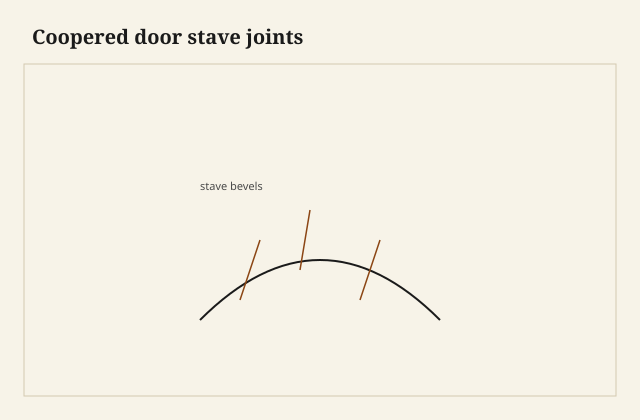

The stave was a sliver with two bevels. Alone it looked like a mistake. On the form, next to its sisters, it was a piece of a barrel. I had eight of them for a small cabinet door, white oak, the hollow facing the inside so the show was a shallow belly. A coopered door is not a bent lamination and it is not a brick stack. It is a set of long-grain joints standing in a circle that you then cut into a rectangle and hang.

<figure class="faj-figure">
  
  <figcaption><strong>Figure 1.</strong> Coopered door stave joints. Pack schematic (CC0).</figcaption>
</figure>

<figure class="faj-figure faj-museum">
  
  <figcaption><strong>Figure 2.</strong> Coopered doors appear in historical cabinet texts before they appear on your form — plate for type context. (<a href="https://commons.wikimedia.org/wiki/File%3AModern_cabinet_work%2C_furniture_and_fitments%3B_an_account_of_the_theory_and_practice_in_the_production_of_all_kinds_of_cabinet_work_and_furniture_with_chapters_on_the_growth_and_progress_of_design_and_%2814593727998%29.jpg">Wikimedia Commons</a> — No restrictions).</figcaption>
</figure>

<figure class="faj-figure faj-shop-pending">
  
  <figcaption><strong>Photo 3 (pending).</strong> Each stave is a little trapezoid. Together they are a skin. The form is the only square in the room. Keith BBF shop library — unpublished; photographer unnamed until file metadata is pulled Slot: D:\BBF\BBF Photos — coopered door dry-fit on form, stave joints showing (filename pending shop pull)</figcaption>
</figure>

People think the hard part is the curve. The hard part is the *frame*: hinges want a straight stile, the latch wants a straight stile, and the barrel wants to keep being a barrel when the seasons change. If you glue a coopered skin into a rigid square like a prisoner, you have built a drum that will split a stave to get out.

## Bevels that add to a fair

I do not start with a degree I found in a book. I start with the rise I want and the width of the opening, and I make a form — plywood ribs with the inside curve, a couple of battens. Then I rip staves a little wide and I plane the bevels until the dry-stack sits on the form without light at the joints. A shooting board for staves is a long board with a stop. The last shaving is the joint.

How many staves: enough that no one stave has to take a wild bevel, not so many that you are gluing a bundle of chopsticks. For a door I can hold in two hands, I like a number I can clamp. Eight to twelve is a shop number, not a law. [VERIFY] before anyone prints a house count.

Joint between staves: sprung joint, like a tabletop. A tiny hollow in the middle so the ends shut. These are long-grain to long-grain if you ripped the staves along the grain, which you should. End-grain coopering is a different craft and a different failure.

## Glue on a form

I tape the outside, or I use a strap, or I use the form as a caul with a matching outside rib. Hide is kind if you have to get back in. PVA is what I use when the dry-stack already shut and the shop is not an oven. Clamp until the squeeze-out is dull. Do not rush a barrel.

Once it is a skin, I dress the inside and the outside with a compass plane or a curved scraper and a lot of checking with a batten. Fair is the only word. A flat in a coopered door is a stave that is proud or shy. You will see it after finish in the glass-wall light.

<figure class="faj-figure faj-shop-pending">
  
  <figcaption><strong>Photo 4 (pending).</strong> The hollow is the inside of the barrel. The hinge stile is still a board that has to be straight. Keith BBF shop library — unpublished; photographer unnamed until file metadata is pulled Slot: D:\BBF\BBF Photos — coopered door in frame, hinge stile, inside hollow (filename pending shop pull)</figcaption>
</figure>

## How it becomes a door

Two honest architectures:

**Skin in a frame.** The coopered panel floats in a grooved frame the way a flat panel does, only the groove is scribed to the curve or the panel’s edges are dressed to a thickness the groove can live with. The frame is square. The hinges live on the frame. The barrel moves across its width inside the groove. This is the one I trust for a real door.

**The barrel is the door.** You glue straight stiles to the first and last stave, or you leave the first and last stave wide and square on the outer edge so they *are* the stiles. Hinges on that square edge. The curve is the whole door. Movement is now the door changing its belly. I will do this on a small cabinet that lives indoors and I will finish all sides. I will not do this on a pantry door in a wet kitchen without a conversation about the morning it will not latch.

A floating coopered panel in a curved *frame* — rails bent or brick-laid — is the full circus. One circus at a time unless the commission paid for two.

## Hinges and the hollow

Hinge mortises belong in straight long grain. If your stile is the first stave, make sure that stave has meat. A hinge in a bevel-jointed edge is a hinge in a glue line. I have seen the leaf open the stave joint. Mortise stays in the square country.

The latch or catch has to meet a strike that understands the belly. A flat strike on a curved door is a point contact. I shape the strike or I use a catch that can forgive a little. The door will move. The catch should not be a grudge.

## Failures

I glued the skin into a square frame with glue on the panel edge because it rattled. It rattled because I had not sized the groove. In August the middle stave split. I now let coopered panels rattle a little in January. That rattle is the door still being a door in August. The craft pack said this about flat panels. Coopering does not cancel it. Coopering makes the split look like a stripe.

I also under-bevelled two staves and filled the gap with glue. Glue is not a stave. The gap telegraphed as a dark line after oil. Plane the bevel. Do not grout a barrel.

## The long shooting board

The stave shooting board is a six-foot pine plank with a stop at one end and a fence that I can shim. I plane the bevel with the stave on its edge, the plane on its side, the way a door-edge joint is shot. The last shaving should be full length. A shaving that dies in the middle leaves a high spot that will print as a flat after glue.

I spring the joint the same way I spring a tabletop: two or three light hollows in the middle with a jointer plane, ends touching. On a stave the hollow is easy to overdo because the edge is short. I check with a straightedge and I err toward almost-straight. Too much spring and the middle never shuts on the form; the strap then closes a grin that is all glue.

The form ribs are plywood, the curve drawn from a thin batten I bent to the rise I wanted. I do not trust a fairing I drew with a compass on a door this wide — the compass is a circle, the door is a shallow arc, and they are not the same pride. I staple the batten, I mark, I bandsaw, I clean the rib with a spokeshave until the batten lies down without light.

## The grout line I recut

I built a practice door for a small wall cabinet — white oak, eight staves, shop sample — and I got impatient with two bevels that still showed a thread of light on the form. I glued it anyway and I told myself the squeeze-out would fill. After oil, under the glass wall, those two joints were dark hairs the length of the door. I sawed the skin apart along those joints, I reshot the bevels until the dry-stack went dark by itself, and I glued again. The second oil did not draw a map.

That recut taught me to dry-stack with a light behind the form. If I can see the window through a joint, the joint is not shut. Tape on the outside can hide a grin you will pay for later. I look from the hollow.

I now like to have the square frame true, grooves cut, before I glue the barrel, so I can size the skin to a groove that exists. A skin first is a skin I will then force a frame around. I have done both. Frame first means I can dress the panel edges to a thickness the groove can live with — the thickness at the edge is a chord of the curve, fatter than you think if you only measured the stave at the belly. I sneak those edges with a rabbet plane until they slip, and I do not glue them.

## Belly in a rain week

White oak staves in Wilmar still move across their width. A coopered skin is a lot of small widths adding up to a barrel that wants to flatten or belly when the shop goes from a cooked January afternoon to a rain week off the river. Inside a grooved frame, that movement is a slide. Glued at the edge, it is a split in the middle stave.

The barrel-as-door version changes its belly in the opening. I finish the hollow and the show the same week so one face does not pull the other. A pantry in a wet kitchen will still swell toward the strike. I shape the strike to the curve with a rasp. A flat strike on a belly is a point that chips a stave.

If the first stave is the stile, I leave it extra wide and I keep the outer edge square before I shoot the inner bevel. The mortise lives there. A leaf that lands on a stave joint will open the barrel.

## Compass plane and the batten

After glue I fair with a compass plane set to a radius a little tighter than the door, then a curved scraper. I check with the same batten I used for the ribs. The batten does not lie. My eye will call a proud stave “figure.” The batten will click. I stop when the batten whispers the whole width. Glass-wall raking light is the exam after oil. I would rather find the flat now.

## What I want from D:\BBF

Dry-stack on the form, light behind the joints, no window showing through. The long shooting board with a stave on edge. The hollow, inside, after the compass plane. A hinge stile that is obviously a board, mortise in square grain. A frame already true with the skin rattling a little in the groove. Filename pending shop pull.

## Next time

I cut bevels until the dry-stack shuts without grout. I size a panel to a groove that already exists. I let January rattle. I keep iron in square meat and I shape the strike to the belly. If I want a curve without stave politics I will laminate. If I want the look of a small cask on a cabinet, I will treat the barrel as a panel that is allowed to remain wood — hung, not jailed.
