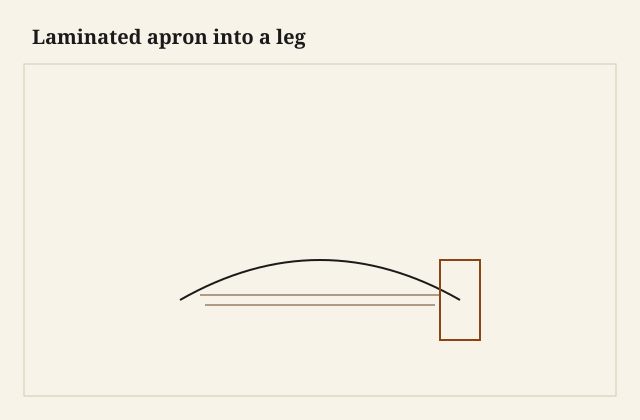
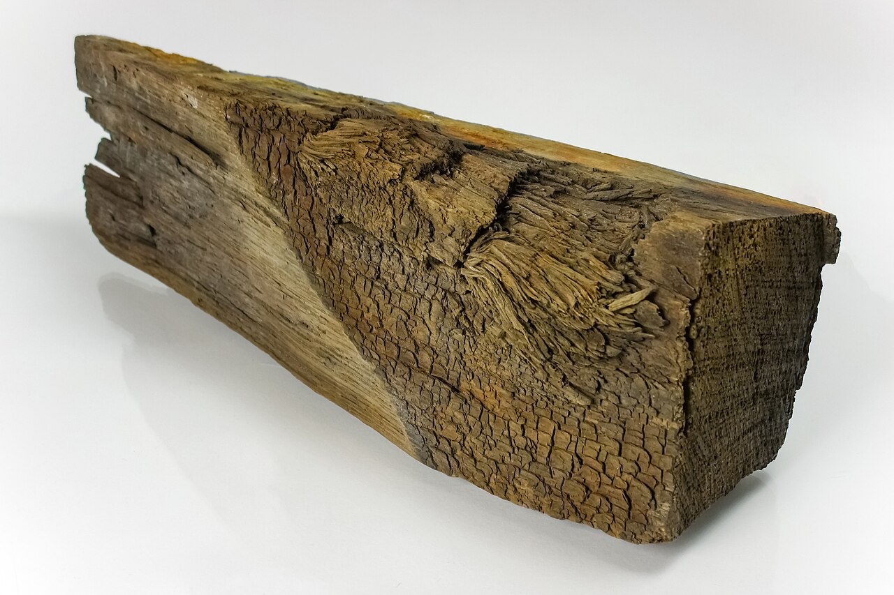

The apron came off the form as a single curve with stripes. Five leaves of oak, a little over 1/8 each, the glue a dark hair if I had been messy and invisible if I had been clean. I needed that apron to enter a tapered leg as if it were a solid rail. A tenon sawed across a glue stack can be a tenon. It can also be five veneers in a hole, waiting to delaminate the first time someone sits on the corner of the table.

<figure class="faj-figure">
  
  <figcaption><strong>Figure 1.</strong> Laminated apron into a leg. Pack schematic (CC0).</figcaption>
</figure>

<figure class="faj-figure faj-museum">
  
  <figcaption><strong>Figure 2.</strong> Laminated aprons follow grain and glue-line discipline — oak sample for species context only. (<a href="https://commons.wikimedia.org/wiki/File%3APiece_of_oak_wood_from_the_ship_Vasa_4.jpg">Wikimedia Commons</a> — CC BY-SA 4.0).</figcaption>
</figure>

<figure class="faj-figure faj-shop-pending">
  
  <figcaption><strong>Photo 3 (pending).</strong> Thin leaves, thick glue discipline. The form is the apron’s memory. Keith BBF shop library — unpublished; photographer unnamed until file metadata is pulled Slot: D:\BBF\BBF Photos — laminated apron on form, leaves visible (filename pending shop pull)</figcaption>
</figure>

Bent lamination is how a small shop gets a fair curve without a steam box and without a pile of broken crests. It is also how a small shop gets a joint that is secretly a glue test. This essay is the test.

## Leaves that can be a tenon

I cut the leaves long. After the glue-up I want extra at the ends so I can choose where the tenon lives. If a glue line lands in the middle of a tenon cheek, I can still live. If a glue line *is* the cheek — if I sawed right on a stripe — I have a cheek that may peel. I lay out the tenon to keep at least two leaves fully in each cheek, or I add a solid end: a short piece of solid, same species, spliced or just left as the last “leaf” thick enough to be a real tenon.

A solid end on a laminated rail is not a confession. It is how boatbuilders keep a scarf from being the fastener. Furniture can borrow that without becoming a yacht.

The form: two cauls, the curve I want plus a little for springback (laminations spring less than steam, which is why we like them). Even clamp pressure. Glue that is rated for the leaves. I will not name a bottle as house standard. [VERIFY]. Squeeze-out between leaves is a stain if it sits. Wipe what you can reach. The rest is a scraper tomorrow.

## Mortise in a turned or tapered leg

The leg may be round. The apron is a ribbon. The shoulder of the tenon is scribed to the turn, or the mortise is in a flat you left on the leg for this purpose. I like a flat. A flat is a place a shoulder can shut without a compass dance. If the design forbids a flat, scribe and be quiet about how long it took.

<figure class="faj-figure faj-shop-pending">
  
  <figcaption><strong>Photo 4 (pending).</strong> The tenon should live in leaves, not in a glue plane. Offset the stack if you have to. Keith BBF shop library — unpublished; photographer unnamed until file metadata is pulled Slot: D:\BBF\BBF Photos — laminated apron tenon entering a turned or tapered leg (filename pending shop pull)</figcaption>
</figure>

Depth and tightness: same as a solid rail, except I dry-fit more nervously. A fat tenon in a lamination is how you start a delamination. Pare. Do not pound. A dead-blow on a laminated tenon is a request for a split between leaves that you will not see until finish.

Haunch if the rail meets the top of the leg. Twin tenons if the apron is tall. The lamination does not cancel ordinary table rules. It adds a rule: the tenon is only as honest as the leaves in it.

## When I refuse the tenon

A tight radius with very thin leaves: I will use a loose tenon in a mortise cut after the apron is dressed, so I am mortising a stack as if it were solid, and I will keep the loose tenon in the middle leaves. Or I will use a steel bracket hidden in a slot — knockdown, later — if the table has to travel. I will not cut a skinny integral tenon in a five-leaf ribbon that already looks like a cracker.

## Finish and the stripes

Oil will find glue lines you thought were invisible. That is not always bad. A quiet stripe can read as coopering. A cloudy stripe is starved glue or a leaf that shifted. I dry-stack the leaves in order from one board when I can, so the grain runs as if it were still a plank. Bookmatching leaves around a curve is a pretty idea that can fight the bend. Strength first.

## Failures

I cut a tenon that was mostly one glue plane. It held for the photo. It loosened after a summer. I opened it, slipped a new solid end in with a scarf, and I still know which apron. The scarf is under the top. The customer does not. I do.

I also clamped a form with too few clamps and got a hollow in the middle of the apron. The tenons were fine. The apron looked pregnant. Re-form, or live with a belly. I re-formed. Clamps are cheaper than a pregnant apron on a dining table.

## Cauls, clamp spacing, the block behind the chisel

The form is two cauls I bandsaw together so they match, then I dress the faces with a compass plane until a leaf lies down without a click. I add a little extra curve for the small spring laminations still make. I line the cauls with packing tape so glue does not marry the apron to the form. Cork on the outside caul keeps a clamp from printing a facet.

Clamp spacing is closer than my pride likes. I set a clamp every three or four inches on a dining apron, alternating sides of the caul so I am not banana-bending the form itself. A hollow in the middle is too few clamps or a caul that was not fair. I have made both mistakes. The pregnant apron was the first.

When I pare the tenon I back the stack with a wide block clamped across the leaves so the chisel is not levering them apart. A laminated tenon that needs a mallet is a tenon I pare again. I keep a wide chisel and that backup block on the bench before I offer the ribbon to the leg. If the mortise in the leg is burned from a router, I scrape the burn before I invite the stack. Burn is a lubricant until it is a gap.

## The glue-plane tenon I opened

The apron that loosened was a five-leaf oak ribbon, shop table, not a named commission I will print. I had sawn the tenon where a stripe sat on the cheek. It looked like one piece in the dry-fit. After a South Arkansas summer — glass wall, then a wet week — the outside leaf let go in the mortise. The table still stood. The corner had a little give you could feel if you knew where to press.

I pulled the apron, I sawed the bad end off, and I scarfed a short solid of the same oak onto the ribbon, long grain, the scarf under where the top would hide it. The new tenon lived in that solid. I should have left the last leaf thick from the start. A solid end is not a confession. It is the joint telling the truth about what a glue line can and cannot be.

I dry-fit the repaired corner overnight, unglued, with a clamp at table tension. If a leaf lifts by morning, the scarf is hungry or the mortise is fat. I will not glue a maybe.

## Leaves, humidity, oil

I resaw leaves from one board when I can, numbered, so the ribbon still reads as a plank after oil. A cloudy stripe is starved glue or a leaf that shifted on the form while I was reaching for another clamp. I would rather recut an apron than stain a stripe into a second lie.

Thin leaves in this shop pick up and dump moisture faster than a solid rail. A ribbon glued on a wet Monday and tenoned on a cooked Wednesday has already changed its mind about thickness. I sticker the dressed apron next to the legs for a day and I meter them together before I cut a tenon that has to stay. [VERIFY] any number a caption wants to print.

I will not laminate a tight radius out of leaves that are too thick and then call the spring a design. Thick leaves in a tight form are a steam job, or a refuse. Laminations spring less than steam; they do not spring never. If the apron comes off the form and I can see daylight under a batten, I re-form or I live with a belly I will hate at finish.

A tapered leg adds a thickness map the tenon does not get to ignore. I set tenon thickness from the meat in the leg at the mortise, and I keep the ribbon’s extra length so I can shift the tenon off a stripe. Offset the stack if you have to. The shoulder still has to shut on the flat I left, or on the scribe I paid for.

## Loose tenon when the ribbon is a cracker

If the leaves are too thin to own an integral tenon, I dress the apron, I mark the middle leaves, and I cut a mortise in the end as if the stack were solid. The loose tenon is hardwood, grain running the way a tenon wants, and it lives in those middle leaves. The outer leaves stay cosmetic and structural for the bend, not for the hole in the leg. That is a different honesty than a glue-plane cheek, and I will take it.

## What I want from D:\BBF

Leaves on a form, numbered, clamps close together, tape on the caul. A tenon with stripes that stay *in* the cheeks, not on the cheek. A backup block behind a paring cut. A flat on a turned or tapered leg where a shoulder can shut. The scarf under a top only if we are teaching the repair — I would rather show the solid end I should have started with. Filename pending shop pull.

## Next time

The ribbon is allowed to be a curve. The tenon is not allowed to be a bundle of wishes in a hole. I keep leaves in the cheeks, or I give the rail a board at the end. I clamp like I mean the middle. I tap, I do not pound. Steam is a different heat. Bricks are a different thickness. This joint is thin truths glued into a shape that still has to sit down on a shoulder like a rail that grew up straight — and if it cannot, I stop calling the stack a rail and I change the fastener.
