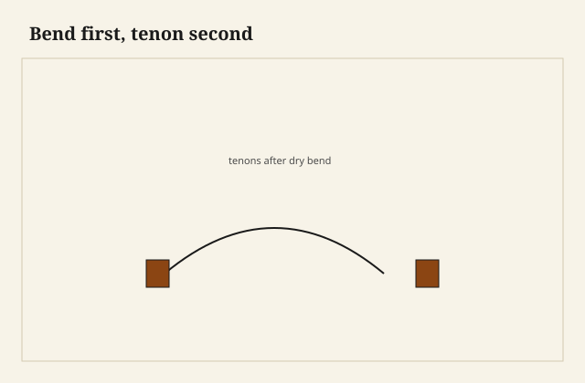

I used to tenon first because the sliding compound saw is happier with a straight stick. I would cut pretty shoulders, then I would steam or laminate, and then I would stand in front of two posts holding a rail whose tenons had rotated into a polite fiction. You can sneak a little. You cannot sneak a tenon that now wants to enter a mortise from a week ago.

<figure class="faj-figure">
  
  <figcaption><strong>Figure 1.</strong> Bend first, tenon second. Pack schematic (CC0).</figcaption>
</figure>

<figure class="faj-figure faj-museum">
  
  <figcaption><strong>Figure 2.</strong> Bend first, tenon second — moisture and species still govern whether the bend stays. (<a href="https://commons.wikimedia.org/wiki/File%3APiece_of_oak_wood_from_the_ship_Vasa_4.jpg">Wikimedia Commons</a> — CC BY-SA 4.0).</figcaption>
</figure>

<figure class="faj-figure faj-shop-pending">
  
  <figcaption><strong>Photo 3 (pending).</strong> Long ends. No shoulders. The rail is allowed to finish its argument with the form. Keith BBF shop library — unpublished; photographer unnamed until file metadata is pulled Slot: D:\BBF\BBF Photos — curved rail blank after bend, ends still long, no tenons yet (filename pending shop pull)</figcaption>
</figure>

This is the sequence essay. The steam-crest piece and the lamination-into-a-leg piece assume it. I am writing it anyway because the sequence is the joint. Shops that skip it spend their time making the wood look like the drawing instead of letting the drawing follow the wood.

## Why the ends move

A bend is a stretch on one face and a crush on the other. The neutral axis stays closer to length. The faces change. The end of the blank, which was square to the straight axis, is no longer square to the *chord* you will use as a rail, and it may not even be the same distance from the shoulder you imagined. Laminations move less than steam. They still move. Springback is a change in radius. A change in radius is a change in where the end sits in space.

If you cut a tenon on the straight blank, you locked a coordinate system. The bend invented a new one. I lock the coordinate system after the new one exists.

## The blank I actually cut

Long. A little wide. No cheeks, no shoulders. I may cut a shallow horn or a dog I can clamp to the form. I do not cut anything that thinks it is a joint.

After the bend and the wait — meter in the same country as the posts — I put the rail against the posts, or against a story frame, and I mark the shoulders from the life in front of me. Then I saw.

<figure class="faj-figure faj-shop-pending">
  
  <figcaption><strong>Photo 4 (pending).</strong> Now the ends know where they live. The saw is invited. Keith BBF shop library — unpublished; photographer unnamed until file metadata is pulled Slot: D:\BBF\BBF Photos — same rail after drying, tenons cut to posts (filename pending shop pull)</figcaption>
</figure>

A tenon jig or a table-saw sled can still help, but the rail is now a curve and it will not lie on a sled the way a stick will. I support it. I do not force it flat. Forcing a bent rail flat to cut a tenon is how you cut a tenon for a rail that will spring back into a different chair.

## Production is allowed to cheat — if it already paid

A run of identical chairs can tenon first if the form is overbent to a measured springback and the mortises are cut to that landing. That measurement comes from scrap rails, not from optimism. A one-off that “tenons first because that is how I always do rails” is not a production system. It is a habit wearing a system’s hat.

Loose tenons after the bend: good. You mortise the rail end *after* it has moved, and you mortise the post, and the loose tenon is just a stick. This is the sequence in a different costume. I like it when the rail is too awkward to take to a tenoner.

## Failures

I tenoned first on a laminated apron because I wanted to use the tenoner while it was set up for a square table. The apron’s tenons pointed in. I recut them shorter and I lost the haunch I wanted. The table is still in a house. The haunch is not. Setup time is not a reason to invert the sequence.

I also marked shoulders from the drawing after a steam bend without offering the rail to the posts. The drawing did not include the springback I actually got. The posts did.

## Two waits, and a pair of posts that stay put

On the form, then off the form. The first wait is obvious. The second wait is the one that feels like idling. The rail is still giving back a little length and a little smile. I sticker it next to the posts so they share the same air in the 65-foot shop — not in a closed box on one end of the glass wall and a kiln pile on the other. A rail that is still wet will shrink after you tenon, and then the shoulders will be in a different place than the mortises.

I will not print a moisture number as house law. [VERIFY]. I will print the habit. Meter the rail. Meter the posts. Same country. Then mark.

I keep a pair of posts, or a plywood stand-in of the posts, at the spacing of the chair. After the rail dries, I offer it to that frame and I mark. The frame is cheaper than a wrong tenon on a rail I already steamed. If I do not have a frame, I clamp the actual posts to the bench at the spacing. The rail comes to them. They do not come to a memory of the rail.

## A shoulder stick, not a tape

The tool that is not already in this essay is a shoulder stick — a thin batten with the post spacing scribed on it, and a pair of sliding fences I pinch with a thumbscrew once the live rail has spoken. I offer the rail to the posts. I knife the shoulders on the rail. I transfer those two knives to the stick. The stick is the drawing from then on. The paper drawing is retired.

I have marked from a tape after a bend and then wondered why one tenon was fat and the other shy. A tape measures a chord. The shoulder lives on a curve. The stick takes the two points the posts actually gave me.

When I recut, I recut to the stick, not to the old knife lines on a rail I am about to throw in the burn pile. I once steam-bent a pecan crest, marked from the paper, cut tenons, and found both ends short of the posts by enough that a longer tenon would have been fiction. I cut a new blank. I bent it on the same form. I waited both waits. I marked from the posts onto a new stick. The second crest fit. The first one is a clamp caul now, which is a kind of honesty.

## Cradles that do not flatten the smile

A tenoner wants a straight stick. A bent rail on a tenoner is a rail you have to cradle so you are not flattening the bend to please the machine. I keep two shaped scraps that match the rail’s curve — cut from the same form, not from a guess — so a sled can see a straight world without asking the rail to become yesterday’s stick.

If I cannot make those cradles in the time it takes to set up a mortiser, I switch. I mortise the rail end after it has moved, and I use a loose tenon. The loose tenon is a stick. Sticks can go to the machine. The rail stays a curve.

I have also cut cheeks on the bandsaw with the rail standing in a birdsmouth, the smile pointing up, a sacrificial fence behind the cut. That is slower than a tenoner and kinder than a clamp that squishes the belly flat. The cheek that comes off a flattened belly is a cheek for a flatter chair.

## Humidity is a change of address

Steam leaves water. Laminating glue leaves water. Both of those waters leave the rail after you think the shape is done. Oak and pecan do not give it back on the same afternoon. [VERIFY] species notes before anyone captions a schedule. A rail stickered on the form overnight and tenoned at first light is a rail whose shoulders will walk toward the posts as it dries, or walk away, depending on which face was the stretch.

I watch length, not just smile. I put a pencil tick on the story frame at the day-one landing. If the tick and the rail disagree after the second wait, I mark again. I do not “split the difference” with a shorter tenon and a fatter glue line.

A house in Warren in August will take more water than the shop on a dry January morning. If I tenon to a shop-dry rail and the chair later lives through a rain week, the rail can plump and shove the posts. If I tenon while the rail is still proud of the posts’ moisture, the shoulders open. The sequence includes the weather. The saw does not.

## What I want from D:\BBF

The long blank on the form, horns still on, no shoulders. The same rail later against the posts, tenons cut, the shoulder stick in the frame if we have that honesty. Two photographs, one sequence. Filename pending the pull. Photographer unnamed until the file says so.

## The judgment

Bend first, then tenon. Wait until the rail and the posts are in the same moisture country. Mark from the posts onto a stick you can hold. Cradle the curve if a machine must cut, or mortise for a stick after the move. A warm tenoner is not a sequence. It is a temptation with a motor. The faster order is how you build a chair for last night.
