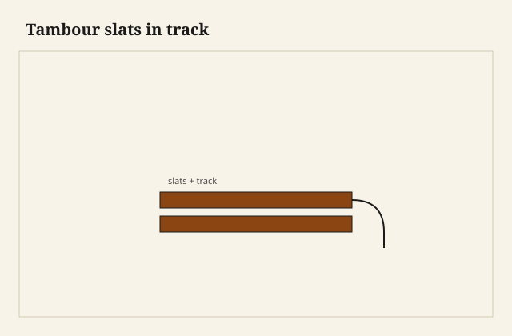
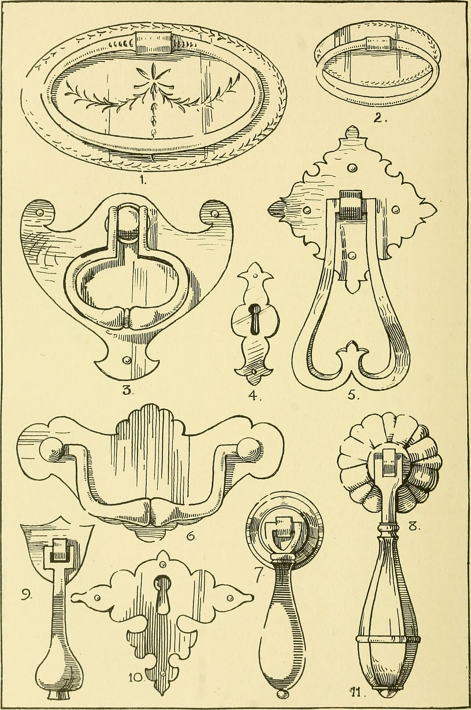

The slats looked like bacon on the bench, a row of little faces, the canvas on the back still smelling like whoever glued it. I lifted one end and the curtain rolled. That roll is the joint. A tambour is not a door you hang. It is a door you *feed* into a track, and the track is a pair of grooves that have to remain a pair when the case moves.

<figure class="faj-figure">
  
  <figcaption><strong>Figure 1.</strong> Tambour slats in track. Pack schematic (CC0).</figcaption>
</figure>

<figure class="faj-figure faj-museum">
  
  <figcaption><strong>Figure 2.</strong> Tambour desks belong to cabinet-fitment history — plate context, not a romantic stock desk. (<a href="https://commons.wikimedia.org/wiki/File%3AModern_cabinet_work%2C_furniture_and_fitments%3B_an_account_of_the_theory_and_practice_in_the_production_of_all_kinds_of_cabinet_work_and_furniture_with_chapters_on_the_growth_and_progress_of_design_and_%2814593727998%29.jpg">Wikimedia Commons</a> — No restrictions).</figcaption>
</figure>

<figure class="faj-figure faj-shop-pending">
  
  <figcaption><strong>Photo 3 (pending).</strong> The cloth is the hinge. The slats are only as kind as the gap you left between them. Keith BBF shop library — unpublished; photographer unnamed until file metadata is pulled Slot: D:\BBF\BBF Photos — tambour slats on canvas, inside face (filename pending shop pull)</figcaption>
</figure>

I will not write a museum note on cylinder desks. I will write about slats, cloth, and a channel. A breadbox, a small cabinet, a desk if the commission is real. [VERIFY] before this becomes a house claim.

## Slats that can go around a corner

Thin enough to take the radius of the track. Thick enough that the show face does not read as veneer on cloth. Square edges will bind on a tight radius; a little bevel or a radius on the inside edges lets them hinge. I cut extras. The extras replace the ones that chip when you still think you are being careful.

Species: something that will take a small section without crumbling. Oak is possible and fussy at this scale. A quieter hardwood is kinder. I will not print a house species as law.

The canvas (or a linen, or a modern tape some shops trust) is the long-grain hinge. Glue slats to the cloth with a gap you can see. No gap, and the curtain cannot roll. A fat gap, and you see the cloth from the sofa. I use a spacer. I do not eyeball a tambour gap on a piece I have to live with.

Adhesive: [VERIFY]. A glue that stays flexible is the point. A glue that dries like a board is a second slat you did not want.

## The track is the mortise

Two grooves, parallel, a consistent distance apart, running the path: straight, then a curve, then straight. The curve is where tambours go to die. If the radius is tighter than the slat thickness will allow, the slats climb out or they jam. I make a test curtain of three slats and I run it in a test block of the radius before I cut the case.

<figure class="faj-figure faj-shop-pending">
  
  <figcaption><strong>Photo 4 (pending).</strong> The track is a pair of grooves that must stay a pair. A pinch is a tambour that stops being a door. Keith BBF shop library — unpublished; photographer unnamed until file metadata is pulled Slot: D:\BBF\BBF Photos — tambour in its track, cylinder desk or cabinet (filename pending shop pull)</figcaption>
</figure>

The groove width is the slat thickness plus a little for humidity and finish. Too tight in June is a door that will not open. Too loose is a tambour that rattles and leaves the track at the curve. I finish the slats *before* they go in if I can, at least a sealer, so they do not swell into a raw-wood surprise.

A lock rail or a handle slat at the front is thicker, sometimes with a real tenon into the first few slats or just a wider glue patch on the cloth. That rail is what people pull. If you pull on a thin slat, you will pull a thin slat off the cloth.

## The case has to stay a gauge

If the two sides of the case move toward each other, the tracks pinch. A carcase that is only a pair of sides and a top, no web or no back that keeps the width, will pinch a tambour in the first season. I treat the track distance as a dimension I will not leave to hope. A web frame, a fixed shelf, a back that is a panel — something. The craft-pack sliding dovetail as a structural shelf is a friend here.

## Failures

I glued slats with no spacer “because they looked tight and tidy.” They were tidy. They would not go around the curve. I soaked the cloth, ruined it, recut slats. Use a spacer.

I also cut the groove after finish on the case and I tore out at the curve. Cut the track before the case is precious, or use a climbing pass and a backing.

A canvas that was too narrow left the slat ends unsupported in the groove. The ends crumbled. The cloth should come close to the groove without dragging. That is a fitting job. Dry-run the curtain in the open case before you close the last side if the design allows. Some designs do not allow. Those designs are why test blocks exist.

## A gluing board that is a jig

The tool that is not already in this essay is a gluing board: a flat scrap as long as the curtain, two raised fences the thickness of the slats, and a spacer stick I can lift and set again. Slats go face-down between the fences. The spacer sits between each pair. Weights — bricks, or a second board — keep the slats from rocking while the cloth goes on.

I do not glue a tambour in the air. I have tried. The slats wander and the gaps become a song. The board is the only square in that hour.

I run a test curtain of three in a radius block until I am bored of it. Boredom means the radius is kind. Excitement means I am forcing a slat around a corner it cannot take. I change the corner. I do not change the slat thickness to please a drawing I liked on a screen.

The lock rail gets a square, a thicker glue patch, and sometimes two short dowels into the first slats so a yank cannot peel cloth. People pull the lock rail. I build it like a rail.

## The recut after the first slat chipped

I cut extras. I still ran short once, because the first three slats chipped on the inside arris when I still thought a block plane was too much ceremony. I recut those three from the extras, then I recut two more when the canvas adhesive wicked onto a show face and stained a stripe. The curtain that went into the case was the second curtain. The first one taught the spacer and the sealer.

Dry-run in the open case if the design allows. I feed the lock rail first, I walk the curve by hand, I listen. A tick at the curve is a slat climbing. A grind is a groove that is shy or a finish crumb. I do not close the last side until that run is boring.

If the three-slat test jammed and I had already cut the case, I have one ugly mercy: open the radius with a thicker template and a second pass, if the side still has meat. If it does not, the case is a different cabinet. Recut the side. Do not sand the slats thinner until they rattle.

## Tracks before the case is jewelry

I cut the tracks before the case is precious. A template of the path — straight, curve, straight — and a guide bushing, or a scratch stock if the run is short. The template is a pair. Left and right are mirrored. I mark them L and R. A flipped template is a pinch you will blame on August.

At the curve I use a backing block and a climbing pass if I am routing. Tear-out there is a crater the slat will catch on every trip. I ease the groove entries with a small chamfer so the curtain can be fed without peeling the first slat.

I wax the groove after the sealer, not before the first dry-run, so I can still feel a stair. Slick on a torn crater is a jam I will blame on humidity.

## Humidity is a pinch and a swell

June in South Arkansas will swell slats in thickness. The cloth does not swell with them. The gaps you left are there so the curtain can still roll when each slat is a hair fatter. No gap, no roll. A fat gap, cloth from the sofa.

The case is the other weather. Walnut sides and pecan slats do not keep the same calendar. [VERIFY] any pairing before it becomes a caption. If the sides move toward each other, the tracks pinch even if every slat was perfect. The web, the fixed shelf, the back — that gauge goes in before I call the tambour done.

A canvas glued with a glue that dries like a board is a second slat. The hinge has to stay a hinge. [VERIFY] the bottle. I finish the slats to sealer before they live in the groove, so a rain week does not swell raw end grain into a door that will not open. I finish the inside of the groove too. Raw oak pores in a track are a sponge.

## What I want from D:\BBF

The cloth side of a curtain on the gluing board, spacer still in the shot. A slat entering a curve in a track. A lock rail that is obviously thicker than its neighbors. Filename pending the pull. Photographer unnamed until metadata is pulled.

## The judgment

Slats that disappear are a curtain and a track. Gap them on a board, keep the cloth flexible, cut a radius the slats can actually run, and do not let the case pinch the gauge. A tambour is a mortise that never sees a tenon. It still has to stay a pair. Listen in the test block, not in the finished desk.
