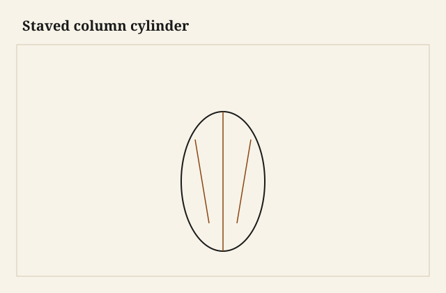

The cylinder stood on the bench, a hollow oak drum, eight staves, the inside still showing clamp marks. It looked like a post. It was a post only if I gave it a way to carry a top. A ring of long-grain glue joints is strong in compression if the load is even. A tabletop is not an even load. Someone will sit on a corner. The drum will then try to become an oval, and an oval stave joint is a split.

<figure class="faj-figure">
  
  <figcaption><strong>Figure 1.</strong> Staved column cylinder. Pack schematic (CC0).</figcaption>
</figure>

<figure class="faj-figure faj-museum">
  
  <figcaption><strong>Figure 2.</strong> Staved columns are segmented cylinders; joint plates keep the vocabulary honest. (<a href="https://commons.wikimedia.org/wiki/File%3AEB1911_Joinery_-_Fig._12.%E2%80%94Joints.jpg">Wikimedia Commons</a> — Public domain).</figcaption>
</figure>

<figure class="faj-figure faj-shop-pending">
  
  <figcaption><strong>Photo 3 (pending).</strong> A hollow post. The staves take the ring. Something else has to take the table. Keith BBF shop library — unpublished; photographer unnamed until file metadata is pulled Slot: D:\BBF\BBF Photos — staved cylinder dry-fit, inside hollow (filename pending shop pull)</figcaption>
</figure>

A coopered door hangs. A coopered column stands. Same bevels, same form, different politics. I will not repeat the stave-plane lecture. I will talk about the block.

## The drum is a sleeve

I treat a staved column as a sleeve around a structure: a solid core, a steel tube, a wooden post, or a pair of blocks at top and bottom tied by a rod. The sleeve is the show. The structure is the joint.

A hollow drum glued to a top with screws into stave end grain is a wobble. End grain of a stave is also a glue line’s end. I will not screw a top to that and call it furniture.

<figure class="faj-figure faj-shop-pending">
  
  <figcaption><strong>Photo 4 (pending).</strong> The block is the joint. The cylinder is the dress. Keith BBF shop library — unpublished; photographer unnamed until file metadata is pulled Slot: D:\BBF\BBF Photos — staved column with top block or iron plate (filename pending shop pull)</figcaption>
</figure>

**Top block.** A round or polygonal block, grain chosen so it can take screws or a tenon, let into the drum or sitting on a rabbet I cut after the drum closed. The block can be brick-laid if it is wide. It can be solid if it is not a propeller.

**Rod.** Through the blocks, nut in a mortise. Knockdown if you can reach it. The drum then cannot go oval without fighting the rod.

**Solid core.** A turned post inside, the staves glued to it. Heavy. Honest. Movement between core and staves is a thing: glue in zones, or don’t glue and pin. A fully glued skin on a solid core is a drum that will split to get away from the core in August. I glue at the ends and I let the middle be a fit.

## Bevels and the circle

More staves than a door, often, because a column wants a rounder read. I still sneak the last pair. I still fair with a batten. A column that is a stack of flats is a hex you did not finish. That can be a design. If it is not the design, keep fairing.

Flutes: cut after the drum is true, or you will flute a lie. A fluting jig that rides the outside is a pleasure if the outside is already a circle.

## Failures

I screwed a top into stave ends. It held for the photograph. It did not hold for the first lean. I added a block from below, which is a repair you do on your knees and remember.

I also glued a skin hard to a solid core and the drum opened a stave in the first summer. Glue at the ends. The middle can shine a little. Shine is not a split.

## Discs, a strap, and a long plane

I cut the staves from one board when I can so the color agrees as you walk around. I dry-stack on a pair of plywood discs that are the inside diameter. I letter the discs so I use the same pair at top and bottom. A random disc is a random diameter. An accidental cone is a block that will not sit.

The tool that is not already in this essay is a long plane on a shooting board I tip to the stave bevel. Table-saw bevels get me close. The long plane makes the face a plane so the glue line is a line, not a scallop that will telegraph after oil. I sneak the last pair on that board, not on optimism.

I glue with a strap and I leave the discs in if they will come out later, or I use outside cauls. I check the strap. A drum that dries in a strap that was tighter on one side is an oval in the morning. I check diameter at two heights with a stick I keep for this — not a tape around the belly. A tape around an oval will lie and call itself a circle.

I oil the inside of the sleeve before the rod goes home so I am not oiling a tube I cannot reach. The inside still weathers. A raw inside and a finished outside is a cup in a circle. I do not need the inside pretty. I need it even.

## The recut when the drum went cone

I dry-stacked eight oak staves, glued, and found the top mouth a quarter smaller than the bottom. The last pair had been sneaked from the bottom’s gap. The top had been already shut. I had built a cone.

I could not fair a cone into a cylinder without making a thinner cone. I split the glue on one joint — hide, luck, a wedge — and I recut that pair from a leftover of the same board. I dry-stacked again with both discs in, and I sneaked while both mouths were open. The second drum sat. The first one is a lamp, which is what a pretty drum becomes when it nods.

When I recut now, I dry-fit with both discs in and a diameter stick across each mouth before I mix glue. If the sticks disagree, I sneak again. I do not glue a disagreement.

I letter the top and bottom of the sleeve so the rod goes home the same way it did in the shop. A slight cone will sit only one way. The letters save a reverse that cracks a block.

## The block after the drum is true

The top block can be a disc let into a rabbet I cut after the drum is true. I cut that rabbet on the router table with the drum running against a bearing, or I work it by hand if the drum is too precious for a machine. The block is screwed from below into long grain I left, or it is through-bolted to the foot-block with the rod.

A solid core: I turn or I eight-side a post, I fit the sleeve, I glue at the top and bottom thirds, and I leave the middle able to shine. A fully glued sleeve on a core is the split I already owned.

Compression is kind to a ring if the load is centered. A dining top is not centered when a person sits on the edge. The rod and the blocks keep the ring from going oval. The staves alone will try. I do not ask them to try alone.

I lean on the spider before the top goes on. If it nods, the feet or the block, not a flute I have not cut yet. Flutes on an oval are a second language I did not mean to speak. If the drum is still a hex of flats, I either own the flats as a design or I keep fairing. I fair with a batten around the drum, not with a belt sander I cannot see around a curve.

## Humidity is an oval you did not glue

August in South Arkansas will swell a raw inside if the outside is already oiled. That cup in a circle is a stave joint in shear. I finish inside and out, even if the inside is a dark tube no diner will praise.

A fully glued skin on a solid core is the other weather problem. The core and the sleeve do not move together. The sleeve wants to get away. I glue at the ends. The middle can show a hair of light and still be a column.

Oak staves and a walnut block are a pairing I will meter, not assume. [VERIFY] before a caption names a moisture. The habit: the drum and the blocks wait in the same air by the glass wall, then the rabbet, then the rod. A wet drum shrunk onto a dry block is a crack that follows a stave.

## What I want from D:\BBF

The hollow with clamp marks still visible and both discs in the mouths. The block in the rabbet. A diameter stick across the top. Filename pending the pull. Photographer unnamed until metadata is pulled.

## The judgment

A column from staves is a sleeve. Build the sleeve well — the door essay’s bevels still apply — and then put a block or a rod in it that can take a table. The hollow is pretty. The block is the joint. A pretty drum that nods is a lamp. A table has to take a corner sit. Do not confuse dress and joint when someone sits on the corner.
