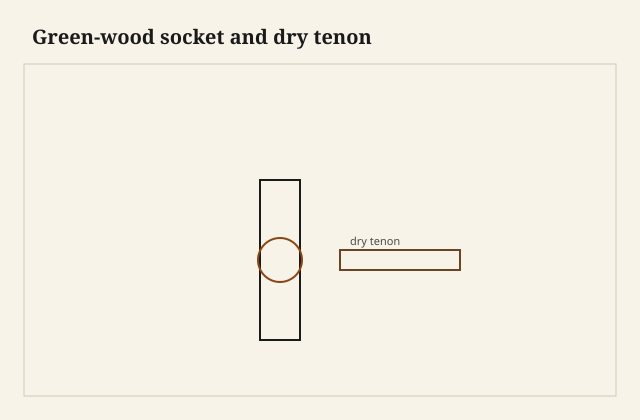

The shaving came off the tenon long and wet-looking even though the stretcher had been drying in the rafters. The leg was still green — not dripping, just heavier than it would be in a month, the hole I had just bored a little fuzzy. This joint does not pretend kiln-dried oak is the only furniture. It uses a wet socket and a drier tenon so the hole can shrink onto the pin. That shrink is the clamp. Glue is optional and, in the old habit, sometimes rude.

<figure class="faj-figure">
  
  <figcaption><strong>Figure 1.</strong> Green-wood socket and dry tenon. Pack schematic (CC0).</figcaption>
</figure>

<figure class="faj-figure faj-museum">
  
  <figcaption><strong>Figure 2.</strong> Green-wood sockets shrink — species and moisture context without inventing a chair photo. (<a href="https://commons.wikimedia.org/wiki/File%3APiece_of_oak_wood_from_the_ship_Vasa_4.jpg">Wikimedia Commons</a> — CC BY-SA 4.0).</figcaption>
</figure>

<figure class="faj-figure faj-shop-pending">
  
  <figcaption><strong>Photo 3 (pending).</strong> Wet hole, dry pin. The shrinkage is the clamp you cannot buy. Keith BBF shop library — unpublished; photographer unnamed until file metadata is pulled Slot: D:\BBF\BBF Photos — green leg, bored socket, dry stretcher tenon (filename pending shop pull)</figcaption>
</figure>

I will not claim the Wilmar floor is a Windsor shop unless that is true. [VERIFY]. I will write the joint as it is practiced, because a bent stretcher in a socket is curved work that a lot of “fine furniture” people skip and then wonder why their chairs rack.

## Wet and dry, not myth

The leg (or the seat) is higher moisture. The spindle or stretcher tenon is lower. As the socket dries, it closes. If both are dry, you have a chair joint that needs glue and maybe a wedge. If both are wet, they shrink together and the joint loosens. The differential is the trick. A meter is not romance. Use one. [VERIFY] targets before anyone prints numbers.

A wedge in the tenon, driven from the show face of a seat, is the through-tenon version of this religion. The stretchers are usually stopped, so the wedge is a fox-wedge if you use one — a different essay — or you trust the shrink and a little hide.

## The tenon is a cylinder you meant

I shave to a gauge, or I use a hollow auger, or I use a tenon cutter that I trust that day. Round is the point. An oval tenon in a round hole is a joint that is tight on two meridians and loose on the others. It will rack toward the loose.

<figure class="faj-figure faj-shop-pending">
  
  <figcaption><strong>Photo 4 (pending).</strong> The bend is the line. The tenon is a cylinder you shaved to a gauge. Keith BBF shop library — unpublished; photographer unnamed until file metadata is pulled Slot: D:\BBF\BBF Photos — steam-bent stretcher, shaved tenon, chair underway (filename pending shop pull)</figcaption>
</figure>

The stretcher may be steam-bent. Bend first, then tenon — the sequence essay still applies. A bent stretcher whose tenons were cut while straight will enter the sockets as a frown.

Bore the socket to the gauge, square to the *axis you want in the room*, not square to a face that is already a carve. Windsor legs are turned and then reamed. A tapered reamer and a tapered tenon is the deluxe version: the joint seats like a tap. A straight hole and a straight tenon can still work if the shrink is real and the fit was a tap, not a pound.

## Glue, or not

Hide in a wet hole is a soup. Some chairmakers glue, some do not. I will not start a war. I will say: if you glue, use something that can stand a little moisture, and do not treat glue as a substitute for the differential. If you skip glue, your fit and your moisture have to be the whole sentence. A sloppy dry joint without glue is a chair that walks.

## Failures

I bored a wet leg and then let the chair sit unassembled until the hole had already moved. The tenon was then loose. Assemble while the differential still exists, or keep the legs in a bag so they do not race you.

I also cut a tenon on a bent stretcher the night of the steam. Morning: different smile, tenons cocked. Sequence.

A kiln-dried “Windsor” kit with all dry parts and PVA is a different chair. It can be a good chair. It is not this joint. Do not advertise the shrink if you did not use the shrink.

## Whether this shop does this

I marked [VERIFY] on purpose. If the Wilmar floor is a dry shop with a kiln pile and no green riving, this essay is documented practice, not a house claim. I will not caption a green-wood chair as a BBF build until someone says the legs were wet and the tenons were dry and a meter was in the room.

The joint is still worth writing. Chairs rack. This is one of the old answers. If this shop is dry-only, I build the dry chair and I do not caption a shrink I did not use. The [VERIFY] stays until someone says the legs were wet.

A caption that invents a wet leg is a different kind of loose joint.

## A ring gauge and a scrap of the same story

The tool that is not already in this essay is a shop-made ring gauge: a hardwood block with a hole I bored with the same bit I will use in the leg, and a mouth I can slip over the shaved tenon. I shave until the tenon is a tap in that hole, not a pound. I keep the gauge hung with the bit. A tenon cutter I have not used this month is a cutter I test on a scrap of the same moisture story as the stretcher.

A reamer I have not used this month is a reamer I test the same way. Mixing a new hole size with an old tenon cutter is how I build a loose chair I will blame on the weather.

Pick a pair. Straight hole and straight tenon, or taper and reamer. A tapered tenon in a straight hole is tight at the mouth and loose at the bottom, or the reverse. That is not a shrink. That is a wobble with a story.

## The recut after the oval

I shaved a stretcher tenon by eye after a steam bend and I trusted the first circle the hollow auger gave me. The auger had wandered on the smile. The tenon was an oval. It tapped into the gauge on two meridians and rocked on the others. I recut the tenon shorter, back into round wood behind the wander, and I lost length I had wanted in the socket. The stretcher still works if you do not look at how shallow the pin sits.

Now I offer the tenon to the ring gauge before I offer it to a leg. If the gauge rocks, I recut. I do not “tap it tighter” in a wet hole. A pound in green wood is a reamed oval you cannot un-ream.

Dry-fit here is a tap on the scrap pair — a scrap leg of the same moisture, a scrap tenon of the same dryness — before I bore the chair. The scrap pair is cheaper than a loose stretcher in a chair I already like.

## Seat wedge and stretcher shrink are not one sentence

A through-tenon in a seat, wedged from above, is a show joint and a clamp. A stopped stretcher tenon is a shrink joint you cannot see. I do not treat them as the same work. The seat wedge you can see is the craft-pack cousin. The stretcher shrink is this essay.

Bend the stretcher first. Wait. Then shave. The sequence essay already spent its morning on that. Here I will only say: a tenon cut the night of the steam is a tenon for a smile that will not be this smile at assembly.

Assemble while the difference lives. A bag on the legs, or a morning that does not include a three-day wait after the boring. Holes race you. The meter stays in the sentence until the shop says otherwise.

## Humidity is the clamp — or it is not

If the shop runs green, the weather is the clamp you cannot buy. Wet hole, drier pin. The socket closes as the leg dries toward the house. South Arkansas August will still move a chair after that close. A stretcher that was bone dry and a leg that was only “less wet” is a milder shrink than the books like to draw. [VERIFY] any number. The meter is the joinery.

If the shop is dry-only — kiln pile, no riving, no bag of wet legs — then PVA and a good fit are the chair. That can be a good chair. It is not this joint. Build it honestly. Do not borrow the shrink caption.

I will not print a house moisture pair. I will print the fork: differential and assembly while it lives, or a dry chair that does not pretend.

## What I want from D:\BBF

A fuzzy wet hole and a shaved tenon in the same frame, a meter in the shot if we have that honesty. A bent stretcher off a form. Do not use a dry kit chair as the picture for this joint. If the floor does not rive green, the caption changes or the frame stays in the drawer. Filename pending the pull. Photographer unnamed until metadata is pulled.

## The judgment

A socket in green wood is a clamp the weather applies, and only if the weather was actually invited. Wet hole, drier pin, round to a gauge, bend before you tenon. If the shop does not run green, say so and build the dry version honestly. If it does, the meter is part of the joinery. The steam is only how the stretcher got its line.
