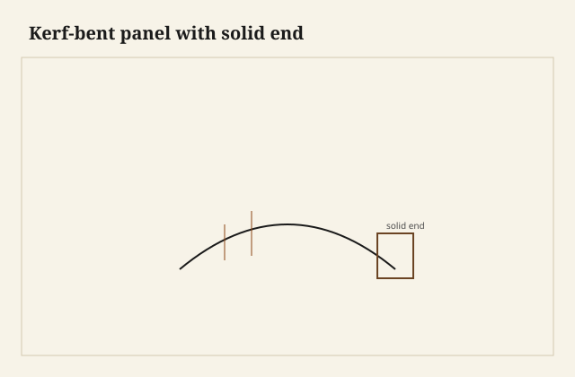

I counted the kerfs because I always do, and then I counted the uncut inches at the end because that is the number that matters. The board would bend around a plywood rib into a gentle quarter, a case side for a small cabinet that wanted a soft corner without a stave meeting. Kerf-bending is a trick. It is a good trick. It is also a board you have turned into a hinge for most of its length. The joint has to live where you did not cut the hinges.

<figure class="faj-figure">
  
  <figcaption><strong>Figure 1.</strong> Kerf-bent panel with solid end. Pack schematic (CC0).</figcaption>
</figure>

<figure class="faj-figure faj-museum">
  
  <figcaption><strong>Figure 2.</strong> Kerf bending meets solid ends for joinery — general joints plate as classroom anchor. (<a href="https://commons.wikimedia.org/wiki/File%3AEB1911_Joinery_-_Fig._12.%E2%80%94Joints.jpg">Wikimedia Commons</a> — Public domain).</figcaption>
</figure>

<figure class="faj-figure faj-shop-pending">
  
  <figcaption><strong>Photo 3 (pending).</strong> The kerfs are the bend. They stop before the end that has to be a joint. Keith BBF shop library — unpublished; photographer unnamed until file metadata is pulled Slot: D:\BBF\BBF Photos — kerf-bent panel on form, kerfs showing on the hollow (filename pending shop pull)</figcaption>
</figure>

This is not coopering. Coopering is many boards. This is one board, sawn almost through, over and over, so it can take a radius. The show face stays mostly whole. The back is a comb.

## Stop the comb

I mark a fence: kerfs end here. Beyond that fence the board is still a board — thick enough for a tail, a tenon, a hinge stile, a rabbet. If a kerf runs into a dovetail socket, the pin has a slot in it. That slot is a split you scheduled.

Depth of kerf: almost through, not through. A hair of face is the hinge. Too little meat and the face cracks when you bend. Too much meat and the board will not take the radius and then you push, and then the face cracks anyway. Test on a scrap of the same board. Same board, not a cousin from the rack. Thickness varies.

Spacing: even, or a little tighter on the inside of a tighter radius. I use a story stick. I do not freehand a comb I have to live with.

<figure class="faj-figure faj-shop-pending">
  
  <figcaption><strong>Photo 4 (pending).</strong> Solid country. This is where the saw is allowed to mean joinery. Keith BBF shop library — unpublished; photographer unnamed until file metadata is pulled Slot: D:\BBF\BBF Photos — solid end of a kerfed side, tails or tenon laid out (filename pending shop pull)</figcaption>
</figure>

## Glue in the comb — or not

Some shops flood the kerfs with glue and bend, so the curve sets as a lamination of many tiny ribs. That is stronger and heavier and it fights later movement. Some shops leave the kerfs empty and hide them with a liner or a second skin. An empty comb is quieter in the bend and louder in the long term — it can spring, it can collect dust, it can telegraph as lines if the face is thin.

I glue the kerfs when the side is structural. I leave them empty (and lined) when the side is a skin on a frame. [VERIFY] house habit before a caption picks a church.

A second skin — a veneer or a thin liner on the inside — hides the comb and can be the glue that sets the bend. That liner is not a dovetail. Do not try to make it one.

## Joinery at the solid ends

Through-dovetails, if the end is wide enough and square enough after the bend. The bend will change the angle of the end a little. Dress the end after the bend, then mark tails. Sequence again.

A frame-and-panel case with kerfed skins applied to straight stiles is the adult version. The stiles take the hinges and the joints. The kerfed skin takes the look. I like this when the cabinet has to last. I like a full kerfed side when the piece is small and the ends are truly solid.

## Failures

I ran three kerfs into the tail zone because I was watching the radius, not the fence. The corner opened along a kerf after the first season. The tail was a decoration on a hinge. Stop the comb.

I also bent without a form, by hand, “just to see.” The radius was a flat and two kinks. The face checked at a kink. Use a form. The form is cheaper than a checked face on the last wide board in the pile.

A finish that soaked into empty kerfs and then spotted the show face: seal or glue the comb before you oil, or oil will find every slot.

## A kerfing sled and letters I can see when the saw is loud

I test kerf depth on a cutoff of the same board. Thickness varies. A cousin from the rack is a different hinge. Almost through, not through.

The tool that is not already in this essay is a kerfing sled: a sliding carriage with a depth stop I set from the same-board scrap, and a fence I can index from the story stick. I do not freehand a comb against the saw fence while I count in my head. The sled holds the board so the face hinge stays even. An uneven hinge is a face that cracks at the thin station when I bend.

I write STOP on the fence line in letters I can see when the saw is loud. I have cut past a polite pencil. The letters are not decoration. I count the uncut inches at each end out loud before I start the comb. The number is the joint. If the number is smaller than a tail plus meat, I change the radius or I change the board. I do not change the number after the saw is already singing. I do not add “one more to be sure.” One more is how I enter the tail zone.

I hold the board to the form with a pair of folding wedges and a strap, not with my palms. Palms invent kinks. The form is cheaper than a checked face on the last wide board in the pile.

## The recut after three kerfs in the pin

Those three kerfs in the tail zone were not a small miss. The corner opened along a slot I had sawn on purpose. I recut the side from a new board. I did not fill the kerfs with epoxy and call the pin solid. Epoxy in a kerf is a hinge with a different color.

When I recut now, I lay the new board on the old form and I mark the STOP line from the story stick before I plug in the saw. I dry-bend the same-board scrap on the form until it takes the rib without a crack. Then I cut the comb on the real side. Then I bend. Then I dress the solid ends as if they were new boards, because the bend has changed their angle. Then I mark tails. Not before.

A thin liner on the inside can hide the comb and set the bend. That liner is not a tail board. I do not dovetail a liner. I dovetail the solid end I left, or I apply the kerfed skin to a frame that already has joints.

## Empty comb, glued comb, and oil that finds a slot

I glue the kerfs when the side is a beam. I leave them empty and lined when the side is a skin on a frame. Oil in empty kerfs will spot the show. I seal or I glue the comb before I oil.

An empty comb in a Warren August can take water and telegraph as hairlines on a thin face. A glued comb fights later movement and can force a split in the solid end if I did not leave the end as a real board. I pick a church and I stay in it. [VERIFY] before a caption names the house habit.

The adult cabinet — kerfed skin on straight stiles — keeps the humidity argument in the skin. The stiles stay square. The hinges stay in long grain. I like this when the piece has to last in a house that has weather. I like a full kerfed side when the piece is small and I counted the uncut inches twice.

## Humidity is a hinge that still moves

South Arkansas rain week on an empty comb is a sponge behind a pretty face. South Arkansas January on a glued comb is a set curve that will not give when the solid ends want to shrink. Either way, the joint lives in the uncut inches. I sticker the board with the rest of the case before I kerf, so I am not bending a wetter board than the rails it will meet.

I do not print a moisture number. [VERIFY]. I do print the order: same-board scrap, STOP line, comb, form, glue or liner, dress the ends, then tails. A kerf in the tail zone is a recut, not a filler.

Pecan face, oak liner: they will not move together. I meter them or I pick one species for both. A pretty pairing that checks at a kink is a pairing I will own in the scrap pile.

## What I want from D:\BBF

The comb, stopped, the STOP letters still on the solid end. The form with the wedges in. A checked face from a kink, if we kept the scrap. Filename pending the pull. Photographer unnamed until the file says so.

## The judgment

Kerfs that must stop are a comb with a fence. Bend on a form, keep solid country for the joint, dress the ends after the bend. The uncut inches are the joint. The pretty radius is the decoration. If you need a structural curve with no comb, laminate or cooper. If you need a soft corner on a small case, kerf it — and then remember that most of that board is now a hinge. Hinges do not hold pins.
