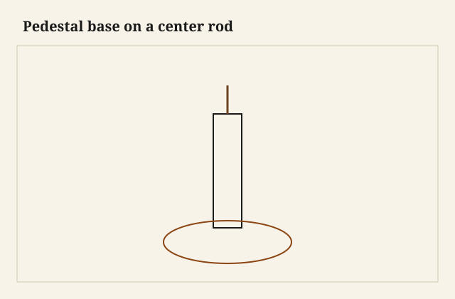

The table was a dining top and a vase and a set of feet, and it would not go through the door as a vase. I had built the column as a brick-laid pretty thing and I had glued the feet as if the house would never move. The house moved. I cut the column free, I put a rod through, and I learned a cheaper lesson than building the second table: a pedestal that splits is a pedestal you can deliver.

<figure class="faj-figure">
  
  <figcaption><strong>Figure 1.</strong> Pedestal base on a center rod. Pack schematic (CC0).</figcaption>
</figure>

<figure class="faj-figure faj-museum">
  
  <figcaption><strong>Figure 2.</strong> Pedestal tables split for travel — gate-leg and pedestal families share center-column thinking in period work. (<a href="https://commons.wikimedia.org/wiki/File%3AGate-leg_table_MET_DT235356.jpg">Wikimedia Commons</a> — CC0).</figcaption>
</figure>

<figure class="faj-figure faj-shop-pending">
  
  <figcaption><strong>Photo 3 (pending).</strong> Three piles. If you cannot make three piles, you built a statue. Keith BBF shop library — unpublished; photographer unnamed until file metadata is pulled Slot: D:\BBF\BBF Photos — pedestal table base apart: block, column, feet (filename pending shop pull)</figcaption>
</figure>

The brick-and-gouge essay was the curve. This is the iron.

## Three piles

**Top block / spider.** The thing the top actually screws to, with slots for movement if the top is solid.

**Column.** Sleeve or solid, brick or stave or turn, with a hole for a rod or a pair of flanges.

**Feet.** A cross, a tripod, a four-foot, joined to a block at the bottom with tenons or with plates.

The rod ties 1 to 3 through 2. Nuts you can reach. If you cannot reach a nut after the top is on, you have designed a museum piece. Dining tables are not museum pieces. They live in rooms that get new rugs.

<figure class="faj-figure faj-shop-pending">
  
  <figcaption><strong>Photo 4 (pending).</strong> The nut you can reach is the nut you will tighten in five years. Keith BBF shop library — unpublished; photographer unnamed until file metadata is pulled Slot: D:\BBF\BBF Photos — rod and nut in pedestal block, access (filename pending shop pull)</figcaption>
</figure>

## Feet that are joints

A tripod with sliding dovetails into a bottom block is a classic, and it can be permanent or it can be pegged. I like pegs I can drive out. A plate under the feet with machine screws into inserts in the foot’s long grain is the shop version that will still be tight after a move. End-grain screws into a foot are a wobble.

The column should not be asked to take the foot joinery in its thin waist. The waist is a look. The block at the bottom is the joint.

A four-foot with two boards crossing is a lap or a half-lap with a plate. I do not glue a cross without a mechanical lock if the table is KD. The cross wants to open when someone sits on a long overhang. A tripod with sliding dovetails into a block is prettier and I still peg it. The peg is the knockdown. The dovetail is the locate.

Leveling: one foot will be short on a real floor. I put a leveler in one foot, or I tell the customer the floor is the other half of the joint. A steel leveler in a carved foot wants an insert, not a screw in end grain.

## How I would build the next one from the start

Full-size drawing of the profile, then three blocks on the paper: spider, column, foot-block. The rod drawn through, nut access drawn as a rectangle you can get a socket into. Then I build the foot-block first, because the feet tell the truth about the table’s footprint. Then the column as a sleeve with a hole I bored before I carved the waist. Then the spider. Then a dry stack with the rod, no top, and I lean on the spider. If it nods, the feet are the problem or the block is the problem. The column is rarely the first sinner unless I bored it drunk.

I put the actual socket I will send in the access hole before I carve the last of the waist. If the socket will not turn, the waist is already too pretty. I open the access, not the caption.

I finish the column off the rod so I can oil the inside of a sleeve. Then I assemble, then I fit the top with figure-eights or slots, then I take it apart and I pack the rod with the nuts in a bag taped to the spider. The nut that stays in a kitchen drawer is the nut that is missing at the house.

I deliver a printed note with the piles: which nut, which way the column sits, where the leveler lives. People lose notes. I also stamp the underside of the spider. The stamp survives the note. The bag of nuts is taped where a hand will find it before the vase goes up.

## The top is not the base

I have seen pedestals sold with the top glued to the spider “so it will not rack.” The top then splits, or the spider tears out, or both. The top can help racking if it is attached in a way that allows movement. It cannot be the only racking member if the base is a noodle. Build the base to stand without the top. Then attach the top as a top.

## Glass-wall heat and a glue line

A brick-laid column has glue lines. A rod hole that is bored after the shop has cooked on the long glass wall will sometimes follow a glue line the way a bit follows a knot. I bore a test in a cutoff, or I leave a core I trust, and I bore the column before the waist is a knife. I once bored after the carving because I wanted the hole to “find center in the pretty.” The drill walked the glue and came out the show. That hole is a plug I still see in raking light.

I level the foot-block on the shop floor before I carve the last of the column. A column that is pretty on a winding block is a table that nods in the room. The floor is the other half of the joint. I let it speak early.

I check the rod threads for paint or finish before the house assembly. A finished thread is a nut that will not start. I bag the rod clean.

## The door is a measuring tool

The door at the house is a measuring tool I should have used in the shop. I deliver in two or three boxes. I assemble in the room. I do not assemble in the shop and then look at a door. I already did that. The joint is the split. The split is the delivery.

I tape the shop-door rectangle on the floor and I walk the assembled vase through it once, so I know the split is not a fashion. If the vase will not make the shop door, the rod is not optional. I will not glue feet onto a carved column and call the carving the joint.

The three piles ride in blankets: column padded so a brick arris does not print, spider with the nut bag already taped, feet as a pair that cannot kick each other. I have thrown a bare column in a truck and watched a glue line chip on a tailgate. The pad is how the delivery still looks like a vase when it stands.

## Failures I will own

Glued statue. Door. Saw. Rod. Do not be me.

A spider that was plywood screwed only into a thin top: the top dimpled. The spider needs spread and the screws need a thickness. Or use figure-eights and let the top be a top.

I once left the nuts in a coffee can on the truck seat and assembled the vase with a hardware-store pair that was a thread too fine. The rod started and then stopped. The house had guests in an hour. Now the nuts ride in the bag on the spider, and I try the actual nut on the actual rod in the shop before I like the finish.

## What I want from D:\BBF

The three piles on a moving blanket, readable as spider, column, feet. The nut access with a socket in it, so a future editor can see the reach. A waist detail that shows a brick line, if the column was bricks, without pretending the brick is the joint. Filename pending. Photographer unnamed until metadata is pulled.

## The judgment

A pedestal that splits is three piles and a rod you can reach. Carve what you want. Do not glue a dining base into a doorway problem. The split is not a lesser joint. It is the joint that respects the stair.
