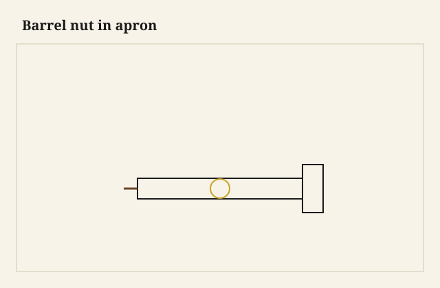

The bolt stopped, half an inch short of tight, with a gritty feel I have learned to respect. The barrel was a degree off. The bolt was cutting a thread in the steel and a slot in the wood. I backed out, opened the apron, turned the barrel with a screwdriver in its slot, and I tried again. This time it went home. A cross-dowel is a meeting of two holes that have no right to miss. When they miss, the joint still “works” in the shop and then walks in the dining room.

<figure class="faj-figure">
  
  <figcaption><strong>Figure 1.</strong> Barrel nut in apron. Pack schematic (CC0).</figcaption>
</figure>

<figure class="faj-figure faj-museum">
  
  <figcaption><strong>Figure 2.</strong> Barrel nuts are hardware, not joinery — joints plate keeps the essay anchored in structure. (<a href="https://commons.wikimedia.org/wiki/File%3AEB1911_Joinery_-_Fig._12.%E2%80%94Joints.jpg">Wikimedia Commons</a> — Public domain).</figcaption>
</figure>

<figure class="faj-figure faj-shop-pending">
  
  <figcaption><strong>Photo 3 (pending).</strong> The barrel is across the grain. The bolt is along the rail. They have to meet as if you meant it. Keith BBF shop library — unpublished; photographer unnamed until file metadata is pulled Slot: D:\BBF\BBF Photos — barrel nut in apron, bolt from leg (filename pending shop pull)</figcaption>
</figure>

I use these on tables that have to ship, on legs that are too pretty to glue forever, on a knock-down that is not a trestle. A stub tenon or a loose tenon still locates if I can have one. The barrel is the clamp. If I cannot have a tenon, I use two bolts, because a single bolt is a pivot.

Locate in wood if you can. Clamp in iron. A barrel without a tenon is still a clamp. A clamp that is also the only locate is a pivot with manners.

## Alignment is the joint

I make a jig. Not a personality — a block that holds the apron and the leg in the relationship they will live in, with bushings for the two bores. The barrel hole is across the apron, at a depth that leaves meat on both faces. The bolt hole comes from the leg, through the tenon if there is one, and meets the barrel’s thread.

<figure class="faj-figure faj-shop-pending">
  
  <figcaption><strong>Photo 4 (pending).</strong> If the holes miss, you are cutting a slot with a bolt. That slot will grow. Keith BBF shop library — unpublished; photographer unnamed until file metadata is pulled Slot: D:\BBF\BBF Photos — jig or story stick for barrel-nut alignment (filename pending shop pull)</figcaption>
</figure>

A story stick will do for a one-off if you are patient. A one-off without a stick is how you get the gritty stop.

The barrel has a slot. The slot faces a hole you can reach with a screwdriver so you can rotate the thread into the bolt. If you bury a barrel with no slot access, you are praying. I do not pray at the drill press.

A plywood saddle that holds a leg and an apron at 90, with two bushings, is the jig I trust. I clamp both parts into the saddle before the bit turns. I do not freehand a barrel meeting. I have. I got the gritty stop. The jig is cheaper than a slotted bolt hole you then have to plug.

I mark the jig with the rail height and the day I bored the bushings so I do not mix it with a jig for a different apron. Mixed jigs miss. Missed holes grit. Grit is a slot. I hang the jig over the bench where this table’s parts live until the first house assembly is done.

## Wood around the steel

The barrel sits in a hole that is a weak point in the apron. I do not put it in a skinny rail. I do not put it next to a mortise wall so thin the clamp crushes the wall. If the apron is 3/4 and the barrel is large, I am close to a bad idea. A thicker apron, or a block glued inside the corner, or a different joint.

A 2-1/4 apron can hold a common barrel with dignity. A 1-1/2 apron is getting thin. A 3/4 apron is a request for a different joint — inserts in a corner block, or a real tenon and a bed bolt, or a tusk. I will not starve an apron to keep a profile and then blame the barrel.

The bolt head wants a washer or a seat so it does not crush the leg. A finished leg with a crushed ring around a bolt is a tell. Countersink, or a brass cup, or a bolt that lives under the top where no one sees the crush.

## A four-leg table I would ship

Aprons with stub tenons into the legs, one barrel per corner, two on the long aprons if the table is long. Jig bored. Bolts from the inside of the legs so the show is clean, or from the outside with cups if the design wants to see iron. I assemble in the shop, I mark the legs to the aprons, I take it apart, I pack the bolts in a bag taped to a leg.

The first assembly at the house should not be the first assembly. The gritty stop should happen on my bench.

I keep a spare barrel of the same size in the bolt bag. A barrel that rounds in its hole is a barrel I will replace, not a barrel I will overtighten. Overtightening a rounded barrel is a stripped thread and a walking corner.

I start the bolt by hand with the barrel held by a long screwdriver. Then I wrench. A bolt I start with a drill is a crossed thread I will not see until the corner walks. Hand first. Steel on steel is not wood. It will not forgive a cross-thread the way a screw in pine will.

## Heat in the truck, width in the wood

A steel bolt in a hot truck will be a different length than a steel bolt in a cold house by a nothing that does not matter. The wood will be a different width by a something that does. I do not overtighten in a dry shop in January. I tighten to seat, and I tell the customer a quarter-turn in June is allowed if they can reach the bolt. If they cannot reach the bolt, I designed a museum piece again.

I have watched an oak apron that was quiet on a January bench swell enough in a wet week to make a barrel feel “tight” when the bolt was only binding on a swollen hole. I back out. I do not invent a slot with the bolt. A slot grows. A grown slot is a walking table.

The table travels as sticks in a blanket, legs in a pair, bolts in the bag. I have tried to be kind and stand the table in a pickup “so they can see it.” The first low branch on a Bradley County road is a hallway I did not measure. Now it ships in piles. The house sees the first standing.

January dry oak will also split at a barrel hole if I bored the hole on the show-side of thin and then wrenched to “make it quiet.” The quiet was a crush. The split showed in June. I bore the barrel in the middle of the meat, I use a washer under the bolt head, and I stop at seat. A crushed ring on a finished leg is a tell I will own: I did that once with a cup I skipped because the bolt was “under the overhang.” People sit. They look under the overhang.

## Failures I will own

Gritty stop, slot in the wood. Recut the barrel hole or use a larger barrel that can be rotated into truth. Do not keep tightening.

I also put one bolt in a table with no tenon. The leg rotated. Two bolts, or a tenon, or both.

A barrel in oak that I did not ease: the threads gall if you cross them. Start by hand.

I once used the jig from a shorter rail on a taller apron because the bushings “looked the same.” The bolt met the barrel as a chord. The corner walked before the first dinner. Now the jig is labeled, and a mixed jig goes on a hook that is not this table’s hook.

## What I want from D:\BBF

An open corner: barrel in the apron, bolt in the air, tenon visible so locate and clamp read as two jobs. The jig on the bench, bushings readable. A bolt that cut a slot, if we still have that scrap. The scrap is the lesson. Filename pending the pull. No invented credit.

## The judgment

A barrel in the apron is two holes and a nut that cannot spin if you seated it. Jig the meeting. Locate with wood if you can. Clamp with iron. When the wrench goes gritty, stop. The joint is telling you the holes missed. Listen before you invent a slot.
