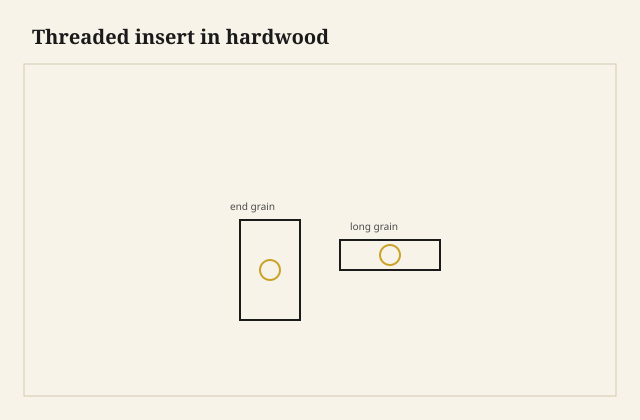

The screw came out with the insert still on it, a little steel owl in the threads, the hole in the oak suddenly a cave. I had put the insert in end grain because the rail ended at the leg and I was in a hurry. End grain will hold an insert the way a fist holds water if you did not give it a collar or a cross. I plugged, I glued a long-grain block inside the corner, I set a new insert, and I wrote it on the wall of my head.

<figure class="faj-figure">
  
  <figcaption><strong>Figure 1.</strong> Threaded insert in hardwood. Pack schematic (CC0).</figcaption>
</figure>

<figure class="faj-figure faj-museum">
  
  <figcaption><strong>Figure 2.</strong> Threaded inserts sit in grain you must read — reference plate for grain-aware hardware. (<a href="https://commons.wikimedia.org/wiki/File%3AEB1911_Joinery_-_Fig._12.%E2%80%94Joints.jpg">Wikimedia Commons</a> — Public domain).</figcaption>
</figure>

<figure class="faj-figure faj-shop-pending">
  
  <figcaption><strong>Photo 3 (pending).</strong> The insert is flush or a hair under. The screw should not bottom on the insert’s lip. Keith BBF shop library — unpublished; photographer unnamed until file metadata is pulled Slot: D:\BBF\BBF Photos — threaded insert in hardwood apron or block (filename pending shop pull)</figcaption>
</figure>

Inserts are how a one-man shop makes knockdown without a barrel if the geometry is a simple screw from a plate or a leg bolt from a known face. They are not magic. They are a thread in a piece of steel that is itself threaded into wood. The wood is still the weak story.

## Long grain is the default

I set inserts in long grain whenever I can: the inside of an apron, a block grain-oriented for the purpose, a cleat. The tap (or the self-tapping insert) then bites fibers that can resist. End grain is a bundle of straws. The insert’s outside thread is a wedge that can split the straws or just polish them.

If the design forces end grain, I add a cross-grain plug or a pin through the insert’s body, or I use a T-nut on the hidden face, or I change the design. A T-nut is ugly and honest. An insert in naked end grain is pretty and a liar.

<figure class="faj-figure faj-shop-pending">
  
  <figcaption><strong>Photo 4 (pending).</strong> Long grain holds an insert. End grain holds one if you help it. Helping is a cross-pin or a better block. Keith BBF shop library — unpublished; photographer unnamed until file metadata is pulled Slot: D:\BBF\BBF Photos — insert in end grain vs long grain, two samples (filename pending shop pull)</figcaption>
</figure>

## Installation is a joinery step

Square to the face. The right hole. The right depth. A screwdriver or a hex that does not wander. Brass inserts in oak can gall; steel in oak is a different bite. I will not name a brand. I will say: if it starts crooked, back it out and start over. A crooked insert is a screw that binds and then strips.

The insert driver that almost fits is how I cam the insert out of square. I use the one that fits. I stop when the insert is flush or a hair under. A proud insert will print on a pad. A deep insert is an insert the screw may not reach.

Epoxy in the hole: some shops swear by it. Some say it is how you hide a sloppy hole. I use a drop if the wood is punky or if the insert is a second chance. I do not use a puddle to save a cave.

The machine screw should not bottom in the insert so hard that it jacks the insert out on the way in. Length is a measurement. Leave a thread or two. I pick a screw length with the insert in front of me, not from a bin in a hurry.

I chase the insert with the machine screw once, by hand, before I put the leg on. A bind on that chase is a crooked insert I can still back out. A bind with the leg on is a bind I will strip.

## A corner block I trust

I glue a long-grain block inside the apron corner, grain running so the insert’s outside thread bites long fiber. The block can be ugly. It lives in the dark. The insert sits in the block. The machine screw comes from the leg or from a plate. This is how I recover from the owl-on-the-screw mistake without enlarging the rail into a cave.

A T-nut on the hidden face of a cleat is a captured thread that does not care about your tap. It needs a face. It will spin if the prongs do not bite and you did not epoxy. I use them under a bench or inside a ply box. I do not use them on a show post.

## Species, seasons, the hole that changes

Soft pine will not hold a coarse insert the way oak will. The insert will spin. Then you are in epoxy country. I would rather change the joint than epoxy a pine hole and call it engineered. Pecan and hickory will hold and they will also split if you force a tap. Pilot the size the insert asked for. Hero pilots are caves.

An insert in long-grain oak will take more assemblies than a confirmat in a ply edge. It will still wreck if you cross-thread or if you jack it out by bottoming a short screw. I count threads.

August oak on the glass wall can be a little punky at the surface and still hard an inch in. A tap that feels easy at the mouth and then grabs is a split waiting. I ease the start and I do not lean on the driver to “get it flush in one go.” January oak will hold like iron and then split if the pilot was the summer size I remembered. I pilot what this board asked for today.

I keep a scrap of the same species with a good insert and a bad end-grain insert wired to the box of inserts. The scrap is the argument I will have with myself when I am in a hurry. Hurry puts inserts in end grain. The owl on the screw is hurry. The block is the cure.

## A plate that has to travel

A knockdown plate on an apron — a table that has to come off a spider, a rail that has to leave a post — is why the insert exists. I flatten the plate seat before I set the four inserts. Inserts are not a way to pull a winding rail true. True the rail, then insert.

I letter the plate to the rail. A plate that can go on four ways will find the one way that binds. The hallway does not care which insert you stripped on the landing. I pack the machine screws in a bag taped to the plate, same religion as a pedestal nut.

I clamp the corner block while the glue goes quiet, and I do not set the insert until the block is a block, not a slippery pad. An insert driven into a block that is still creeping is an insert that dries crooked. The driver lives in the insert box, not in a coffee can of almosts.

A move down a stair is the test the insert was paid for. I take the plate off in the room, I carry the top as a top, and I expect the hole to be the same hole at the bottom of the stair. If it is not, I did not set long grain, or I jacked the insert by bottoming a short screw in the shop and called the bind “snug.”

## Failures I will own

Owl on the screw. Block, new insert, long grain.

I also used a coarse furniture screw into a hole I called an “insert” because I had run a tap through oak and felt proud. A tap in oak is not an insert. It is a hole that will grow. Steel has a job here.

A plate with four screws into four inserts that were not coplanar: the plate bent and one insert started. Flatten the plate seat. True the rail, then insert.

I once set a brass insert in oak with a driver that almost fit, and I watched it walk a degree as I leaned. The machine screw bound. I stripped the brass trying to “persuade” it. Steel insert, driver that fits, back out at the first lean. Persuasion is how you buy a cave.

## What I want from D:\BBF

A flush insert in a long-grain block, and the same block’s end-grain failure if we kept it. Two samples in one frame is the whole argument. The steel owl on a screw, if that scrap still lives in a jar. Filename pending. Photographer unnamed until metadata is pulled.

## The judgment

Threads in the hardwood are a steel hole in long grain, set square, with a screw of a length you measured. End grain gets help or it gets a different joint. Knockdown only works if the hole is the same hole the second time. That is the whole standard.
