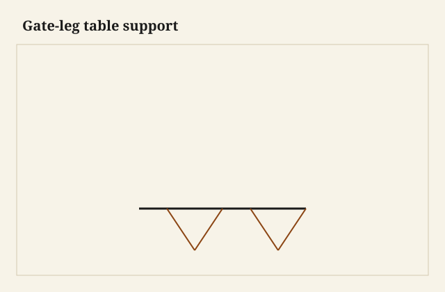
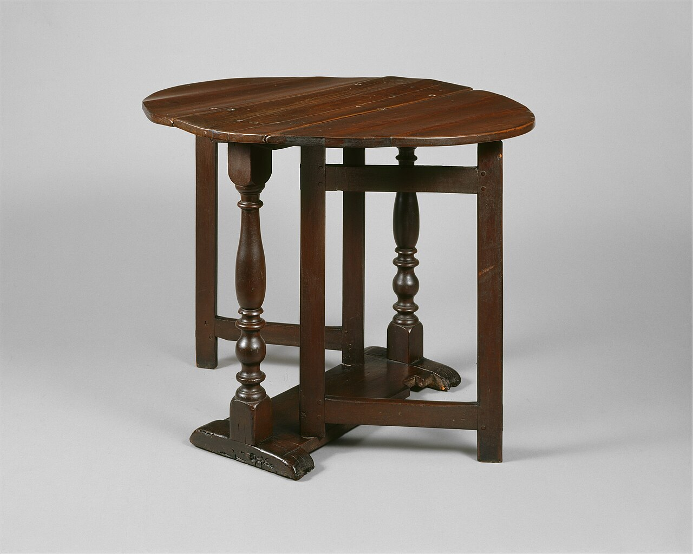

The leaf was up and the gate was out, and I could rock the table with a finger at the corner of the leaf. The gate was a pretty little frame — mortised, even — and it was hinged like a cabinet door. A door is allowed to be a parallelogram if the catch holds it. A table is not. The leaf had become a ramp. Dinner on a ramp is a story people tell without kindness.

<figure class="faj-figure">
  
  <figcaption><strong>Figure 1.</strong> Gate-leg table support. Pack schematic (CC0).</figcaption>
</figure>

<figure class="faj-figure faj-museum">
  
  <figcaption><strong>Figure 2.</strong> A gate-leg table with the gate open — the load path this essay names. (<a href="https://commons.wikimedia.org/wiki/File%3AGate-leg_table_MET_DT235356.jpg">Wikimedia Commons</a> — CC0).</figcaption>
</figure>

<figure class="faj-figure faj-shop-pending">
  
  <figcaption><strong>Photo 3 (pending).</strong> The gate is a leg frame. If it racks, the leaf becomes a ramp. Keith BBF shop library — unpublished; photographer unnamed until file metadata is pulled Slot: D:\BBF\BBF Photos — gate-leg table, gate open, leaf up (filename pending shop pull)</figcaption>
</figure>

A gate-leg is knockdown in spirit: the table halves its footprint. The joint is the gate’s *frame* and the way that frame locks when it is a table.

## Build the gate like a chair, not like a door

Two legs, two rails, real tenons, a stretcher if you have the room. I drawbore or pin if I can. I do not biscuit a gate and hope. The hinge stile is one of the legs or a stile next to the leg; either way it has to stay square when someone leans on the leaf.

The hinge: a pair of hinges on a center that is plumb. If the axis leans, the gate rises or drops as it swings and then the leaf is not at the plane of the top. I hang the gate after the main frame is true. I do not hang it from a frame that is already in wind.

<figure class="faj-figure faj-shop-pending">
  
  <figcaption><strong>Photo 4 (pending).</strong> The hinge wants to be a door hinge. The latch is what makes it a table. Keith BBF shop library — unpublished; photographer unnamed until file metadata is pulled Slot: D:\BBF\BBF Photos — gate hinge and latch, underside (filename pending shop pull)</figcaption>
</figure>

## The latch is the second joint

A gate that only swings and friction-parks under the leaf will creep. I like a spring catch, a hook, a pin in a hole, something that says *here*. The rule-joint essay already asked the leaf to meet the top. The gate has to hold that meeting. If the catch is shy, the leaf sags and the rule joint opens into a ditch.

Some gates have a small tenon or a block that lands in a mortise in the underside of the leaf. That is a locate. I like it. It is also a thing that will tear out if the leaf is thin and the block is a screw in end grain. Long grain, or an insert.

Locate in wood if you can — the block in the leaf, the latch pin in a hole. Clamp in iron if the latch is a hook. The hinge is neither. The hinge is permission to swing. Standing is a different job.

## Hanging the gate after the table is a table

I build the main frame first — legs, aprons, the rule joint if there is one — and I get it standing without a wobble. Then I hang the gate. A gate hung on a winding table will inherit the wind and add a swing. I shim the hinge stile until the gate’s top rail meets the leaf at the plane I want, then I mortise.

Two hinges, not one. A single hinge is a pivot and a sag. The knuckles should share an axis you can sight. I sight the two hinge knuckles with a stick. If the stick rocks, the gate will rise and the leaf will miss the plane. I fix the axis before I cut a latch. A latch will not correct a rising gate.

A stop at the useful angle keeps the gate from going past and lifting the table. I put the stop on the underside where a foot will not find it. A stop that lives on the floor is a dent. A stop is joinery. A dent in the floor is not.

## The leaf is a lever

When the leaf is up, the gate is holding a cantilever. The latch has to take that without a creep. I hang a bag of books on the up leaf and I walk away for a minute. If the latch has crept when I come back, I change the latch. A latch that holds a hand and not a bag is a latch for a photo. Dinner is a bag of books that talks and leans.

I sight the leaf plane from the side of the table after the bag of books has sat. If the rule joint opened, the latch crept. I change the latch, not the leaf.

A swing-leg (one leg, not a gate frame) is a cousin. It has even less rectangle to offer. I treat a swing-leg as a post with a good tenon into a hinge rail, and I still latch it. A single leg that only friction-parks is a leaf that will sag during dinner.

## Against the wall, through the hall

The table against a wall, gates in, is a different object. The gates should not scrape the floor every time they move. A little clearance, a little felt if the floor is precious. A gate that shaves the floor is a gate whose axis is already wrong or whose legs are already long.

I put felt on the gate foot if the floor is precious, after the axis is true. Felt will not hide a shave. A shave means I recut a leg or I remortise a hinge. Then felt.

In the shop I walk the folded table through the chalk door. A gate-leg that is “fine open” and too thick folded for a 1920s turn is a table I will recut the leaf for, or I will admit it is a dining table that lives in the room. The knockdown is the footprint. If the footprint will not travel, the hinges were decoration.

## Wet week, dry week

A leaf that sat through a wet week on the glass wall will cup. The gate that was plumb in a dry January shop will then bind at one end of the swing and flop at the other. I finish both faces of the leaf. I hang the gate after the leaf has gone quiet, not the afternoon I glued the rule joint.

I once hung a gate the same day I jointed a leaf that had come in from a humid truck. The leaf flattened overnight. The gate, which had met the leaf at noon, met air at the far corner in the morning. I remortised. Now the leaf sits stickered in the shop until it stops moving, and then I hang.

I clamp the gate frame to the bench like a small chair when I chop the tenons — holdfast on the stile, caul on the show — so the shoulder does not creep under the mallet. I pare hinge mortises with a router plane after I have sighted the stick on the knuckles. A chisel-only mortise that is deep at one end is how an axis that looked plumb on Monday rises on Tuesday.

## Failures I will own

Door-built gate. Rack. Recut with real tenons.

I also hinged a gate off a thin apron with screws that found the mortise of the main rail. The apron split. The hinge wants its own meat. Design a hinge stile.

A gate that opened past the useful point and then would not come back without lifting the table: stop it.

I biscuit-joined a practice gate because I wanted to see the swing before I “committed” to mortises. The biscuits held a polite hand and then racked under the bag of books. I burned the gate for kindling and I cut a new one with tenons. A gate is a small chair. Chairs get tenons. A practice failure you can own is cheaper than a dinner that slides.

## What I want from D:\BBF

Gate open, leaf up, a hand on the corner of the leaf — the rack test. The underside latch. The hinge axis sighted with a stick if we have a working frame. Filename pending the shop pull. Photographer unnamed until metadata is pulled.

## The judgment

A gate that has to stand is a small chair you hinged to a table. Mortise it, latch it, hang it plumb. The knockdown is the footprint. The joint is the refusal to become a parallelogram when the leaf is a dining top.
