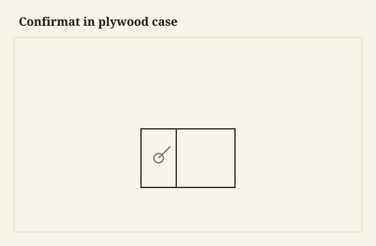

The confirmat went in with that waxy, slow bite that means the pilot was right, and the ply edge did not mushroom. I have also gone in with a single stab from a drill that was “close enough” and watched the face veneer lift like a scab. A confirmat is not a drywall screw with a European passport. It is a two-diameter fastener. Treat it like a small bolt you cut the nut for in the wood.

<figure class="faj-figure">
  
  <figcaption><strong>Figure 1.</strong> Confirmat in plywood case. Pack schematic (CC0).</figcaption>
</figure>

<figure class="faj-figure faj-museum">
  
  <figcaption><strong>Figure 2.</strong> Confirmats are plywood case hardware — period cabinet plate until shop ply photos land from D:\BBF. (<a href="https://commons.wikimedia.org/wiki/File%3AModern_cabinet_work%2C_furniture_and_fitments%3B_an_account_of_the_theory_and_practice_in_the_production_of_all_kinds_of_cabinet_work_and_furniture_with_chapters_on_the_growth_and_progress_of_design_and_%2814593727998%29.jpg">Wikimedia Commons</a> — No restrictions).</figcaption>
</figure>

<figure class="faj-figure faj-shop-pending">
  
  <figcaption><strong>Photo 3 (pending).</strong> The head sits. The thread is in the edge. The edge was piloted. Keith BBF shop library — unpublished; photographer unnamed until file metadata is pulled Slot: D:\BBF\BBF Photos — confirmat in plywood case corner, head seated (filename pending shop pull)</figcaption>
</figure>

This belongs next to the 32mm essay. Same world. A one-man shop will still build a ply case that has to come apart. Confirmats can be removed and driven again a few times if you did not wreck the edge. After a few times, the edge is a hole. Then you insert, or you dowel, or you admit the case is now permanent.

Ply is the native food. I will not confirmat a walnut solid case to save an afternoon. Solids get inserts or tails. The caption says ply and screw, or it does not get this screw.

## Pilot both pieces

The face panel gets a clearance hole for the shank. The edge gets a smaller hole for the thread. Special step-drills exist because this is not optional. I mark a fence so the confirmat lands in the middle of the edge, not a hair toward the show face where it will telegraph.

<figure class="faj-figure faj-shop-pending">
  
  <figcaption><strong>Photo 4 (pending).</strong> Two diameters. One hole for the shank, one for the thread. A single stab is how you split a panel. Keith BBF shop library — unpublished; photographer unnamed until file metadata is pulled Slot: D:\BBF\BBF Photos — confirmat step-drill or two-diameter pilot (filename pending shop pull)</figcaption>
</figure>

Clamps while you drive. A confirmat will walk a panel if the panel is free. The walk is a case that is out of square and a screw that is now a clamp on a diagonal.

I still like a rabbet or a tongue to locate, then the confirmat to clamp. Location plus clamp. The same sentence as the cam, the barrel, the bed bolt. Hardware is not a substitute for a shoulder. It can be a substitute for glue.

## The step-drill stays in the press

The step-drill lives in the drill press for this job, not in a hand drill I cannot keep square to an edge. A tipped confirmat is a mushroom. A mushroom is a cap that will not sit. I joint the edge first. A clean edge takes a thread. A burned edge from a dull blade powders, and the powder is not a nut.

I set a fence on the press so every edge hole is the same inset and the same depth. Face clearance holes come from a story stick I made for that case — one stick, the hole centers marked, no tape I re-read four times. The stick hangs on the same hook as the step-drill so I cannot lose the relationship.

I dry-assemble with clamps and no screws, check for square against a rod from corner to corner, then I drive. The first confirmat in a corner sets the relationship. If it walks, I back it out and I clamp harder. I do not drive the other three to “pull it over.” Four screws pulling a panel into a parallelogram is a case you will fight at the wall.

## A case I would actually confirmat

A four-shelf ply bookcase, 30 by 12 by 72, maple veneer, a rental that will move twice. I would rabbet the back, confirmat the four corners and the fixed middle shelf, and leave the other shelves on pins in a 32mm row if I had the grid. The middle shelf is the racking rail. Without it the case is a ladder even if every confirmat is perfect.

I cut the parts from one sheet when I can so the veneer direction agrees. I mark inside faces. Maple veneer will telegraph a confirmat that sat a hair toward the show. The fence is cheaper than a filler that never quite matches.

Caps over the heads: I use them on show faces. I do not use them as a way to hide a head that is already crushed. Seat the head in a clean countersink. The cap is a cover, not a bandage.

## Failures

Scabbed veneer. Step-drill. Clamp.

I also used confirmats in solid-wood edges. They can work. They also split. Ply is the native food. Solid gets inserts or real joinery. Do not make a walnut case prove a ply screw.

A confirmat as a hinge: no.

The walk I owned was a tall side I drove without the rabbet seated. The panel crept a sixteenth as the thread pulled. I kept driving. The case was then a parallelogram you could see from the glass wall. I backed all four out, I clamped the rabbet home, I drove the first corner true, and I plugged nothing because the holes had not yet ovaled. Pride would have been the fifth screw.

## How many teardowns

I will take a confirmat out twice without much grief if the pilot was right. The third time the edge starts to look polished. The fourth time I am in a hole. Then I go to an insert in a plugged hole, or I move over a half-inch and I plug the first. Design the case so the customer is not doing this every spring. Shop fixtures can be a different number. Furniture that ships once and lives is one teardown at delivery and maybe one more at a move. That is the life I drill for.

If I expect many teardowns, I insert from the start and I use the confirmat only where I mean a few. An insert in ply wants a clean hole and a bit of epoxy or a tight thread in the face — [VERIFY] the house habit before anyone prints a recipe. The confirmat is not jealous. It is a tool with a short life in an edge.

## Summer in a 65-foot shop, and a stair that is a truck

Ply still moves a little, and the glue in the core still smells when the glass wall cooks the bench. I do not leave a dry-fit case clamped overnight in that heat with confirmats half-driven; the heads will print. Drive, seat, done. If I have to stop, I take the screws out so they are not a clamp on a swelling edge.

August humidity will swell a ply edge just enough that a confirmat you left sitting in a half-driven hole becomes a clamp you did not mean. I have a printed ring in a maple cheek that is the shape of a confirmat head. I sanded it. I still see it.

The hallway changes this joint when the case has to come apart on a landing and go back together in a room that is not square. I square the case to itself, not to the wall, and I shim the gap. Four confirmats used as wracking irons against a drunk wall will oval the edges on the first move. The wall is not a clamp.

A truck is a stair that rattles. I bag the confirmats with the driver that fits them. A kitchen that has every bit except this one is a kitchen that will grab a drywall screw. That substitution is a scab I already described.

## When I put the box away

If the case is walnut solids, I do not reach for this screw. If the case is a chest a person will call furniture in the sitting-room sense, I dovetail or I loose-tenon and I use hardware as a clamp, not as the corner. If the case is ply and it has to live in a truck, the confirmat is a citizen. The joint can still be square, clean, and kind to the next person who has to take it apart.

## What I want from D:\BBF

A close frame of a seated head in maple ply, raking light, no mushroom. A second frame of the step-drill in the press — not a hand drill — and the two diameters on a scrap with the names of the diameters written in chalk, not a brand, a size. The story stick hanging next to the fence. If the library has a blown face-veneer scab, that is a better teacher than a catalog shot of a clean case. Do not invent the frame.

## The judgment

A confirmat in ply is a piloted, clamped, two-diameter fastener that can knock down a few times. It is not a dovetail. It is not a sin in a sheet-good case. The sin is a single stab, a walnut chest asked to prove a ply screw, and a caption that says handmade when you meant handy.
