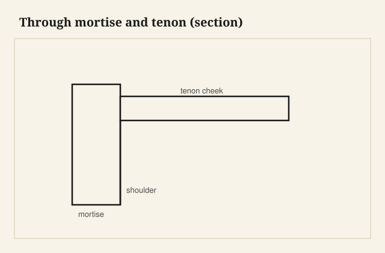

A through mortise and tenon lives or dies on parallel cheeks and shoulders that land at the same time. Layout is the whole game—saw to the line, pare the waste, then test fit while you can still see daylight.

## At the bench

Knife the shoulder lines full width before you chop the mortise. Chop from both faces if the mortise is deep; keep the cheeks vertical with a wide chisel riding your layout. Size the tenon fat, then sneak up with a shoulder plane until the joint slides home with hand pressure only.

<figure class="craft-figure">
  
  <figcaption><strong>Figure 1.</strong> Cheek faces stay parallel; shoulders define depth stop.</figcaption>
</figure>

## Photo slot (staged)

**Staged only** — drop a `mortise-and-tenon-basics` frame from `D:\BBF` when the shot is captioned and color-corrected. Do not publish catalog pulls.

## Checklist

- Mortise walls square to the face; tenon cheeks parallel within a shaving.
- Shoulders seat fully before cheeks bind—light at the perimeter means a high spot.
- Mark face orientation on both parts before disassembly for glue.
