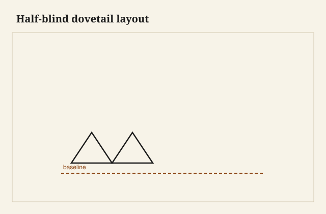

The gauge line is a hair deeper than it needs to be. That is on purpose. When the saw stops in the line, and the chisel pares to it from the waste side, the drawer side will meet the front in a plane you can feel with a thumb. Sneak past the line and you have a step. Leave the line proud and you have a ridge that will show under finish like a scar someone tried to powder.

Hand-cut dovetails are not a moral exam. They are a corner that locks in two directions without a nail. Pins and tails, slope, baseline, waste. The romance is other people’s problem. The work is usually a drawer, sometimes a carcase, rarely a box someone will call an “heirloom” before it has held a winter of socks.

<figure class="craft-figure">
  
  <figcaption><strong>Figure 1.</strong> Baseline and slope lines before any saw cut.</figcaption>
</figure>

## Why this joint, on this corner

A drawer wants to be a shallow box that runs true, takes a pull, and does not open at the front corners when a child yanks it. The half-blind dovetail puts tails on the side and pins inside the front, so the show face stays a clean board. You see the joint from the side if you look. You should look.

Through dovetails on a blanket chest or a tool box show both faces. They are faster to cut and easier to teach. They are also how a lot of eighteenth-century work said, without a speech, that the maker was not hiding. Machine through-dovetails from a jig can be handsome. They can also look like a row of identical plastic. The hand-cut row is a little drunk if you are honest, and that drunkenness is information: this was a person, this was an afternoon, this slope was walked with a saw.

A nail-and-glue drawer is a different object. It can be serviceable. It will not take the same yank. The front will creep. I have patched enough of them to know the sound they make when the nail lets go — a dry click, then a sag.

## Pins first, tails first

Pick one and keep it for a season. Tails first is common in American benches: cut the tails, scribe the pins from them, chop. Pins first is the other church: the pins are the harder sawing for some hands, and the tails get marked from a finished pin board. Both work. Switching mid-drawer is how you get a corner that almost closes.

Layout is where the joint is designed. Wide tails, skinny pins — the look most people mean when they say “hand-cut.” Even pins and tails — more machine, more Arts and Crafts if the slope is shallow. A single half-pin at each edge so the corner does not end on a weak sliver. On a 4-inch drawer side I want the half-pins real, not a rumor. On a deep chest I will add pins so the waste does not become a chisel marathon in one socket.

Slope: 1:6 in softwood reads steep and crisp. 1:8 in hardwood is a common quiet slope. Oak will take either if you do not get greedy and undercut the pins to a knife-edge. A knife-edge pin is a pin that will break in the clamp. [VERIFY] if the shop keeps a single slope on production drawers; a house slope is a kindness to the next person.

## The saw, then the waste

A thin-kerf dovetail saw, rip-filed, will follow a line if you start it like you mean it. The first stroke is a nick on the far corner, then the near, then the saw finds the kerf. Do not grip the handle like it owes you money. The teeth are doing the work. Your job is to not steer after you have started.

Waste between the pins: I like to pop most of it with a coping saw or a fret, staying off the baseline, then pare. Some people chop it all. Chopping is fine if the chisel is sharp and you work to the middle from both faces so you do not blow out the back. The back is where drawers look cheap.

The baseline is sacred. A chisel set in the gauge line, bevel away, a tap to set the wall, then the waste comes out. If you pry, you crush. If you rush the last sixteenth, you leave a hump and the joint will not seat. The sound of a good seating is not a crack. It is a dull, pleased thump, and then the boards are one corner.

Half-blind sockets in a drawer front are the part that teaches patience. You saw the pins’ cheeks as deep as the tail thickness, then you chop the waste in a hole you cannot see the bottom of until you have made it. A router can hog the waste if you stay shy of the line. The last wall is still a chisel. A router that kisses the baseline will leave a burn and a width you cannot put back.

## Fit is not a vibe

Too tight and you will split the front when you drive it. Too loose and you will flood the joint with glue and call the squeeze-out a sign of quality. The fit I want is: together by hand, last eighth with a block and a measured mallet, no shine of crushed fibers on the pins. If I have to hammer, I have a pin that is fat at the base — the usual mistake. The saw wandered, or I marked fat and did not pare.

Glue on dovetails is a film on the long-grain faces. You do not need to butter the end grain like a sandwich. Clamp across the tails so the pins draw in. Check diagonal. A drawer that is a parallelogram will announce itself on the first runner.

I still use hide glue on a drawer I expect to be around in thirty years. PVA is what the shop will grab at 4 p.m. Either one, cleaned off the inside corner before it skins, because a glue ridge inside a drawer is a cut waiting for a knuckle.

## Machines, and the thing they cannot fake

A good jig and a sharp bit will cut tails that fit. Production drawers can be excellent this way. The tell is uniformity and a slightly rounded inside corner from the bit. There is no shame in that on a kitchen run. There is a small lie in advertising those corners as “hand-cut.” The customer is not stupid. They can see a router radius.

What the jig does not teach is the recovery. A hand-cut mistake is usually local: one pin, one socket, a slip of veneer, a new front if you have been truly proud. You learn the wood. Oak chips. Walnut pares like it wants to help and then tears if the grain dives. Cherry burns if your chisel is dull. Maple laughs at a soft mallet.

South Arkansas shops that grew up around mill stock have always mixed methods. A drawer that leaves Wilmar can be jigged and still honest if the wood is the wood and the fit is the fit. The hand-cut drawer is for the job that pays for the hour, or for the cabinetmaker who is keeping their eye in. Both can live in the same building.

## What I look for when I open a drawer

Baseline tight. No daylight at the tail roots. Pins that do not look extruded. A bottom in a groove, not nailed up into the end grain like an afterthought. Runners that match the side thickness. If the piece is old, a slight wear on the bottom edges and a smell of beeswax or paraffin where someone helped it later.

I do not need the pins tiny enough to thread a needle. Tiny pins are a flex. They can be beautiful. They can also be a row of weak teeth. I would rather see three well-proportioned pins on a small drawer than seven that look like a comb.

The waste pile on the bench is always more than you think. Little triangles, a curl of end grain, the smell of the species. That pile is the joint. What remains is the part you keep. If you rush the pile, you keep a gap.

I run a thumb over the inside corner after the glue has set and the proud tails have been planed flush. The plane takes a whisper. The grain of the side runs into the front and stops, locked. That stop is the reason to do it. Not the photograph. The stop.
