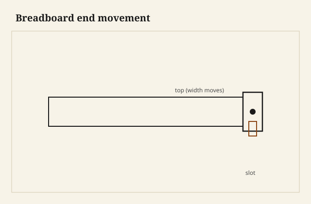

Breadboard ends tame cupping on wide tops, but they fight the top's width change unless you let the center hold and the ends breathe.

## At the bench

Glue only the center few inches of the tongue into the end cap. Drill the center pin tight; elongate outer pin holes toward the ends. Drawbore if you use pegs—slight offset pulls the shoulder tight without locking the whole width.

<figure class="craft-figure">
  
  <figcaption><strong>Figure 1.</strong> Fixed center; slots at ends for seasonal width change.</figcaption>
</figure>

## Photo slot (staged)

**Staged only** — drop a `breadboard-ends` frame from `D:\BBF` when the shot is captioned and color-corrected. Do not publish catalog pulls.

## Checklist

- Center fixed; end pins in slots, not tight holes.
- Glue line short at the middle—no squeeze-out bond across the full width.
- Check end-cap shoulders for twist before pegging.
