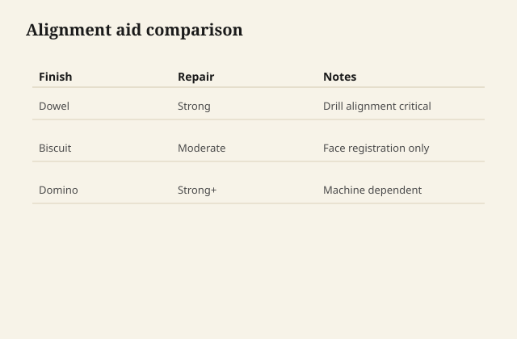

Dowels and biscuits both register faces in a glue-up, but they answer different panics: dowels resist shear and keep parts from creeping; biscuits mainly align surfaces.

## At the bench

For a carcass back or web frame, dowels let you dry-fit with alignment pins then drive home on glue. Biscuits buy open time on wide panels but do not count on them for racking strength. Mark faces so you do not flip a part mid-glue.

<figure class="craft-figure">
  
  <figcaption><strong>Figure 1.</strong> Dowels: strong registration. Biscuits: face alignment, weaker shear.</figcaption>
</figure>

## Photo slot (staged)

**Staged only** — drop a `dowel-vs-biscuit` frame from `D:\BBF` when the shot is captioned and color-corrected. Do not publish catalog pulls.

## Checklist

- Dowel centers punched from one story stick—no cumulative drift.
- Biscuit slots on both faces before glue; clamp plan written down.
- Dry clamp once with cauls that mimic final pressure.
