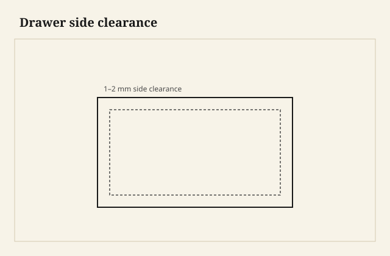
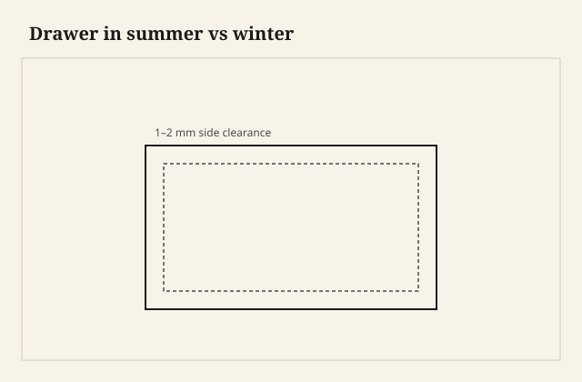

The drawer that binds does not bind in the photograph. It binds on a Saturday in June when the air is thick and the guest bedroom has been closed. You pull. The side swells against the runner, or the bottom has humped and kisses the dust panel, or the back is high because someone measured the opening and then built the box as if wood were aluminum.

I have a little hornwood stick I use as a feeler. If I cannot run it along the top of the drawer side in the opening, I am not done, even if the drawer looks tight and expensive. Tight is not the same as fitted.

<figure class="craft-figure">
  
  <figcaption><strong>Figure 1.</strong> 1–2 mm total side play; front reveal even left-right.</figcaption>
</figure>

<figure class="craft-figure">
  
  <figcaption><strong>Figure 2.</strong> Size for mid-RH; runners take up slack.</figcaption>
</figure>

## The box is a climate object

Drawer sides are usually the height that moves. Grain runs front to back, so the *height* of the side is the cross-grain dimension. In a wet month the side gets taller. If you fitted it to a coat of paint in January, June will lock it. The gap you leave at the top is the joint with the weather.

How much gap: enough. I will not print a universal 1/16 and walk away. A 5-inch side in white oak in a house that swings hard needs more thought than a 2-inch side in quartersawn walnut in a tight case. [VERIFY] the house clearance on the line you are building. The mistake I see is a proud, even reveal around a false front that was fitted to look like furniture jewelry. The reveal is paint. The side is the problem.

Bottoms: a panel in a groove, grain running so the movement goes left-right, nailed or screwed at the back in a slot, free at the front of the groove. A bottom glued all around is a drum that will split or will bow and rub. Plywood bottoms are stable and I use them without a speech when the drawer is a kitchen drawer and the budget is a kitchen budget. Solid bottoms in a fine case are a pleasure if you let them move.

## Runners, kicks, and the cheap plastic that sometimes wins

Wooden runners under the side, or a groove in the side riding a slip, or a center runner on a wide drawer so the box does not skew. Kickers above so the drawer does not dive when you pull it out halfway and put a hand on it. That dive is how you dump silverware and how you break a back dovetail.

Wax. Paraffin. A heel of a candle. Not a spray that turns to gum. The first pull after wax is information. If it still stutters, you have a ridge, a proud pin, a runner that is not coplanar with its pair.

Commercial slides — undermount, side-mount, the soft-close that everyone wants — are a different product. They can be excellent. They ask for a box built to a spec, usually a side thickness and a width the catalog printed. They do not forgive a case that is out of square. I do not sneer at them on a kitchen. I sneer at a kitchen that uses slides to hide a box that was never square, because the slide will say so in a year.

A wide file drawer on wooden runners without a center guide will rack in the opening. You will call it swelling. It is geometry.

## Sides: thickness, species, the wear

Maple and yellow poplar have been drawer-side woods for a reason: they wear, they plane, they do not cost like walnut. Oak sides in an oak case can be right if you like the look when the drawer is open. Oak on oak without a harder sneak or a wax habit will wear a trough. I have seen 19th-century pine sides worn to a crescent. That crescent is a record of use. It is also a drawer that needs a patch or a new runner.

Thickness: 1/2 inch is a common honest side. 3/8 on a small drawer. 5/8 on a heavy one if the opening allows and the joint at the front can take it. A thick side with a skinny tail is a thick side that will split at the pin.

I plane the sides after the dovetails are flush, not before I swear the width is final. Glue and seating change things. Then I shoot the bottom edges so both sides sit on the runners like a pair.

## The opening is the other half of the drawer

A case that is not square gives you one drawer that looks right and three that you “fit.” Fit, in that sentence, means you are carving a box to a mistake. Square the case. Check diagonals before you glue the carcase. A twisted case will bind a perfect drawer on one corner.

Dust panels are not snobbery. They keep a down-traveling sock out of the drawer below, and they stiffen the case. They also give you a plane for the runner. A case without dust panels can still run well if the runners are supported and the sides cannot sag. Many cheap chests skip them. You can hear it when you walk by.

Stops: a block at the back so the false front does not punch through the case, or a stop that catches the front. I like a stop you can move. A glued stop in the wrong place is a chisel later.

## Fronts, false fronts, and the lie of the even gap

A half-blind dovetailed front is the drawer. A false front screwed from inside is a face you can adjust. Kitchens live on false fronts. Fine chests can go either way. If you use a false front, do not pretend the box can be sloppy. The slides still see the box.

The even reveal around a bank of drawers is layout. You leave the fronts proud and sneak them as a set. You do not finish first and then discover one front is a heavy sixteenth. Or you do, once, and then you stop doing that.

## When I pull a drawer in a strange house

I listen. Wood-on-wood with wax is a hush. Plastic slides are a hiss. A grind is grit in the runner or a proud nail. I pull it all the way. If the back drops, there is no kicker. If it skews, there is no center guide on a wide box. If it dies at two inches of travel, June has the side, or a screw from the runner has backed out.

Repair is often a sneak of hardwood on the runner, a plane shaving on the side, wax, and a conversation about the humidifier. People want a magic spray. The magic is clearance and a case that was square in the first place.

In a Wilmar kitchen run, the honest drawer is the one that still moves in August. That is a more useful boast than a species name on the front. The front is what they bought. The side is what they live with. I put my name, privately, on the side.
