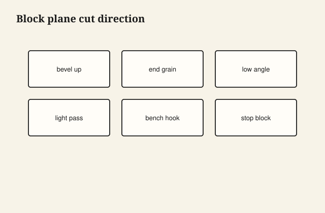

Block planes excel at end grain and quick chamfers because the low bed angle shears instead of wedging. They punish you on downhill face grain if you plane the wrong direction.

## At the bench

On end grain, plane into the uphill fibers—often from the outside corners in. Skew the plane slightly to shorten the effective cutting edge. For face-grain cleanup, try a higher pitch plane if the block chatters.

<figure class="craft-figure">
  
  <figcaption><strong>Figure 1.</strong> Plane into the uphill grain on end grain.</figcaption>
</figure>

## Photo slot (staged)

**Staged only** — drop a `block-plane-use` frame from `D:\BBF` when the shot is captioned and color-corrected. Do not publish catalog pulls.

## Checklist

- Light passes; thick shavings on end grain tear the far corner.
- Knife a witness line so you know when the end is square.
- Plane sole waxed or dry—sticky soles skip on hard species.
