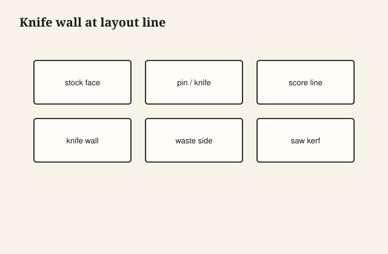

Marking gauge lines that saws can follow — working notes for the shop. Measure on your stock; humidity and species move the numbers.

## At the bench

Use the diagram as the layout reference. Mark waste sides before any saw cut. Dry-fit twice when shoulders must close at the same time.

<figure class="craft-figure">
  
  <figcaption><strong>Figure 1.</strong> Saw kerf rides in the knife wall; waste side is obvious.</figcaption>
</figure>

## Photo slot (staged)

**Staged only** — drop a `marking-gauge-technique` frame from `D:\BBF` when the shot is captioned and color-corrected. Do not publish catalog pulls.

## Checklist

- Layout lines are knife-deep where saws must register.
- Test fit without glue; note where light shows through.
- Finish samples on offcuts from the same milling session.
