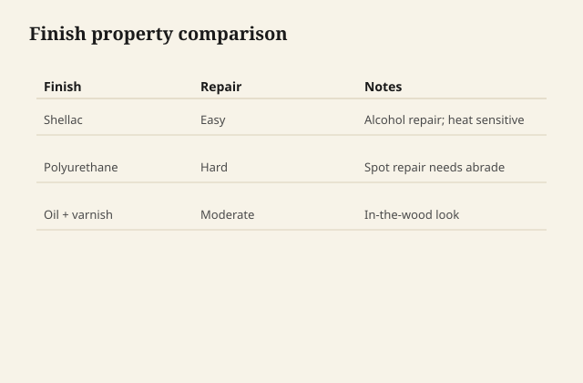

Tabletops need a finish you can live with after the first coffee ring. Shellac repairs in minutes; polyurethane builds a harder film but fights spot fixes.

## At the bench

Shellac sticks to itself forever—alcohol rewets and blends. Poly wants mechanical prep between coats and does not melt into old film. Pick shellac when you touch up often; pick poly when abrasion matters more than repair speed.

<figure class="craft-figure">
  
  <figcaption><strong>Figure 1.</strong> Shellac: fast repair; poly: harder film, slower spot fix.</figcaption>
</figure>

## Photo slot (staged)

**Staged only** — drop a `shellac-vs-polyurethane` frame from `D:\BBF` when the shot is captioned and color-corrected. Do not publish catalog pulls.

## Checklist

- Sample boards: same species, same prep, same number of coats.
- Heat resistance tested with a warm mug on scrap—not on the delivery piece.
- Write the product and date under a leaf or on the back rail.
