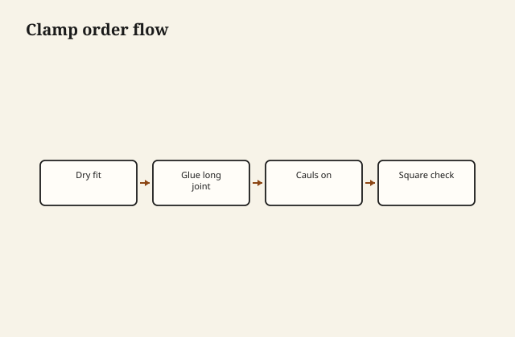

Glue panic is what happens when you skipped the dry clamp rehearsal. Know the order, the longest open-time joint, and where the cauls go before the bottle opens.

## At the bench

Dry-fit with all clamps you will use. On glue day, spread on the biggest joint first, then sub-assemblies, then check square on the diagonals. Cauls spread pressure; wax paper keeps them from becoming permanent.

<figure class="craft-figure">
  
  <figcaption><strong>Figure 1.</strong> Dry fit → glue longest joint → cauls → check square → wipe squeeze-out.</figcaption>
</figure>

## Photo slot (staged)

**Staged only** — drop a `glue-up-clamping-strategy` frame from `D:\BBF` when the shot is captioned and color-corrected. Do not publish catalog pulls.

## Checklist

- Clamp map sketched: which clamp closes which joint first.
- Squeeze-out wiped with a damp rag on the show faces only.
- Square checked twice before the glue skins—adjustment time is short.
