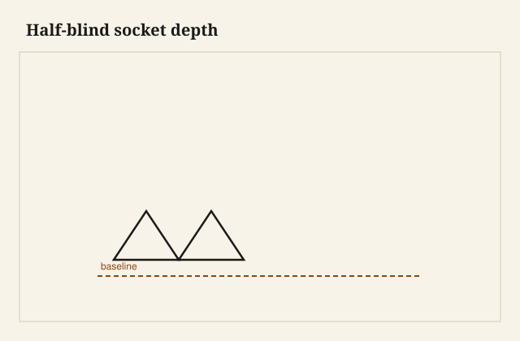

The chisel stands in the knife line, bevel toward the hole, and I give it a tap that is more like seating a hinge than like splitting stove wood. That tap sets the wall. After that I can hog. If I hog first, the chisel follows the grain out of the mortise and I have a wall that looks like a coastline. Tenons do not like coastlines. Glue does not make a coastline into a plane.

A mortise is the part of the joint nobody photographs until it fails. I have opened legs that were bored with a brace and cleaned with a chisel, walls true enough to write on. I have opened machine mortises that were burned, tapered, and short, the tenon bottoms sitting on a pile of compacted chips. Both kinds of shops exist. I would rather eat lunch in the first one.

<figure class="craft-figure">
  
  <figcaption><strong>Figure 1.</strong> Tail length equals socket depth plus reveal allowance.</figcaption>
</figure>

## Hand, hollow chisel, slot, router

Hand-chopped: layout, drill out the waste or just chop, work from the middle to the ends, both faces if it is through, so you do not blow out. The ends of the mortise are chopped, not levered. Levering with a mortise chisel is what the tool is for, a little; levering with a bench chisel is how you break a bench chisel.

Hollow-chisel mortiser: the machine I want in a furniture shop that makes tables. Square hole, repeatable. The bit must be sharp and the chisel must be set so it is not burning and not tearing. A dull mortiser smells like a bad molder — cooked wood — and the walls glaze. Glazed walls are poor glue surfaces.

Slot mortiser or horizontal borer: oval-ish or round-ended holes for loose tenons. Fine if the tenon matches. A Domino is this family with a brand. I use the family. I still look at the walls.

Router mortise: a jig, a plunge, two passes. Corners are round. Tenons get round or the corners get squared. A router mortise that wanders is a fence that moved.

## Depth is a secret until assembly

I mark the depth on the chisel with tape, or I use the machine’s stop, and I still check with a scrap tenon. A tenon that bottoms out will not let the shoulders close. You will clamp until the clamp lies, and the clamp will lie. A little clearance at the bottom — a saw kerf’s worth, more on a wide tenon — is not slop. It is a place for glue to go and a place for the shoulder to be the boss.

Chips left in the bottom are a false floor. I hook them out. I have glued a joint that would not close because I was “sure” I had cleaned it.

## Through mortises

Work from both sides. Meet in the middle. If you blow through from one face, the exit is a cave-in and the show face is a patch. A backing board helps on the exit if you insist on one direction.

The walls of a through mortise are visible if you look down them. I like that. It keeps me from calling a tapered hole “close.”

## The ends

The ends of a mortise take the tenon’s shoulders in the length direction. If they are undercut, the tenon has a place to hide and the rail can wiggle. If they are fat, the tenon will not enter and you will pare the wrong thing. I sneak the ends to the line after the waste is out, chisel vertical, eye on the square.

A haunched tenon wants a haunched mortise: a shallow extra at the top. If you cut a full-depth mortise to the end of a leg, you have a short wall that will split. The haunch exists to stop that split and to fill the groove if a panel groove runs through.

## Machine habits that wreck walls

Forcing the hollow chisel, dwelling so the wood burns, failing to retract and clear chips, moving the fence between legs in a set. The last one gives you a table that is a trapezoid. I cut a pair of test mortises in scrap when I change anything. I do not “remember the setting” from a job in March.

On a production run I number the legs and I keep the same reference face to the fence. I have already said this in the layout essay. It is still the failure I see most.

## Repairing a bad wall

A slip of matching wood, glued to a wall you pared back to honest, then a new cut. Or a floating tenon in a cleaned-out slot if the original tenon is a loss. Or a new leg. I have done all three. The patch is visible to me forever. The new leg is cheaper than a patch I will hate.

Do not epoxy a sloppy mortise full and recut if you can avoid it. You will be mortising a plastic that dulls tools and does not move with the wood. Sometimes you cannot avoid it. Then you say so, in the job notes, for the next person.

## A mortiser that was burning

The hollow-chisel smelled like a dull molder — cooked oak — and the walls came out glazed, shiny, a poor glue surface. I had been forcing the stroke and not clearing chips. The tenons looked tight and then, after a season, two of them ticked. I recut the walls with a chisel, down to dull wood, and I reglued. Now I retract, I clear, I sharpen the bit before I blame the species.

A router mortise in a jig that slipped gave me a pair of legs whose mortises were not in the same world. The table was a trapezoid until I plugged and recut. The fence clamp is part of the wall. I tug it before I plunge.

## Depth stories

I have bottomed a tenon on a pile of chips and I have clamped until the clamp squealed and the shoulder still showed a hair. I hooked the chips out with a bent nail I keep for that job. The nail is not elegant. The closed shoulder is.

On a through mortise I meet in the middle. The one time I blew through from a single face, the exit was a cave. I glued in a slip, I recut, I still see the slip when I kneel. Both-faces is not extra work. It is the work.

## What I want from an apprentice on day three

A mortise in soft pine, walls I can set a square against, depth that matches a mark, no blowout. Then oak. Then a pair of legs that match each other. If they can do that, they can learn a dovetail without the dovetail becoming a personality.

The wall is a plane. The tenon cheek is a plane. When those planes meet, the shoulder can do its job. When they do not, the joint is a story about almost. I do not sell almost. I sell a chair that does not walk, and a table that does not rack, and a mortise you could trust in the dark with a finger. The finger knows. The photograph can wait.

I keep a scrap mortise on the windowsill, walls I can set a square against, as a standard for the next pair of legs. If the new mortise is a coastline next to that scrap, I am not done, no matter what the clock says. The scrap is pine. The job is oak. The wall still has to be a wall.
