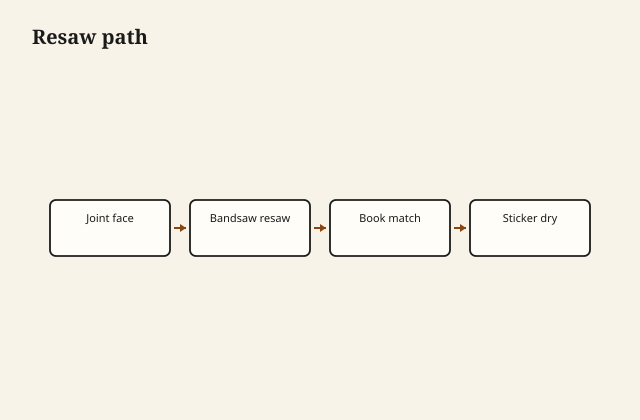

Resawing is bandsaw drift management: the blade wants a path, and the fence must follow that path, not your fantasy square line.

## At the bench

Set tall fence and track drift with a freehand cut mark on scrap. Featherboard the work against the fence; flip halves for book-match at the center cut. Sticker the stack immediately so both faces dry evenly.

<figure class="craft-figure">
  
  <figcaption><strong>Figure 1.</strong> Tall fence + featherboard; flip book-match at center cut.</figcaption>
</figure>

## Photo slot (staged)

**Staged only** — drop a `resawing-veneer` frame from `D:\BBF` when the shot is captioned and color-corrected. Do not publish catalog pulls.

## Checklist

- Blade tension set per manufacturer deflection test.
- Drift line marked before locking the fence parallel to it.
- Stickers align with support; top weighted lightly while green.
