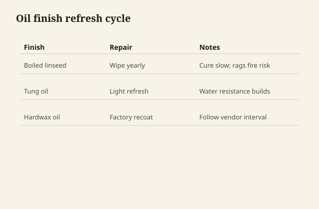
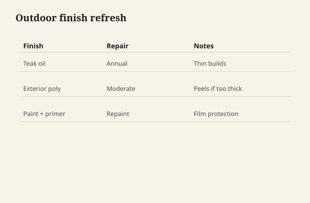

The cloth comes up darker than it went down, cherry dust and oil, and the board looks wet in a way that will dry back and then, over months, go the other way — deeper, warmer, the color cherry is famous for and that no stain quite fakes. I wipe the excess. If I leave it, I have a sticky table and a customer who thinks oil is a scam.

A film finish — varnish, lacquer, conversion, a waterborne that actually works — sits on the wood as a coat you can dent with a fingernail and, if you built it, rub to a glow that looks like a piano or like a satin that does not show every thumb. It is a different contract. The oil contract is: I will look like wood, I will take a water ring, I will repair with another cloth. The film contract is: I will keep the ring off the fibers longer, I will scratch as a coat, I will repair as a coat.

I do not think one is holier. I think a dining top in a house of glasses wants a film, or an oil-varnish blend that is closer to a film than the catalog word “oil” admits. I think a walnut chest that will be touched and waxed for thirty years wants oil or shellac and wax. I think a kitchen island with a granite neighbor and a raw-wood boast wants an honest film on the wood doors and an honest conversation about the top.

<figure class="craft-figure">
  
  <figcaption><strong>Figure 1.</strong> Light wipe coat when water no longer beads.</figcaption>
</figure>

<figure class="craft-figure">
  
  <figcaption><strong>Figure 2.</strong> Annual light coat beats thick build that peels.</figcaption>
</figure>

## What “oil” usually is

Pure tung, raw linseed, polymerized linseed, the Danish-oil bottles that are mostly varnish and solvent with a little oil — the names are a mess. Flexner has been shouting this for years and the bottles still lie kindly. A wiping varnish will build. A true oil will not build much. If you want a film, stop calling it oil. If you want the in-the-wood look, do not expect it to shrug off a wet salad bowl left overnight.

I have used boiled linseed and I have waited, and waited, and I have smelled it in a piece a year later. I ventilate. I do not pile the rags. The rag essay is the safety essay; the short version is: rags go in a can with water or they go flat, outside, to dry, or they go to the fire they were always willing to be.

Hardwax oils are a fashion that sometimes earns it: a thin film, a repair story, a feel that customers like. They are not magic. They want maintenance. A shop that sells them without a care card is selling a return.

## What a film is doing

A film is a plastic, in the old sense: a formable coat. Varnish (alkyd, polyurethane, spar) cures into a sheet. Lacquer flashes and builds fast and is still a shop standard in many places. Conversion finishes and 2K waterbornes are how a lot of kitchens stay kitchens. They need air, they need a booth or a discipline that is close to a booth, they need a person who reads the data sheet.

A film fails by cracking, by blushing, by not sticking to an oily contaminant, by being too hard on a wood that moves and then checking. A film fails by being too thin on the edges and too thick in the panels. The edges are where hands live.

I like a satin film on a dining table more than a mirror. The mirror shows every pad mark and every crumb. The satin shows the wood and still wipes. Rubbing out a film — pumice, rottenstone, or the modern pads — is how you get a level, even sheen that the gun did not quite give you. That is a separate day’s work and worth it on a piece that will be stared at.

## The hybrid that shops actually run

Wipe-on varnish. Oil, then a thin film. Shellac as a sealer, then almost anything (with the usual caveats about some waterbornes and some polyurethanes — [VERIFY] the data sheet, not a forum). This is how a Wilmar top can look like wood and still take a family.

A sealer coat is not optional on blotchy species. Cherry, pine, some maples: they take stain like a map of the mill. A washcoat of thin shellac can quiet that. Or do not stain. I would rather not stain cherry. I would rather wait.

## Both faces, again

If I oil the top and leave the underside raw, I have a cup. If I film the top and leave the underside raw, I have a cup with a harder face. Coat the underside. The breadboard essay said it. The finish essay says it again because this is the failure I still see.

Doors: same. Panels: edges sealed before assembly if you can.

## Repair as a design choice

An oiled top with a scratch: you can often cut it back locally and re-oil. A filmed top with a scratch: you may be in a spot-repair that shows, or a full recut. Customers hear this if you say it before the sale. After the sale it sounds like an excuse.

Hospitality work — the SNF and cafe jobs a shop in this county has actually shipped — usually wants a film you can wipe with a real cleaner, not a salad-oil romance. [VERIFY] a specific project finish against the job folder before naming it. The point stands without the name: use is the first spec.

## Color

Oil warms. Waterborne films can cool, a little gray, unless you put a warmer sealer under them. Customers who wanted “natural” sometimes wanted warm. A sample board, same species, same sanding, both systems, in their light, is cheaper than a refinish.

I do not stain oak to look like walnut and then talk about honesty. I will stain oak to even a wild board or to match a millwork run already in the house. Matching is a craft. Faking a species is a request I try to talk into a better species.

## A salad bowl overnight

An oiled cherry top, a wet bowl, a pale ring. I cut it back locally, I re-oiled, the ring faded into the story of the top. The same ring on a conversion film would have been a spot-repair or a panel recut. I had sold them the oil contract: it will look like wood, it will take a ring, it will repair with a cloth. They remembered. The call was short.

A film dining top in a house of glasses: I would rather sell the film and a satin rub. The hand reads orange peel as cheap. The film keeps the salad off the fibers longer. Neither system is holier. The room is the spec.

## Both faces, the cup I still see

I oiled a walnut top and left the underside raw because I was late. The cup was a slow month. I coated the underside later; the cup eased and did not die. Both faces, always, even a simpler coat below. The breadboard essay says it. The finish essay says it. The cup does not read essays.

## The cloth

Cotton, lint-free enough, turned often, not dripping. The last wipe is dryish, with the grain, and then I look with raking light for holidays and puddles. Puddles become shiny commas. Holidays become dry stripes that catch the eye more than a small defect.

I hang the sample next to the job for a day. Wet is not dry. Dry is not the color in six months. I say that out loud. Cherry will move. Walnut will settle. Oak will stay oak, which is its own problem if someone wanted jewelry.

The cloth, in the can, under water, is the last sentence of the day. The table will tell the rest over a year. If I chose the system for the room instead of for the catalog word, the year is kinder.
