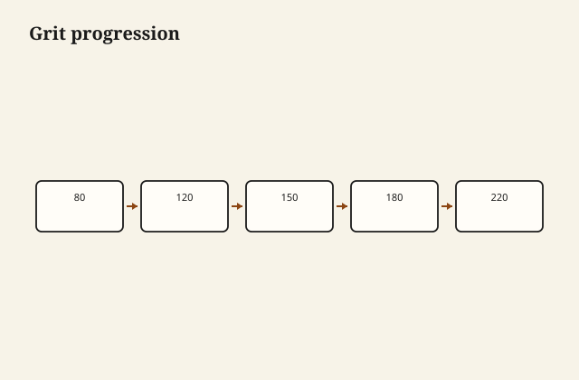

Someone jumped to 180. You can see it when the sun is low and the top looks like a pond with a wind on it — little arcs, the memory of 80 grit, filled with finish that only made them glossier. I have been that someone. I was in a hurry. The paper in the 120 slot was gone. The top “felt smooth.” A thumb is not raking light. A thumb is a liar after lunch.

Sanding is not a personality and it is not a punishment. It is a sequence of scratches, each set finer, each set required to erase the last. If you skip, the last coarse set stays. Finish does not hide it. Finish is a lens.

<figure class="craft-figure">
  
  <figcaption><strong>Figure 1.</strong> 80 → 120 → 150 → 180 → 220 for film finishes.</figcaption>
</figure>

## The sequence is boring on purpose

I start as coarse as the surface requires, not as coarse as my anger. A planed top might want 120 and then 150 or 180. A wide-belt that left 80 wants 80, then 100 or 120, then on, *with the grain* at the end if I can, because random-orbit arcs are another kind of memory.

Skipping 80 to 150 on a rough board is how you spend an hour making shiny valleys between deep trenches. The trenches remain. You have polished their rims.

A stop at 180 is enough for a lot of oil and a lot of film. 220 is common. 320 on a film between coats, carefully, to knock nibs, not to cut through an edge. 400 and beyond is rubbing out, not sanding wood, and it is easy to cut an arris into a raw line that will stain dark.

I do not sand to 400 on bare oak and then wonder why the stain went blotchy and the wood looks tired. Fine grits close the surface. Some finishes want that. Some stains do not.

## Machines, hands, the edges

A random-orbit is a gift and a swirl factory. I use it, then I go by hand with the grain for the last pass on a show top. Edges: the ROS loves an edge. It will round a crisp arris in ten seconds. I tape, or I sand edges by hand, or I accept a softer edge because the design wanted it. I do not accept a softer edge because I was thinking about the radio.

Profiles and moldings: a profile sander or a folded paper, not a brick of a pad that flats the bead. Millwork dies under a flat pad. The knife cut a shape. Your job is to keep the shape and take the fuzz.

Between coats: dull the sheen, take the dust nibs, do not cut through. Cut-through on an edge is a dark line if you stain, a raw line if you do not, a place water will find.

## Dust is part of the grit

A paper that is loaded is a finer grit than the number, and then a chunk of waste comes off and you have a 60-grit comet. I clean the surface. I clean the paper. I vacuum, I tack, I do not wipe with a filthy rag that is just moving grit in circles.

A shop that sands near the finish table is a shop that owns nibs. I am not going to pretend I have a hospital. I am going to say the fan and the sequence matter, and the last hour before a final coat is not the hour you scrape a lot of oak.

## Water pop, grain raise, the honest extra step

Water pop: a damp cloth, dry, a light re-sand, then stain or finish. The grain that wanted to raise in the first coat raises now, when you can cut it. I do this on oak that will get a waterborne, and on any piece that will live in a wet-wiped kitchen. I skip it when I am oiling a surface I already planed and the customer likes a little tooth. I do not skip it and then complain about the first coat feeling like a beard.

## How I inspect

Raking light. A low LED. I get my eye down. I look across, not down. Down is how managers inspect. Across is how the dining room inspects at dinner.

I also use a pencil scribble: cover the surface with light graphite, sand until the graphite is gone. What remains is a low spot or a scratch you have not reached. This is old and it works and it feels childish until you see the scribble left in a pore line you would have missed.

## Production pressure

A line that has to ship on Friday will skip. I have skipped. The return is more expensive than the paper. If the schedule cannot hold 120, the schedule cannot hold a show top. It can hold a painted side. Distinguish.

Wide-belt shops have a grit sequence in the machine. Trust it only if the belts are not glazed and the platen is not grooved. A glazed 180 belt is a burnisher. It will shine a defect and call it done.

## Hands, lungs

Sanding is the quiet injury. Dust of hardwoods is not a rustic smell. It is a lung problem. I wear a respirator when I am on a machine, and I still forget on a “quick” hand sand, and I am wrong when I forget. The safety essay will say it louder. Here: grit discipline includes not breathing the grit.

Oak dust on a wet oil cloth is a mud that stains a fingerprint into the top. I blow down, I tack, I wash my hands. The fingerprint is always mine.

## A top that felt smooth

The thumb said 180 was enough. The sun, at four, said the 80-grit arcs were still there, filled with finish, shinier than the wood around them. I had skipped 120 because the box was empty. I recut the film, I went back through the grits, I bought the paper. The paper was cheaper than the recut. It always is.

Pencil scribble on the next top: I covered the field, I sanded until the graphite left. What stayed was a low streak at a glue joint I had not flushed. I flushed it. The scribble is childish and it is the most adult thing I do on a show surface.

## Edges, again, because I still round them

A random-orbit will take a crisp arris off a breadboard in the time it takes to look at a phone. I tape the arris or I sand it by hand. I have a table in a house whose breadboard looks soapy because I looked at a phone. I do not go back and tell them. I tape now.

Profiles: folded paper, a piece of dowel as a backer, not a flat pad. The knife cut a bead. My job is to keep the bead and take the fuzz. A dead bead is a painter’s problem I created.

## The rule I write on the inside of a door, once

Do not skip. If you skip, go back. If you do not have the grit, stop and buy it. If the light is bad, wait. If you are tired, you will round the edge.

Eighty is not a suggestion when the surface is an 80-grit surface. It is the first sentence. 180 is not a first sentence. It is a later one. Finish is the last sentence, and it will quote everything you said.
