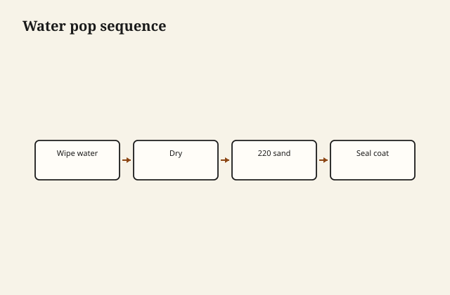

The sample looked right under the fluorescent and wrong under their west window. That is the usual story. They wanted the oak “a little warmer,” which in a photograph means orange, and in a room with a cool LED means mud. I brought three boards from the same lot, same grit, same sealer, and we stood in the room at the hour they eat. We picked the duller one. The duller one was the one that would still look like oak at dinner.

Stain is not a sin. A millwork run that has to meet a door already in the house needs stain, or toner, or a glaze, or a dye, and a person who can see. Stain becomes a lie when it is asked to turn poplar into walnut for a sales tag, or when it is wiped on a blotchy cherry board to “even it out” and instead writes a map of the mill in brown.

<figure class="craft-figure">
  
  <figcaption><strong>Figure 1.</strong> Wet → dry → 220 → seal; avoids raised grain after finish.</figcaption>
</figure>

## Dye, pigment, the difference you can feel

A dye dissolves and colors fibers more evenly. A pigment sits in the pores and the scratches. Pigment stain on oak is why oak looks like oak in a catalog: the pores take the brown and the rays do their thing. Pigment stain on maple is why maple looks dirty in a hurry: there are no pores to be kind, only scratches and blotch.

I use dyes when I want color without mud. I use pigment when I want pore emphasis or a match to an old piece that was pigment. I use both, in sequence, when the match is hard. I do not shake a mystery can and hope.

Gel stains are pigment in a thick carrier. They sit on top more. They can save a blotchy pine door. They can also look like paint that lost its nerve. A sample, again.

## Washcoats

Thin shellac, or a commercial pre-stain, to quiet blotch. On cherry I would rather skip stain. On pine I rarely skip a washcoat if color is required. On maple I think twice about the whole idea of dark maple.

A washcoat that is too heavy and you have sealed the wood so the stain is a weak tea. Too thin and you have done nothing. The test board is not optional. The test board is the work.

## Matching the house

Existing millwork is the boss. I take a door to the shop if I can, or I take a drawer, or I take a photograph *and* a sample because photographs lie in the other direction — phones warm, phones cool, phones HDR a pore into a canyon.

I stain a sample, I put the topcoat on the sample, I let it dry, I take it back to the room. Wet stain is not the color. First-coat film is not the color. The color is the system.

Glaze: a thin dirt, carefully, to age a profile or to even a panel. Easy to make a piece look filthy. A wiped glaze in the corners of a raised panel can be handsome if you stop. Stopping is the craft.

## When I refuse

I refuse to stain walnut dark brown to hide a sapwood I should have cut off. I will cut off the sapwood or I will design with it and say so. A brown blanket on sapwood is a brown blanket that will wear off at the arris and show a stripe of truth.

I refuse to make red oak into “espresso” without a conversation about the pores still being red oak pores. They will show. The customer should nod before the money moves.

I refuse a match over the phone. I have lost that argument enough.

## Application that does not add a story

Even wet, wipe with the grain, keep a wet edge, do not stop in the middle of a panel to take a call. Lap marks are darker rivers. End grain drinks; I size it or I accept a darker end and I say so. A breadboard end that goes black is a sized-end problem or a proud glue problem.

Spray toner is how a lot of production color is actually done: a tinted coat, even, controllable. It is a film of color. It can look plastic if it is heavy. It can save a job if it is light. I do not pretend a hand-wiped stain is holier than a good toner. I pretend less, period.

## Arkansas oak, Arkansas light

Our oak can be yellow, pink, a little green in the white oaks, a lot of cathedral in the red. Southern light is strong. A stain that looked European and gray in a catalog will look dirty-gray here at noon and purple at night. I test in this light. I do not test only in the spray room.

A piece that will sit in a lake house with reflective water is a different light than a piece in a curtained dining room in Warren. I ask where it will live. If they do not know, I pick the more forgiving, less trendy color. Trends age faster than oak.

## End grain, again

A breadboard end that went near-black next to a field that was honey: I had not sized the end. The end drank. I now wipe a thin washcoat on ends before the stain, or I accept a darker end on purpose and I say so. Accidental dark is a mistake. Chosen dark is a drawing.

Lap marks: I stopped in the middle of a panel to take a call. The river is still there, under a film, a little darker. I do not take that call.

## A match that needed a night

They picked the warm sample under the fluorescent. Overnight in their dining room they picked the duller one. I had left both. The night did the work. I do not do color on a phone in a parking lot. I have tried. The piece arrived as a different brown than the one they remembered, which was the phone’s brown.

Glaze in the corners of a raised panel can quiet a wild field. It can also make a cupboard look unwashed. I wipe, I step back, I stop. Stopping is the only hard part of glaze.

## The lie I will not print

“Stain enhances the natural beauty.” Sometimes it does. Sometimes it covers a glue smear and a mismatched board in a glue-up that should have been recut. I enhance by selecting boards that already belong together. I use stain to join a new rail to an old room, or to quiet a wild sap streak we all agreed to keep.

If the boards do not belong together, color will not make them family. It will make them a group in the same shirt.

I leave the sample with the customer for a night. In the morning they have a different favorite, or the same one, and I can work. The night is part of the finish. So is the west window. So is the refusal to brown a board that only needed a better friend in the glue-up.
