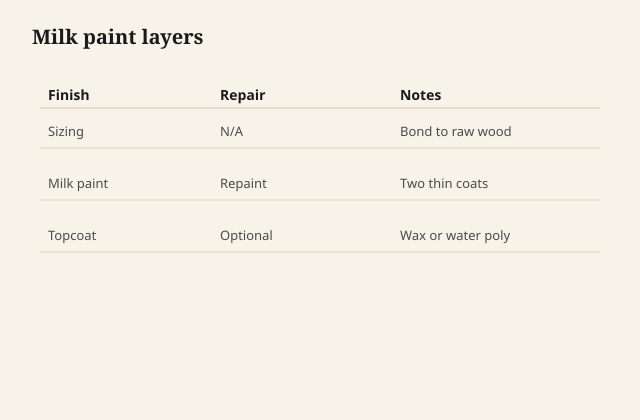

Milk paint does not smell like a chemicals aisle. It smells a little like a barn and a little like a kitchen, and it dries flat in a way that makes a cupboard look like it was always in the room. I mix it in a jar, I wait, I stir again, I put a thin coat on a poplar door that will never pretend to be walnut. The first coat looks starved. The second coat looks like a decision.

I like it on pieces that will be touched: a step-back, a child’s cupboard, a chair that can take a chip at the foot and not look ruined. I do not like it as a costume on a plywood box that was routed with “distressing” the same afternoon. Wear is a use. Distress is a product.

<figure class="craft-figure">
  
  <figcaption><strong>Figure 1.</strong> Sizing → milk paint → light sand → second coat.</figcaption>
</figure>

## What it is

Casein, lime, pigment, sometimes clay — the commercial bags are a controlled version of an old shop paint. [VERIFY] the bag you opened; recipes vary and some “milk paints” are just flat latex with a story. I use the kind you mix because I want the mineral flat and the way it bonds to raw wood. It can chip. That chip is not always a defect. On a chair foot it is a record. On a kitchen island next to a dishwasher it may be a callback.

Bonding: milk paint on raw wood can grab so hard it is a pain to strip. On a sealed surface it can flake like a sunburn. I scuff, I use the manufacturer’s binder when I have to go over a film, and I test. I do not paint a conversion-varnish door with milk paint and act surprised.

## Color that is not a stain

The old colors are iron reds, yellow ochres, lamp blacks, the blue that is never quite the catalog blue. They sit on the wood, they do not become the wood. A little grain can telegraph if the coat is thin. I like a little telegraph on a cupboard. I do not like it on a piece that was sold as a perfect field of color.

Two thin coats beat one thick. Thick milk paint craze and chip in sheets. Thin wears at the arris and stays in the panels. That is the wear I will sign.

## Topcoats

A drying oil or a wax will deepen the color and make it wipeable. A film will make it more furniture-store and less cupboard. I oil or wax most milk-painted work. I film it if the piece will live in a wet kitchen and the customer heard me say “it will still wear.”

A hardwax oil over milk paint is a common modern stack. It can look good. It can also make the paint too slick and too even, like a photograph of a farmhouse. I stop before photograph.

## The distressing problem

A bag of chains, a wire brush, a stain glaze in the chips — I have been asked. I will put a chamfer where a chair already gets hit. I will not beat a new dresser so it matches a movie. If they want old, they can buy old, or they can wait. A shop that sells beaten new furniture is a shop that has run out of patience with time.

Wear at a pull happens because a hand found the pull. I can ease the arris so the paint is already thin there; use will do the rest. That is enough theater.

## When paint is the honest species

Poplar, maple, a mixed glue-up, a repair in a different wood — paint is how those become one object. I would rather paint poplar than stain it “walnut.” I would rather say painted furniture than “solid wood” with a brown photograph on the web.

Millwork already knows this: painted doors, stained doors, different species, different shop. Furniture pretends otherwise because the sales tag likes a species name. A painted cupboard in a Warren house is not a lesser cupboard. It is a cupboard that chose color.

## Mixing, pot life, the grit

I strain. I stir. I do not keep a mixed jar until it ferments into a science project. I sand lightly between coats with a fine grit, dust, and I do not cut through to a stripe of wood unless I meant a stripe of wood.

Brush marks: a good brush, a thin mix, a light hand. Milk paint can show a brush if you want an old look. It can also be surprisingly even. I pick before I start, not after the first door looks different from the third.

## A cupboard that wanted chains

They asked me to beat a new poplar cupboard so it would match a movie. I eased the arrises where a hand already goes, I painted two thin coats, I waxed. I did not swing a chain. In a year the pulls had worn the paint the way pulls do. They sent a photo. It looked like a cupboard someone used. That was the request, once we translated it.

Thick first coat: it crazed, it chipped in a sheet when a chair back kissed it. Thin coats wear at the arris and stay in the field. I mix, I wait, I stir again. I strain. I do not keep a jar until it ferments.

## Over a film

Milk paint on a sealed door without a binder is a sunburn waiting. I scuff, I use the binder the bag names, I test. I do not paint a conversion-varnish kitchen “farmhouse” and act surprised. If they need a film kitchen, we stay in a film. If they want milk paint, we start from raw or from a surface that can take casein.

## Chips I will repair, chips I will not

A chip from shipping: I touch in. A chip from a year of a boot: I ask. Sometimes they want it touched. Sometimes they have already decided the piece is theirs. The second call is the one I like.

I do not sell milk paint as indestructible. I sell it as a color that belongs to wood and lime and a room, and as a finish that will tell the truth about hands. If they need indestructible, we are in conversion varnish and a different essay, and I will not put a farmhouse word on that door.

A painted poplar cupboard is not a lesser cupboard. It is a cupboard that chose color instead of a walnut lie. Millwork already knows painted doors and stained doors are different shops. Furniture pretends otherwise because the tag likes a species. I would rather say painted, and mean the limey flat, and let a year of hands write the only distressing I will sign.

Oil or wax over milk paint deepens the color and makes it wipeable. A hard film can make it look like a photograph of a farmhouse. I stop before photograph. A chip from shipping I touch in. A chip from a year of a boot I ask about. Sometimes they have already decided the piece is theirs. That is the call I like.

The old colors — iron red, ochre, lamp black, a blue that is never quite the catalog — sit on the wood. They do not become the wood. A little grain telegraph on a cupboard I like. A perfect field that was sold as a perfect field I do not like if the coat is a sheet waiting to chip. Two thin coats. I mix, I wait, I stir again.
