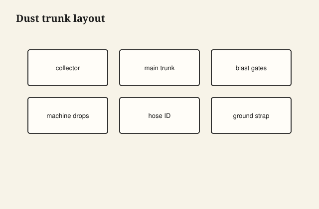

Dust collection fails when every machine tees into a hose spaghetti with no gates—air follows the path of least resistance and your sander gets nothing.

## At the bench

Run a main trunk to the collector; branch short drops to each tool. Blast gates at each branch so only the active machine pulls. Keep flex hose short; long runs need larger duct, not longer skinny hose.

<figure class="craft-figure">
  
  <figcaption><strong>Figure 1.</strong> Main trunk + branches; blast gate at each machine.</figcaption>
</figure>

## Photo slot (staged)

**Staged only** — drop a `shop-dust-collection-layout` frame from `D:\BBF` when the shot is captioned and color-corrected. Do not publish catalog pulls.

## Checklist

- Gate closed on idle machines—open only what you are running.
- Grounded wire in hose runs if static clings chips to walls.
- Drop hood height set per tool manual, not guessed.
