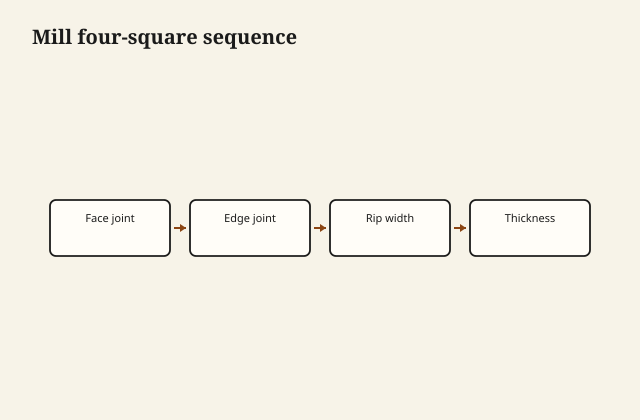

The stack in the yard is not furniture. It is oak on sticks, a forklift scar on a corner, a sticker stain that will become someone’s “character” if we are sloppy later. I pull a board, I look at the end, I look at the face, I put a meter in it. If the meter and the shop do not agree, the board stays in the stack or it goes back. A pretty cathedral at the wrong moisture is a table that will move after it is paid for.

This is the continuum I will stand on: a county that learned to dry, saw, grade, and ship hardwood, and a shop that still has to do those things, in miniature, before anyone talks about a named series or a river. The continuum is not a letterhead. Bradley Lumber Company of Warren was created in 1901 by Samuel Holmes Fullerton of St. Louis, after a small mill and a timber man, Joe L. Reaves, Sr., whose name is in the county histories. By 1907 the Encyclopedia of Arkansas puts Bradley among the big hardwood dealers in a town that also had Southern Lumber and Arkansas Lumber — tens of thousands of board feet a day, hundreds of men, a population that doubled with the mills. [VERIFY] those figures against the Encyclopedia page if you quote them in a catalog; they are published there.

Potlatch bought into Warren’s mill story in the 1950s. The furniture LLC that uses the Bradley name in this century is dated, in directories, around 2008. Those are different corporate objects. The heritage page already says so. I will not un-say it for a smoother paragraph. What is continuous is the dirt, the river names, the oak, the habit of making things out of boards that started as logs in this part of Arkansas.

<figure class="craft-figure">
  
  <figcaption><strong>Figure 1.</strong> Face → edge 90° → rip width → thickness to gauge.</figcaption>
</figure>

## What a mill taught a furniture shop

Grade. A mill that ships No. 1 Common and a shop that pretends every board is FAS are in a fight with the invoice. Furniture can use Common if you cut around the knots and you design for the yield. A “solid oak” sales story that requires every face to be clear is a mill-grade story. Pay for the grade you need. Do not pay for FAS and then stain it into a brown night.

Dry. Kiln schedules exist because air-drying to furniture moisture in this climate is a long argument. A shop that takes 12-percent boards and machines them into tight frames is building winter splits. I meter. I do not trust the stamp alone. The stamp is a start.

Straight-line rip, gang rip, the need to make a glue edge. A mill’s moulding line and a furniture shop’s jointer are cousins. The knife has to be sharp in both buildings. The feed has to be honest in both.

Waste. A mill lives on recovery. A furniture shop that scraps a board because of a sticker stain without asking whether the stain is on the back is not in the same religion. I plane sticker stain. If it goes deeper than the show face, I flip the board or I cut it down. I do not throw away a county.

## Saline, Moro, the names on the map

The Warren, Johnsville & Saline River Railroad was a logging road; the Warren & Saline River Railroad took the property later. Forest Service historical writing describes hardwood moving out of the bottoms toward Warren. [VERIFY] any railroad sentence against that paper and the railroad’s own record before a public claim.

Product names that echo the rivers — Saline Creek, a workshop named for the Saline — are geography if they stay geography. They become costume if they are asked to prove a corporate bloodline. I like the geography. I have stood in air that comes off those bottoms. It is wetter. The wood knows.

Wilmar is not a metaphor. It is a shop floor and a town on the way to the county’s timber memory. Warren is the mill town in the books. A piece can be built in one and sold with the other’s history in a footnote. The footnote should stay a footnote.

## Furniture stock, then furniture

Mid-century descriptions of the plants include pine, oak, flooring, furniture stock, millwork. [VERIFY] the Bradham 1951 list and any plant postcard captions before you put them in a brochure. Furniture stock means: boards selected and dried for people who will make chairs and cases, not just dimension lumber for a house. That is the hinge. A town that cut furniture stock is a town that already had the next shop in mind, even if that shop was in Chicago or High Point or a factory with a different name.

The modern shop is smaller and has to be more particular. We do not have a thousand men. We have a meter, a glue-up, a finish room, and a truck. The continuum is the particularity: still oak, still a climate that punishes a tight panel, still a customer who thinks wood is a photograph.

## What I will not say

I will not say “since 1901” on a furniture invoice as if the LLC poured the first mill foundation. I will not say “the same company.” I will not use a diamond brand from a postcard as proof of ownership. I will say: built in this county, in the hardwood habit of this county, with the rivers still on the map.

If a family employment path into the old plants is confirmed, that is a different sentence and it belongs to the people who can confirm it. Until then it stays off my page.

## A closed truck in August

I cooked a finish in a closed truck that became a kiln I did not schedule. I do not again. Acclimate, mill, join, finish both faces, ship without undoing the kiln. A pretty cathedral at the wrong moisture is a table that moves after it is paid for. I meter. I do not trust the stamp alone.

I will not put “since 1901” on an invoice as if the LLC poured the mill foundation. I will say: built in this county, in this county’s hardwood habit. The 1901 date is a neighbor in the facts. The delivery ticket is the meter and the room.

## The yard test

I walk a stack the way a mill buyer walks a stack. Twist, cup, a board that was too close to the bark, a board that wants to be a sled. I think about the room. A wild cathedral can be a panel in a frame. It should not be a 42-inch glued top unless we have designed the movement. A quiet rift board can be a stile. A flecked quarter can be the top that earns the heritage footnote without a speech.

Then the shop: acclimate, mill, join, finish both faces, ship in a way that does not undo the kiln. A closed truck in August is a kiln you did not schedule. I have cooked a finish that way. I do not again.

The room is the last mill. Heat, sun, a humidifier or none, a glass that sweats. The piece has to arrive as wood that already learned this county’s air, or it will learn it in front of the customer. I would rather the learning happen on the sticks, in the yard, with a meter in my hand, than on a dining night in June.

That is the continuum: sticks, meter, room. The 1901 date is a neighbor in the cemetery of facts. I visit it. I do not ask it to sign the delivery ticket.
