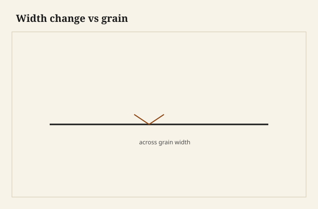

Wood widens and narrows across the grain with humidity. Ignore that and your tabletop splits the breadboard or buckles the screws.

## At the bench

Anchor tabletops in the center along the width; let ends float. Read the diagram for radial vs tangential movement on your species—rule-of-thumb tangential is about double radial on many domestic hardwoods.

<figure class="craft-figure">
  
  <figcaption><strong>Figure 1.</strong> Tangential movement roughly 2× radial on many species.</figcaption>
</figure>

## Photo slot (staged)

**Staged only** — drop a `wood-movement-across-grain` frame from `D:\BBF` when the shot is captioned and color-corrected. Do not publish catalog pulls.

## Checklist

- Fasteners elongated where the grain runs across the rail.
- No rigid glue bond across full width on cross-grain joints.
- Measure stock at shop RH, not the day the heat failed.
