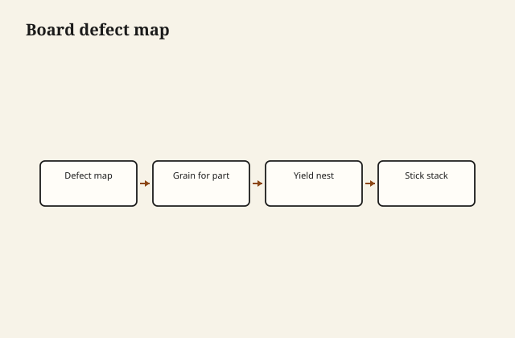

Yard stock is a defect map and a grain direction puzzle. Buy for the parts on your cut list, not for average board feet price alone.

## At the bench

Sketch parts on the board with chalk: knots where screws hide, straight grain on rails, cathedral where it shows. Check twist with winding sticks at the pile; a cheap board that cups wastes more than a straight one costs.

<figure class="craft-figure">
  
  <figcaption><strong>Figure 1.</strong> Mark knots and sap; nest longest parts on clearest grain.</figcaption>
</figure>

## Photo slot (staged)

**Staged only** — drop a `choosing-hardwood-boards` frame from `D:\BBF` when the shot is captioned and color-corrected. Do not publish catalog pulls.

## Checklist

- Defects circled before checkout—returns are rare.
- Grain direction marked for each part while the board is whole.
- Extra length for snipe and end checks at both ends.
