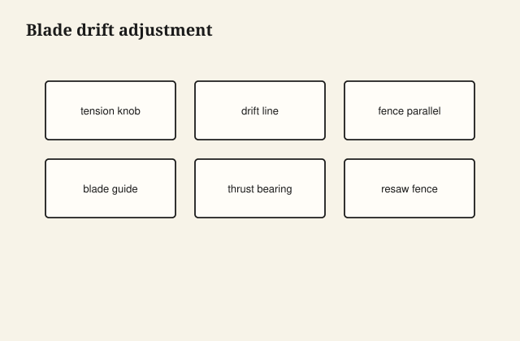

Blade tension and drift set every bandsaw cut. Too loose wanders; too tight wastes blades. Drift is the blade's preferred path—your fence must follow it.

## At the bench

Tension until the manufacturer deflection spec reads right on your finger test. Make a freehand cut in thick scrap; mark the kerf line. Set the fence parallel to that drift, not square to the table miter slot by assumption.

<figure class="craft-figure">
  
  <figcaption><strong>Figure 1.</strong> Mark freehand cut; set fence parallel to drift line.</figcaption>
</figure>

## Photo slot (staged)

**Staged only** — drop a `bandsaw-blade-tension` frame from `D:\BBF` when the shot is captioned and color-corrected. Do not publish catalog pulls.

## Checklist

- Drift line fresh after each blade change.
- Fence locked only after drift test, not before.
- Blade tracking centered on wheels before tensioning to final.
