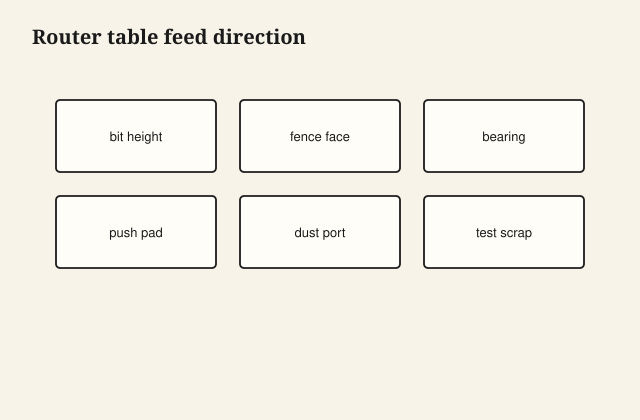

The first stick through a fresh knife is a small event. The oak comes out with an arris you could read with a fingernail, a cove that does not chatter, no shine of burn in the hollow. The tenth stick is still good. The two-hundredth, if no one honed, starts to look like plastic — a glaze in the cove, a fuzz on the quirk, a profile that will take paint like a sponge and look tired before the painter arrives.

Millwork is furniture that agreed to be a line on a wall: casing, base, crown, a built-up plinth, a door sticking. The joinery is different — copes, scarfs, a nail that is allowed — but the knife is the same idea as a plane iron. A mill that ran pine millwork and furniture stock in the same town was not confused. It was a town that cut profiles and boards and knew both paid.

<figure class="craft-figure">
  
  <figcaption><strong>Figure 1.</strong> Feed against bit rotation; bearing follows template.</figcaption>
</figure>

## The profile is a drawing

I take a section from the architect or I take a piece of the house’s existing casing. I do not “get close” on a historic room. Close is a shadow line that does not match at the splice. A custom knife costs money. A wrong knife costs the room.

Stock profiles exist because rooms do not always need a custom knife. A good stock casing, well cut, well coped, is better than a custom profile cut dull and installed with gaps. I have seen both. The room knows.

Quirk, fillet, cove, ovolo, ogee — the words are a way to talk to a knife grinder without waving your hands. Learn them or bring a cutoff. I bring a cutoff.

## Feed, grain, the tear

Molding is often run on long grain, but a profile has places that are effectively cutting across a fiber’s will. Tearout in a cove is a cove full of picks. A backer, a shallow pass, a climb that is controlled, a species that was a bad idea for that profile (open-pore red oak in a tiny quirk is a tiny quirk full of pores).

Paint-grade poplar is the diplomat. Stain-grade oak is the job that shows every chatter. I run stain-grade like I mean it: sharp, slow, a test stick.

End-grain returns — a plinth block, a rosette — are a different cut. A sander that rounds a rosette is a rosette that does not meet the casing. I keep the arris.

## Cope, don’t miter, when the wall is the boss

Inside corners on a profile that has a shape: I cope. The cope is a negative of the profile, cut on the end of one piece so it sits over the face of the other. When the wall is out of square, the cope can close. A miter on an inside corner of a complex crown will open as soon as the house moves, and houses move.

Outside corners: a miter, sometimes a spline if it is big, sometimes a wrap if the paint will hide a small sin. I still cut them tight.

Scarfs on long runs: a long mitered splice, glued, in a place the eye does not rest, not at eye height in the middle of a wall if I can help it. I have put a scarf at eye height. I still see it in that house.

## Furniture shops that also cut sticks

A table apron with a bead is millwork on a table. A bed rail with a thumbnail is millwork. The knife in the shaper is the cousin of the knife in the molder. I want the same sharpness standard. I have seen a furniture shop treat “the molding run” as the job the new person does with the old knives. The new person learns bad profiles. The old knives learn nothing.

Warren’s plants cut millwork as a listed product in the mid-century descriptions. [VERIFY] the list. The habit is: a profile is a product, not a leftover.

## Finish on a stick

A molded edge drinks on the end and on the quirk. Prime the ends. Sand with a profile in mind, not with a flat pad. A flat pad kills a bead in a minute. I have killed a bead in a minute. The painter cannot put the bead back.

Pre-finishing sticks before install is how you avoid a raw line when the house moves and a joint opens. A raw line on stained oak is a lightning bolt. We pre-finish when the job is stain-grade. We still touch up. We do not skip the pre-finish and then blame the painter.

## The wall is out

Every wall is out. I scribe a base to a floor that dips. I do not sand a base to a dip and call it a tighter fit; I call it a thinner base. A scribe is a line. A sander is a habit.

Caulk is a painter’s joint, not a millworker’s pride. A little caulk in a paint-grade inside corner is life. A bead of caulk in a stain-grade reveal is a confession. I cut the wood closer.

## A historic room, dull at two hundred

I ran a stock casing in a 1910 hall because the custom grind was a week out. Close was a shadow that did not match at the splice. I pulled it and I waited for the knife. The room was right. Close is not a section.

The first stick through a fresh grind was a fingernail arris. The two-hundredth, unhoned, was a glaze in the cove and a fuzz on the quirk. Paint ate it. I change the knife before I change the story. A test stick in the job box is how a repair six months later matches. Without it, the repair is a cousin from a different grind.

## Listening to the head

A molder that sings is a molder that is cutting. A molder that slaps is a loose knife or a bad set. You stop. You do not “see how the next stick looks.” The next stick looks like a trip to the ER if the head is unhappy. The safety essay will take the rest. Here: the profile is not worth a hand.

I keep a cutoff of the good run in the job box. Months later, a repair stick can match. Without the cutoff, the repair is a cousin from a different knife. The room will introduce them to each other every time someone turns on the hall light.

The knife in the head is a small piece of steel with a drawing ground into it. When it is sharp, the wall gets a line that belongs to the house. When it is dull, the house gets a shine and a fuzz and a painter’s problem.

Stain-grade oak shows every chatter. I run it sharp, slow, with a test stick in the job box. Paint-grade poplar is the diplomat. A flat sanding pad still kills a bead in a minute. I have killed the bead. The painter cannot put it back. Pre-finishing sticks before install is how you avoid a raw line when the house moves and a joint opens. A raw line on stained oak is a lightning bolt at the hall switch.
