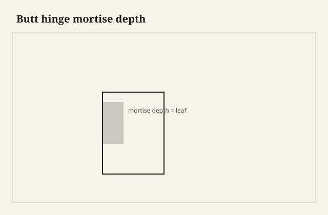

I set the head casing first so the two long legs have something to be about, and I mark the reveal on the jamb with a little gauge — a block, a story, not a wandering pencil. The reveal is a shadow line. If it grows and shrinks around the door, the door looks drunk. If it is even, the wall looks like a person meant it, even when the wall is not.

Then the legs down. The floor is high on the left. Of course it is. I scribe the left leg or I sneak a plinth that can take a scribe, or I live with a sliver of shadow that the painter will want to caulk. Paint-grade can take a little caulk. Stain-grade wants wood.

Door to stop, stop to jamb, jamb to casing: three lines people only notice when one is drunk. I mark the reveal with a block, not a wandering pencil. I shim a jamb plumb for the swing. I do not twist it to chase a twisted wall and then wonder why August binds the door.

<figure class="craft-figure">
  
  <figcaption><strong>Figure 1.</strong> Mortise depth = hinge leaf thickness; barrel flush.</figcaption>
</figure>

## The door is a system

Jamb, stop, casing, perhaps a plinth, perhaps a backband, the door itself, the hinges, the latch. Furniture makers who take on a house think it is a big cabinet. It is a big cabinet that has already moved and will move again, with a floor that was finished by a different trade.

I shim a jamb plumb in the plane that matters for the door to swing, and I let the casing hide sins that are not structural. I do not twist a jamb to chase a twisted wall and then wonder why the door binds in August.

Reveals at the door to the stop, at the stop to the jamb, at the jamb to the casing — three lines. People only notice when one of them is wrong.

## Plinths and the old way

A plinth block at the bottom, thicker than the casing, taller than the base, is how a lot of old houses turned the corner from door to base without a miter that dies in a thick profile. I like plinths. They take a hit from the vacuum. They can be a different profile. They make the casing look like it was designed, not like it ran out.

A rosette at the head is the cousin. Easy to make cute. Fine if the house already has them. I do not add rosettes to a quiet modern opening to “add craft.” The reveal is the craft.

## Backbands

A backband on a simple casing builds thickness and a second shadow. It is millwork’s way of making a cheap stick look like a built-up. It can be handsome. It can also be a dust shelf. I use it when the wall needs the weight, when the existing house has it, when a plain casing looks thin next to a heavy base.

## The meet at the floor

Base to casing: the base should die into the plinth or return, not feather into the casing’s face in a smear of caulk if I can help it. A return is a little piece of profile that turns the end grain away. I cut returns. They take ten minutes and they look like a person was there.

On a remodel, the floor is already in. I scribe. I do not assume the factory 90 on the bottom of the casing. The factory 90 is for a factory floor.

## Doors that are furniture

A dining-room pair of pocket doors, a sliding barn door that is actually a slab (different sins), a built-in that has a door in a furniture carcase — here the furniture shop is at home. The casing, if any, should speak the same language as the piece. I have seen a fine walnut cabinet with a builder-grade colonial casing because the carpenter came later and no one left a stick. I leave a stick. I leave a note. I leave a phone number.

A furniture door in a millwork opening: the gap at the strike is not a furniture gap. It is an allowance for a house. I do not fit a house door like a jewelry-box lid.

## Paint-grade vs stain-grade, again

Putty and caulk and primer will save a paint-grade opening that was installed on a Friday. They will not save a stain-grade opening. I cut stain-grade as if the camera will find the splice, because the sun will.

Nail holes: fill with a filler that takes stain, or with a wax, or with patience and a putty that is not a gray dot. I have left gray dots. They photograph.

## The left floor was high

Of course it was. I scribed the left leg and cut a return on the base so the end grain does not stare. Ten minutes. The room looks like a person was there.

## Why this belongs in a furniture pack

Because a shop that builds cabinets will be asked to wrap a door. Because a heritage mill story that includes millwork is not a side hustle; it is the same knives and the same climate. Because a customer who buys a table will eventually ask who can do the room. If the answer is “we can talk to the carpenter,” leave the carpenter a profile and a reveal.

I run my hand down the casing as I leave the job. If a fingernail catches a proud splice, I am not done. If the reveal is even and the floor meet is a scribe and not a smear, I can go. The door will swing for years. The casing will take the hit of the handle, the hip, the holiday tree. It should look like it expected them.

Stain-grade nail holes are not gray dots. I fill with something that takes color, or I use a wax, or I take the time. I have left gray dots. They photograph. Putty and caulk will save a Friday paint-grade opening. They will not save a stain-grade one. I cut the wood as if the sun will find the splice, because it will, at the hour the hall light comes on.

The customer who buys a table will ask who can do the room. If the answer is “we can talk to the carpenter,” leave the carpenter a profile and a reveal. The casing is furniture that agreed to be a line.

A backband builds a second shadow when a plain stick looks thin next to a heavy base. I use it when the house already has the weight, not as a dust shelf on a quiet modern door. A plinth takes the vacuum hit and lets the casing die into something thicker than a miter that expires in a thick profile.

I do not add rosettes to a quiet modern opening to “add craft.” The reveal is the craft. A furniture door in a house opening is not a jewelry-box lid. The gap at the strike is an allowance for a house that will move. I cut returns on the base so end grain does not stare at the floor. Ten minutes. The room looks like a person was there.
