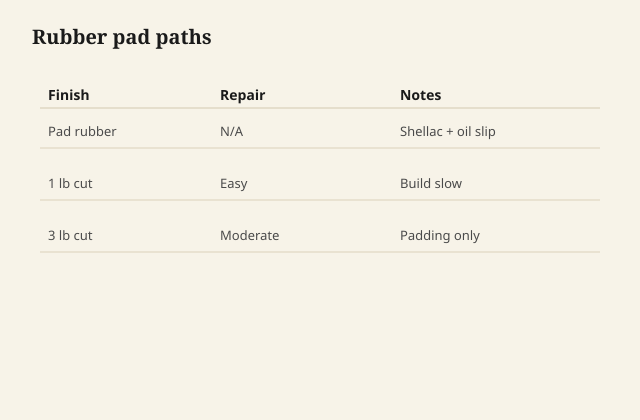

French polish is thin shellac moved with a pad, not a flood coat in one afternoon. Patience builds depth; hurry builds ridges.

## At the bench

Charge the pad lightly with thin shellac; a drop of oil on the pad slips it across the surface in figure-eights. Build many thin passes, resting between sessions. Rub out high spots when the film is even.

<figure class="craft-figure">
  
  <figcaption><strong>Figure 1.</strong> Figure-eight with thin shellac; oil slip prevents drag.</figcaption>
</figure>

## Photo slot (staged)

**Staged only** — drop a `french-polish-overview` frame from `D:\BBF` when the shot is captioned and color-corrected. Do not publish catalog pulls.

## Checklist

- Pad clot wrapped tight—no wrinkles that print lines.
- Oil slip is a lubricant, not a finish layer; wipe back excess.
- Humidity and temperature logged if the session runs long.
