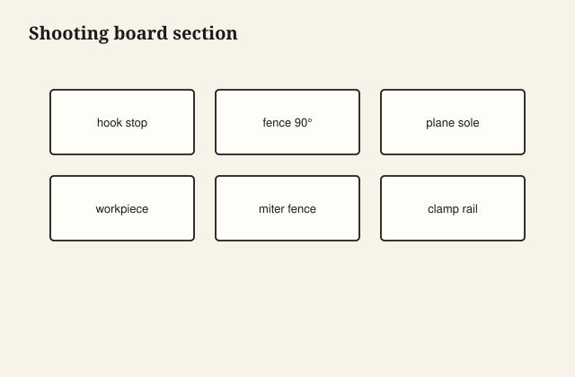

I keep a tenoning jig that is uglier than a catalog and truer than my patience on a Tuesday. The fence has a pencil confession: *which face*. The runner is waxed. The clamp is a real clamp, not a wish. When I put a rail in it, the shoulder is the same shoulder I cut in March. That is the only reason it is still on the wall.

A jig that exists to make a video simpler is often a jig that makes a hand less careful. A jig that exists to keep a hand out of a blade, or to repeat a mortise on four legs, or to hold a door while you hinge it — those I keep. The test is: does the second piece match the first without a hero moment?

<figure class="craft-figure">
  
  <figcaption><strong>Figure 1.</strong> Plane rides fence; work stops on hook.</figcaption>
</figure>

## Disposable vs kept

A plywood fence with a stop for one bookshelf, full of screws, out of square by a hair that only that bookcase needed: it can die with the job. I write the job number on it and I throw it in the rack until the check clears, then I break it down.

A saddle for a round leg, a tapering jig whose angle I use three times a year, a shooting board, a donkey’s-ear, a coping sled, a mortising block that holds a chisel vertical — those stay. I do not make them pretty. I make them true, and I check them when I take them down, because wood moves and plywood remembers a wet week.

## Accuracy is a habit, not a gadget

A jig built from a cupped piece of MDF is a cup you will copy. I flatten, I use a factory edge I have checked, I run a test on scrap, I measure the scrap. I do not measure the jig and trust it like a religion.

Stops wear. Pencils lie. I have a brass screw as a stop on one fence because the wood stop crushed. The brass does not crush. The idea was not mine. I still like it.

## Safety jigs are the ones I will preach

A crosscut sled with a tall fence and a hold-down. A tenoning jig that keeps the rail and the hands apart. A router surround that supports the base so the bit is not a dive on a small part. A push block that is the jig.

I will not keep a jig that requires you to be a little brave. If the operation is brave, the jig is unfinished.

## The CNC is a jig that went to college

A nest, a fixture on the bed, a pin that locates a part that was already face-marked. The same rules: the fixture is true, the revision is the revision, the test part is measured. A beautiful toolpath in the wrong file is a beautiful waste.

I do not treat the machine as a personality that “doesn’t make mistakes.” It makes the mistake you modeled, at speed.

## When not to jig

A single dovetail on a single drawer: I can mark and cut. A jig would take longer and would not teach the next drawer. A single hinge gain: a knife and a chisel. A hundred hinge gains: a jig or a machine.

The judgment is the job count and the risk. People who jig everything have a shop of fences. People who jig nothing have a shop of almosts. I want a small wall of keepers and a pile of scrap that was allowed to die.

## Notes on the jig

Species, date, which way the face goes, which machine it lives on, a warning if the runner is fat in August. I write on the wood. I have tried to remember. The jig outlived the memory.

If two people use it, the note is not optional. I have cut a tenon from the wrong face because the note was in my head. The rail is still under a bench as a reminder, too short to be a rail.

## The short rail under the bench

I cut a tenon from the wrong face because the note was in my head. The rail is too short to be a rail. The note is on the wood now: which face, which machine, fat in August. Two people use it; the note is not optional. The CNC fixture is the same religion. The wrong revision at speed is a beautiful waste.

I built a jig from cupped MDF and copied the cup for a week before I noticed. I flatten the stock I build from. I run a test on scrap and I measure the scrap. If the operation still feels brave — a hand too close to a bit — the jig is unfinished, not the person.

## Mill culture, again

A molder has a setup. A setup is a jig in spirit: knives, fences, a test stick kept in the box. Furniture shops that came from mill towns should already believe in a test stick. The jig wall is the handmade version of the test stick.

I do not need a brand of jig. I need the second door to match, and I need my hand to stay a hand. When a jig does both, it gets a hang hole. When it does one and not the other, I fix it or I burn it (in the legal, outdoor, not-a-finish-rag sense). A bad jig that stays on the wall is a rumor that keeps getting used. Those are the most expensive scraps in the building.

I run a hand down the tenoning jig’s fence before I use it. If I feel a nick that will print, I scrape it. The jig is a tool. It is allowed to need a minute. It is not allowed to need a prayer.

A hundred hinge gains earn a jig. A single gain earns a knife. People who jig everything have a shop of fences. People who jig nothing have a shop of almosts. I want the small wall and the pile of scrap that was allowed to die. The molder’s test stick is the same habit with a different name. The hang hole is how we store the belief.

A bad jig that stays on the wall is a rumor that keeps getting used. Those are the most expensive scraps in the building. I check a keeper when I take it down. Plywood remembers a wet week. A shooting board, a donkey’s-ear, a coping sled: they stay if I use them three times a year and they stay true.

If the operation is brave, the jig is unfinished. I will not keep a fence that asks a hand to be near a bit “just for this cut.” A crosscut sled with a hold-down, a tenoning jig that separates rail and fingers, a router surround that stops a dive — those earn the hang hole.

A weekend plywood fence for one bookcase can die with the check. I write the job number on it and I break it down when the check clears. Truth on scrap is cheaper than truth on a customer’s rail. The second door matching the first is the only reason a jig earns a nail on the wall.
