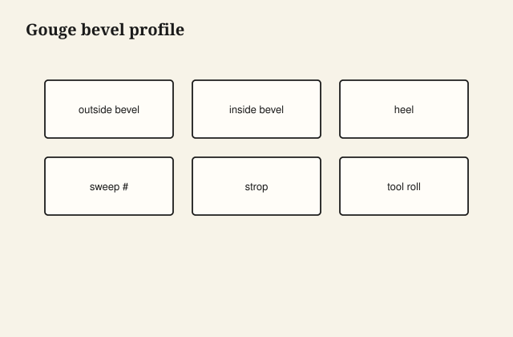

Carving gouges need two bevels working together: outside for depth control, inside for reach in tight curves.

## At the bench

Grind the outside bevel to set how deep the tool dives; hone the inside bevel for clearance in concave work. Match the sweep to the curve you are cutting—a wrong sweep fights the grain.

<figure class="craft-figure">
  
  <figcaption><strong>Figure 1.</strong> Outside bevel sets depth; inside bevel aids tight curves.</figcaption>
</figure>

## Photo slot (staged)

**Staged only** — drop a `carving-gouge-grind` frame from `D:\BBF` when the shot is captioned and color-corrected. Do not publish catalog pulls.

## Checklist

- Outside bevel ground square to the centerline of the sweep.
- Inside bevel polished where it rides the cut surface.
- Test cut in the same species as the carving blank.
