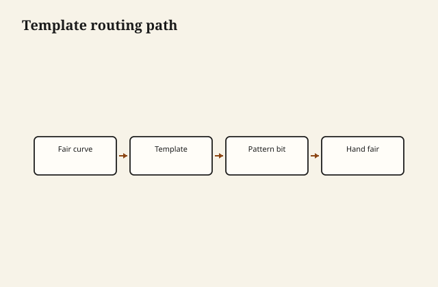

Curved aprons start fair on a plywood template before any hand fairing. The router follows the pattern; your eye follows the template's honesty.

## At the bench

Bandsaw outside the line, screw template to the work, rout with a pattern bit to the bearing. Climb cuts only where you can control exit tear-out. Spokeshave and sand to remove router marks—template gets you close, not done.

<figure class="craft-figure">
  
  <figcaption><strong>Figure 1.</strong> Pattern bit follows template; climb cuts on exit only with care.</figcaption>
</figure>

## Photo slot (staged)

**Staged only** — drop a `curved-apron-template` frame from `D:\BBF` when the shot is captioned and color-corrected. Do not publish catalog pulls.

## Checklist

- Template edge smooth—any bump becomes a permanent groove.
- Pattern bit bearing rides the template, not the fuzz on it.
- Grain direction noted where the bit exits the cut.
