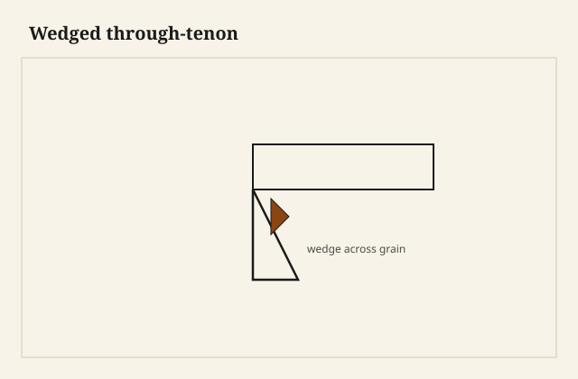

The chair is loose at the front rail and someone has already been here: a yellow-brown drip of wood glue on the underside, a finish smear, a dowel that is not the size of the original hole. I do not add a third glue. I ask how it comes apart. If the answer is hide and pins, I heat, I tap, I label every rail with painter’s tape and a number, I photograph the underside before I forget the angle of a stretcher that only looks symmetric.

If the answer is PVA and a factory dowel, I tell the owner the truth: we may lose wood, we may sleeve, we may recut a rail. The bottle in the kitchen drawer is how chairs become puzzles with no picture.

<figure class="craft-figure">
  
  <figcaption><strong>Figure 1.</strong> Wedge spreads tenon in mortise; orient wedge across grain.</figcaption>
</figure>

## Diagnosis

Rack the piece. Listen. A tick at a shoulder is a joint. A creak in a panel is a panel. A wobble that is a short leg is a floor or a foot that was cut after a finish, raw, and then wore. I look at the finish for a clue to the glue. Shellac and hide often travel together in older work. A thick conversion film and a white glue often travel together in newer work.

I do not start with a clamp across a loose joint and a fresh glue. That clamp closes a dirty joint. A dirty joint is a joint that will open again, sooner.

## Hide, heat, patience

A damp rag, a warm iron, a steam gun used like an adult, not like a weapon. The glue lets go. The tenon comes. I scrape to wood. I dry-fit. I repair a chewed cheek with a slip if I have to. I glue with hide again if I can, so the next person is not me cursing me.

Pins: drive them through if they will, or drill them out if they are stuck and sacrificial. Do not split a rail to save a peg that cost nothing.

## PVA, the fossil

Heat helps less. Acetone and time and picking help some. Sometimes the honest cut is to saw the rail and put in a new tenon or a floating tenon of real size. I would rather recut than build a museum of old glue in a hole.

Epoxy in a chair joint is a last resort I use when the wood is punk or the joint will never be asked to come apart again and the load is real. I write it in the job notes. The next person deserves the notes.

## Tops, breadboards, splits

A split in a top: if it is a movement split from a bound breadboard, I free the pins, I slot what was not slotted, I glue the split if it will close without a wave, I do not glue it and then bind the breadboard again. That is the same injury.

A cup: moisture, finish both faces, battens that are slotted, time. A cup that is a different species glued into a panel is a design error. I recut if I can. I do not plane a cup into a thin, proud, still-angry top and call it flat.

Veneer blisters: hide, a syringe, a warm caul. A missing chip: a leaf from the folder if the original shop was kind, or a harvest from an unseen underside, or an honest fill that does not pretend to be flake.

## Finish repair

A ring in oil: cut back, re-oil, feather. A ring in shellac: alcohol, pad. A ring in poly: a level and a recoat of the panel, or a live-with. I do not spot-gloss a satin sea.

A scratch through color: dye, then the system. A scratch in the film only: rub if the whole panel can be rubbed, or leave it if the house is a house.

## What we build so this goes better

Pins. Hide where the piece will be a chair. Slots in breadboards. Notes in a folder. A finish that can be repaired with the same finish. A screw in a slot instead of a screw in a prison. A corner block that is a block, not a blob.

We do not build for a future museum. We build for a future kitchen. The kitchen will loosen a chair. The kitchen should not have to throw the chair away.

## When I refuse a repair

When the piece is a particleboard tomb with a photograph of oak on it and the joint is a cam lock that has stripped the hole for the third time. I can sleeve. I can also say: this was not a forever object. The owner already knows. They want me to say it so they can stop.

When the finish is a mystery coating I cannot reverse and the owner wants “original” plus “like new.” Pick one.

When the sentiment is real and the structure is gone: I can make a new piece that quotes the old one, and I can keep a rail as a memory. I will not make a dangerous chair for a grandchild because the grandfather sat in it.

“Original” plus “like new” on a mystery coating: pick one. I will sleeve a stripped cam hole once. I will also say when the box was never built to be opened twice.

## Arkansas pieces coming home

A lot of furniture in this state has been through heat and damp and a truck. The joints that were dowels are tired. The joints that were tenons and hide are tired in a way I can wake. I like that work. It is not glamorous. It is the continuum without a brochure: the same climate that dried the oak is the climate that loosened the chair, and the shop in the middle of that climate ought to know both.

I send the chair back with a sentence about not standing on it, and a sentence about humidity if the house is a desert in winter, and no speech about heritage. The chair is the speech. If it does not rack, we did the job. If it racks, I did not take it far enough apart.

The tape labels come off after the glue has sat through the quiet. I keep one photo of the bones, in the folder, in case they send the mate. The mate always comes later. The numbers on the tape are how I will remember which rail was the short one, the one that started the whole conversation.

I do not add a third glue to a dirty joint. A clamp across old PVA and fresh yellow closes filth for a season. Heat and hide if I can. Recut a rail if I must. Epoxy when the wood is punk and the chair will not be asked to come apart again — and I write that in the notes for the next person.

A bound breadboard that split a top: I free the pins, I slot what was not slotted, I glue the split if it closes without a wave. I do not glue the split and bind the breadboard again. That is the same injury wearing a new bandage. The chair is the speech. If it does not rack, we did the job.
