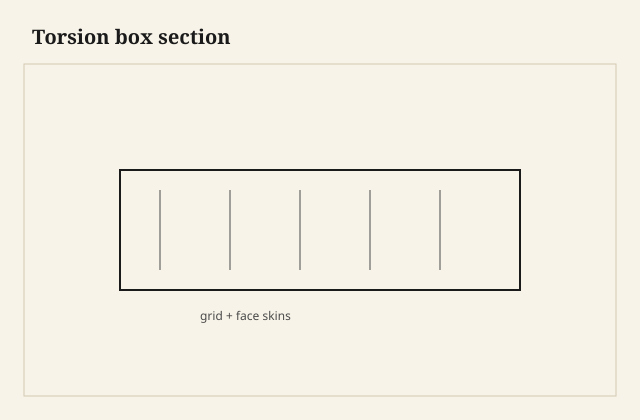

Long shelves sag; torsion boxes resist bend by putting thin skins in shear over a light grid.

## At the bench

Glue top and bottom skins to the grid all at once if you can clamp flat. Edges capture square—banding hides the lamination and stiffens the front. Keep the grid continuous; gaps are where the shelf folds.

<figure class="craft-figure">
  
  <figcaption><strong>Figure 1.</strong> Top and bottom skins glued to grid; edges capture square.</figcaption>
</figure>

## Photo slot (staged)

**Staged only** — drop a `torsion-box-shelf` frame from `D:\BBF` when the shot is captioned and color-corrected. Do not publish catalog pulls.

## Checklist

- Glue-up on a flat dead surface—twist here is permanent.
- Grid joints glued; pins alone do not carry shear.
- Skins oriented with grain running the long span.
