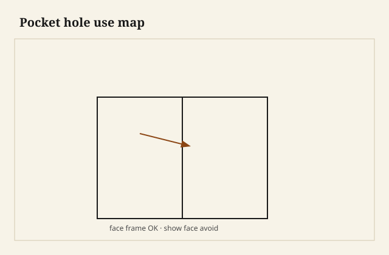

Pocket screws are fast case joinery—not show joinery. They excel where the hole hides behind a face frame or inside a carcass.

## At the bench

Use them on face frames, cabinet backs, and places the screw angles into end grain on a rail. Skip them on visible tabletops and anywhere a plug would still read as a dot. Clamp during drive so parts do not creep.

<figure class="craft-figure">
  
  <figcaption><strong>Figure 1.</strong> OK: face frame, carcass back. Avoid: visible show faces.</figcaption>
</figure>

## Photo slot (staged)

**Staged only** — drop a `pocket-hole-when-to-use` frame from `D:\BBF` when the shot is captioned and color-corrected. Do not publish catalog pulls.

## Checklist

- Holes on the hidden face only on delivery pieces.
- Screw length reaches the far member without poking through.
- Glue on the joint even with screws—screws are clamps, not the only bond.
