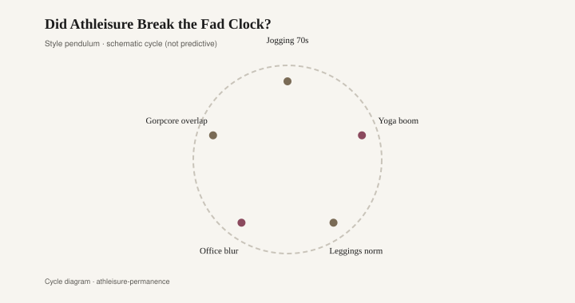
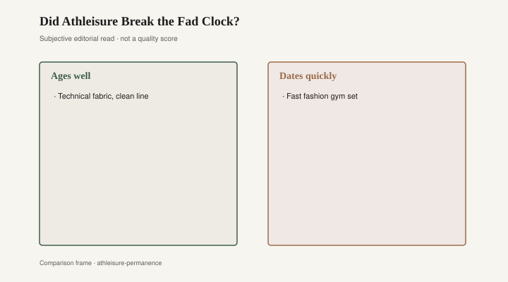

# Did Athleisure Break the Fad Clock?

*Draft stub — copy and body pending editorial pass. Graphics are staged for layout.*

<figure class="fffb-figure">
  
  <figcaption>Style cycle schematic for Did Athleisure Break the Fad Clock?.</figcaption>
</figure>

<figure class="fffb-figure">
  
  <figcaption>What tends to age well versus date quickly in Did Athleisure Break the Fad Clock?.</figcaption>
</figure>
