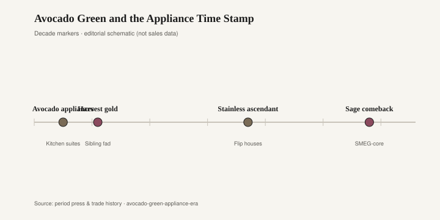
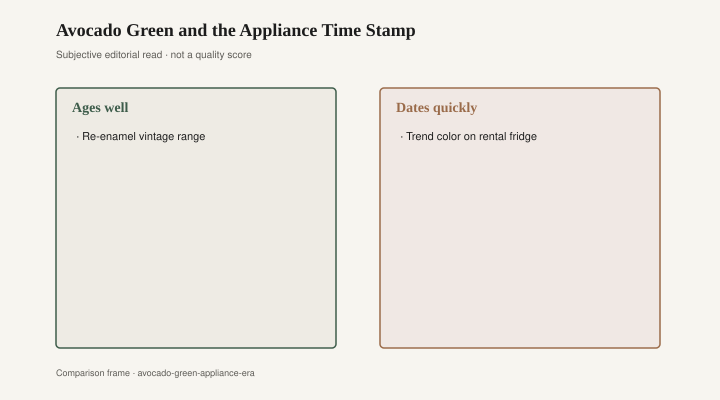

# Avocado Green and the Appliance Time Stamp

Open the kitchen from the hallway and the year hits you before the smell of coffee. The refrigerator door is avocado — not a fruit, a machine color — and the range beside it is harvest gold. General Electric, Frigidaire, and Sears sold those chips as a pair in the 1970s; the laminate on the counters tries to split the difference and fails. A teak cutting board sits on that laminate. The teak does not look like a year. Everything with a plug does. You can date the room without opening a cabinet.

Paint is the cheapest way a house changes its mind. A gallon of alkyd in 1973 cost less than a dinette and covered more surface. That is why color cycles run through kitchens first and furniture second. The wall can be wrong for a weekend. A sofa dyed to match the wall is wrong for the life of the fabric. The hangover is always the same: the paint gets rolled over, and the matching furniture sits in the garage because it still works and no longer belongs.

Harvest gold and avocado were not accidents of taste. They were appliance colors with names on chips, pushed through General Electric, Frigidaire, and Sears into rooms that had just finished with turquoise and pink. Gold read as sun and wheat; avocado read as the outdoors brought inside after a decade of white-and-chrome kitchens. Both colors photographed as warmth in the catalogs. In person, under a fluorescent shop light, they went muddy. That muddiness is what people remember now, and it is unfair to the better rooms. A walnut table under a gold range still looks like a table. The gold range looks like 1974.

<figure class="fffb-figure">
  
  <figcaption>Timeline for Avocado Green and the Appliance Time Stamp.</figcaption>
</figure>

The furniture floors kept up, as furniture floors always do. Department stores and the catalog giants — Sears again, Montgomery Ward, the local Ethan Allen gallery — sold suites stained to live with the chips: pecan, “Mediterranean” oak, a greenish gold on a vinyl dinette that stuck to a bare thigh in August. Some of that wood was wood. Some of it was a print on particleboard with a plastic edge that caught the light the wrong way. The status claim was that the house was current. You had left the pink-and-chrome 1950s. You had entered an earth that came in a can. Matching was the point. The refrigerator, the range, the dishwasher if you had one, the wall, the dinette — a single sentence in four materials.

By the early 1980s the gold had to go. Dusty rose and mauve arrived as a correction that was also a fashion. They sat on brass, on pickled oak, on the gray-mauve carpet department stores rolled out by the acre. A mauve sofa in a 1986 gallery was not a joke. It was a finished thought: softness after harvest, a room that wanted to look expensive without looking brown. The same sofa in 1994 looked like a bridesmaid. Color does that. It does not wait for the springs to fail.

Hunter green and burgundy took the 1990s. Ralph Lauren Home had already taught a generation that a room could dress like a study. Pottery Barn and the mall versions followed with forest-green slipcovers and oxblood leather club chairs. Then the 2000s wanted Tuscany — not the place, the paint aisle: faux-finished gold plaster, a dining set with a distressed ochre base. The 2010s apologized with greige. The 2020s reached for terracotta and sage the way the 1970s reached for gold and avocado: earth again, after a decade of gray. The names change. The mechanism does not. Appliances and paint set the clock. Upholstery that obeys the clock dies on it.

What ages is the object that was never trying to be a chip. Teak, walnut, a cherry table with a clear finish, a hardwood case whose color is the wood — these can live under avocado, under mauve, under Agreeable Gray, because they were not dyed to match a year. A mill that still talks about timber the way Bradley Brand Furniture in Warren, Arkansas, talks about it in company copy — 1902, solid hardwood, no particleboard [CITE NEEDED] — is making a piece that can change its room without changing its identity. What dates is the appliance color bolted to a ten-year compressor, and the sofa dyed to keep it company.

The appliance is a crueler time stamp than the wall because you cannot roll it. You can paint a refrigerator; people did, badly, with epoxy kits from the hardware store. You can panel it to match the cabinets and pretend it is furniture. You can live with it until the compressor dies and then discover that a new stainless box makes the harvest-gold dishwasher look like a prank. Whole kitchens have been ripped for that mismatch. The furniture that matched the old chips goes to the curb or the garage, still structurally willing, socially unemployed.

There is a revival taste for the chips now — a certain Instagram kitchen that keeps the avocado range as a trophy, a certain collector who wants the GE “Harvest” badge visible. That taste is not the same as the 1970s taste. The 1970s taste was current. The revival taste is quotation. Quotation can be charming. It can also be a costume that costs a compressor. If you keep the range because it works and you like the color, you are using an object. If you keep the range because the year is fashionable again, you are wearing one. The teak board on the laminate does not care which you are doing. It was a board before the chips had names.

<figure class="fffb-figure">
  
  <figcaption>What tends to age well versus date quickly in Avocado Green and the Appliance Time Stamp.</figcaption>
</figure>

Paint remains the cheap fashion. A sofa dyed to match the paint year remains the expensive fashion that dies on the same clock. The lesson of avocado is not that green was a mistake. Green is a fruit and a leaf and a perfectly decent machine. The lesson is that a house should not let the most expensive soft goods take orders from the most fashionable hard goods. The refrigerator will be replaced. The range will be replaced. The table, if it was a table, can stay and watch the next chip arrive. That is not nostalgia. It is a difference in what the object was asked to be: a year, or a place to put the cutting board.
