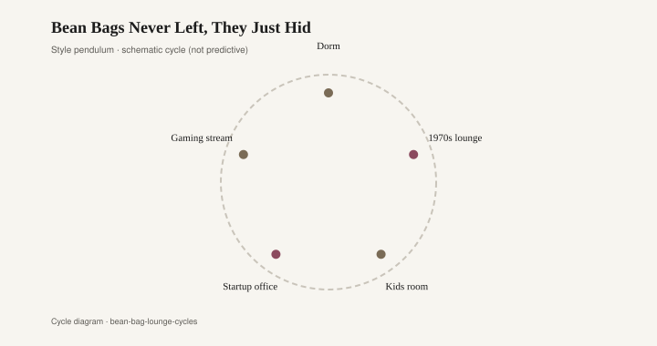
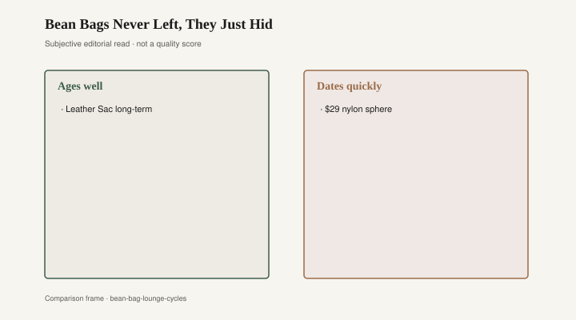

# Bean Bags Never Left, They Just Hid

You sit, and there is still no chair. A pear of leather (or vinyl pretending) slumps in the corner; polystyrene beads rattle like dry seed when you shift. Legs: none. Back: none. Posture: whatever the pellets allow after they run from your weight and then give up. Zanotta’s Sacco, designed in 1968 by Piero Gatti, Cesare Paolini, and Franco Teodoro for Aurelio Zanotta’s Milan firm, made that refusal a museum object — V&A, Cooper Hewitt, the Italian-design canon treating a bag of pellets as serious. It was. The dorm cousin — JCPenney vinyl, a zip that failed — did not get a vitrine. It got a stain and the last trash day of the semester.

Gatti, Paolini, and Teodoro had trained as architects in Turin and begun collaborating in the mid-1960s. The Sacco — Italian for sack — was the anti-chair. Polystyrene pellets in a seamed skin. Zanotta produced it in leather and in plastic (“skinflex” in the V&A’s notes), more than eight colors, advertised with the kind of line manufacturers write when they are pleased with themselves: a chair of a thousand and one nights, a thousand positions by day, one by night (V&A object record). The idea, Zanotta still says, was a universal seat that adapted to any body. Kids used it as a toy. Adults used it as a refusal of the wing chair. In 2020 the Sacco received a Compasso d’Oro for lifetime achievement; earlier prize histories wander (an NGV essay mentions 1979 — [CITE NEEDED] on which Compasso year you print). The object stayed in production. That is rarer than a prize.

What the Sacco licensed, culturally, was floor living. Not a tatami logic — the 1970s Western apartment in which the sofa was optional and the stereo was not. You sat low. You received company low. You watched television from a nest of foam and friends. The cheap beanbag — vinyl, corduroy, a zip that failed, pellets that escaped into the shag — made the Sacco’s idea available to anyone who had a catalog and a dorm double. JCPenney and the college-town import shop sold them by color. A vinyl sack was a housewarming. Those bags were not Zanotta. They were the idea without the leather, without the stitch quality, without a company that expected to still be selling the same object in fifty years. They flattened. They leaked. They smelled like a locker if you kept them in a basement. Once the polystyrene went to dust, no upholsterer wanted the job; there was no frame to recover, only a skin.

<figure class="fffb-figure">
  
  <figcaption>Style cycle schematic for Bean Bags Never Left, They Just Hid.</figcaption>
</figure>

Status of casualness is a real status. It pretends not to be. A formal chair says you dress for the room. A Sacco says the room dressed down for you, which is a flex if the rest of the apartment can afford the joke: good art, good sound, a kitchen that works. In a dorm, the beanbag said you had rejected your parents’ living room and also that you had twenty-five dollars. Both readings were correct. The 1970s made informality a moral style — less stuffy, more honest, closer to the body. The body, it turned out, still needed a seam that held.

The sack never left. It hid. It hid in rec rooms, in kids’ corners, in the basement that also held the harvest-gold lamp. It hid in the 1990s as a novelty print and a dorm-care package. It hid in the 2000s as a video-game perch. Then the 2010s and 2020s brought it back as a relative of the Cloud. LoveSac-style giants (the Utah company dates to the late 1990s — [CITE NEEDED] on the incorporation year), foam pits, modular blobs you fall into as if the living room were a ball court. The category is the oversized foam lounge that eats a bay window and a teenager. It is the Sacco’s grandchild with a different filling: shredded foam instead of beads, a washable cover if you bought the cover, a scale that is less “chair” than “terrain.” Softness as luxury. Structure as optional. The photograph is a person swallowed by upholstery. Casualness, again, as a purchase. You can spend a sofa’s price on a pit that has no legs to level and no rail to recane.

Soft seating of this family cannot be repaired in the way a chair can be repaired. You can restuff a Sacco if you can open it and if Zanotta or a determined upholsterer will still deal with you; the leather original is the exception that proves the rule because someone still values the skin. You cannot really repair a burst vinyl beanbag. The pellets go everywhere. The vinyl does not take a patch that lasts. You replace it. The foam pit, once the foam has crumbled or soured, is a replacement event, not a recover-the-cushions event. Some covers zip. The foam inside is still a landfill in waiting.

A hardwood armchair with a blown seat is a conversation with a caner or a springer. Bradley Brand Furniture, in Warren, Arkansas, will not appear in a Zanotta monograph. The company’s own copy is lumber-mill plain: Bradley Lumber, 1902; solid hardwood; no particleboard [CITE NEEDED]. A hardwood frame with a cushion you can recover is the opposite theology from a sack you can only throw away. Both theologies have a place to sit. Only one leaves a shop a job.

<figure class="fffb-figure">
  
  <figcaption>What tends to age well versus date quickly in Bean Bags Never Left, They Just Hid.</figcaption>
</figure>

What ages is the Sacco as an industrial idea — still in production, still in museums, still a serious joke about posture — and any skin good enough that someone will restuff it. What dates is the vinyl cousin, the novelty print, the foam pit bought as a photograph of youth. The hangover is already in the classifieds and on the curb the week after move-out: flattened sacks, leaked beads in the carpet, a LoveSac cover that washed and a foam that did not. Floor sitting is older than Zanotta. The Sacco was a brilliant factory answer to a 1968 question about youth and posture. The cheap descendants answered a different question: what is the least chair we can ship? The 2020s foam terrain answers a third: what is the most sofa we can photograph? None of those questions is foolish. Only one of them produces an object a shop can mend. The rest hid in the basement until the next cycle called them back by another name.
