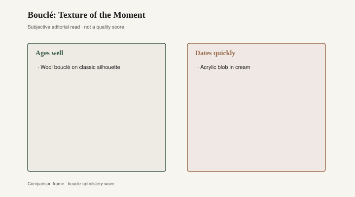
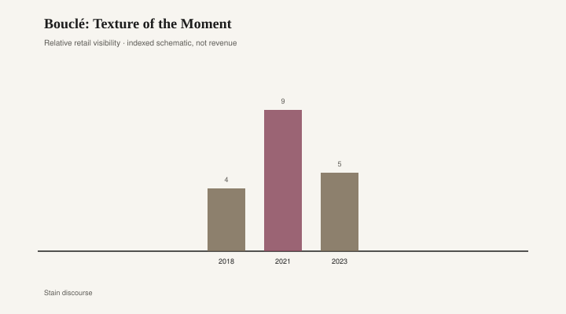

# Bouclé: Texture of the Moment

The chair had a decent bone. You could feel it when you lifted one corner: a hardwood rail, a sprung seat, weight that was not all foam. Over the bone, a cream bouclé the color of a labradoodle. The loops had gone gray on the arms and shiny on the headrest. A single thread had pulled near the seam and started a run that no one would stop, because stopping it meant admitting the chair was already last year’s cloud. The frame could have taken another cloth. The cloth was the purchase people remembered.

Bouclé is not a 2020 invention. The word is French for buckled or looped; the cloth is a yarn with knots and loops that photograph as texture. Eileen Gray used it. Her Bibendum chair, late 1920s, named for the Michelin man — stacked rolls, a modern lounge that needed a cloth with body — has spent a long afterlife in leather and in nubby wool, depending on the maker and the year. [CITE NEEDED on which early Bibendum commissions were specified in bouclé versus leather; later showrooms backdate a cream loop.] The old bouclé was wool, or wool-enough, and it sat on frames that were the point. You bought the chair. The cloth was a coat.

Le Corbusier, Pierre Jeanneret, and Charlotte Perriand’s Grand Confort has spent much of its later life in a pale bouclé that people now treat as original law. Treat the later showroom as a later showroom. Mid-century trade used the nubby upholstery on club chairs because it read as modern without reading as slick. Texture, again, as a decision about light. Gray does not owe the blob a sequel. The blob owes Gray a footnote.

Then 2020 through 2023 made the coat the chair. Every direct-to-consumer brand, and a few old ones that wanted the traffic, issued a cream blob: a rounded lounge, a “cloud,” a sheepish kidney of foam and wood-look legs, all in the same off-white loop. Article, Interior Define, Maiden Home, West Elm, CB2, the Instagram shops with a first name and a furniture SKU. The silhouette was mid-century if you squinted and nursery if you did not. The cloth hid a lot of cheap foam. On a feed, at three feet, the chair looked expensive and soft. In a room, on a July afternoon, it looked like a pet.

<figure class="fffb-figure">
  
  <figcaption>What tends to age well versus date quickly in Bouclé: Texture of the Moment.</figcaption>
</figure>

The cream year was cruel to pale loops. Dirt is not a moral failure. Dirt is physics. A looped yarn holds a crumb. A cream loop displays it. People covered the chairs with throws, which defeated the blob, or they lived with a gray that crept inward from the arms like a tide. Resale listings filled with “barely used” cream chairs that were used the ordinary amount. The next fashion will be a darker bouclé, or a velvet, or a leather-look that photographs as quiet. The frames, if they were frames, will still be there.

Recover versus replace is the same adult question velvet asks. If the bone is good — hardwood, a spring deck, corners that do not rack — recovering is the older economy. You pick a cloth that is not this year’s labradoodle. If the bone is foam on a plywood silhouette with legs that unscrew from inserts, recovering is a donation to a shape that was never meant to outlast the cloth. Do not send a blob to an upholsterer and pretend you bought a Gray.

<figure class="fffb-figure">
  
  <figcaption>Retail-era visibility for Bouclé: Texture of the Moment.</figcaption>
</figure>

What ages: a frame you can recover; a wool that wears into itself; a tighter weave that does not hold a crumb like a net. What dates: the cream loop of 2021, the matching ottoman that completed the pet, a whole room in one nubby off-white, as if texture were a personality. One pillow in a fashion cloth is a note. A whole lounge in a fashion cloth is the song.

Bradley Brand Furniture, Warren, Arkansas, is a hardwood house. Company copy: lumber lineage dated 1902, no particleboard. [CITE NEEDED.] They are not an upholstery mill. A solid case piece does not wear a date in a looped yarn. A chair with a real frame can change its date. A blob with a costume cannot.

I have sat in a 1960s lounge with new wool and felt the original decision in the angle of the back. I have sat in a 2021 cream loop and felt only foam finding its sitting-shape. Both were called bouclé in the caption. The caption is a swatch name. It is not a provenance. Eileen Gray’s Bibendum was a chair with an idea about sitting. The DTC blob was a chair with an idea about a photograph. You can like both. You cannot recover the second into the first.

The hangover is already on bulk-trash mornings: cream kidneys that cannot stand a second cloth, ottomans whose loops pulled into a run, slipcovers in a bouclé-look knit that stretched and then pilled. A few of those pieces had frames. Most did not. The ones that did will be recut. The ones that did not will become the next decade’s joke, the way crushed velvet became a joke and then a nostalgia and then a joke again. If you like the loop, use it on something whose bones you have checked. If you like Gray, look at the frame before you look at the nubby coat. Covers come off. That was always the point of a good chair.
