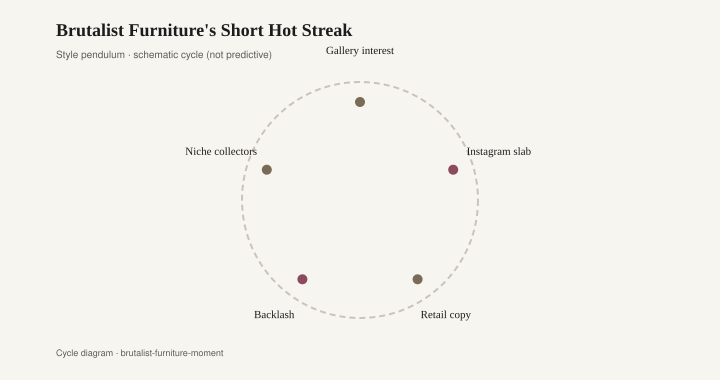
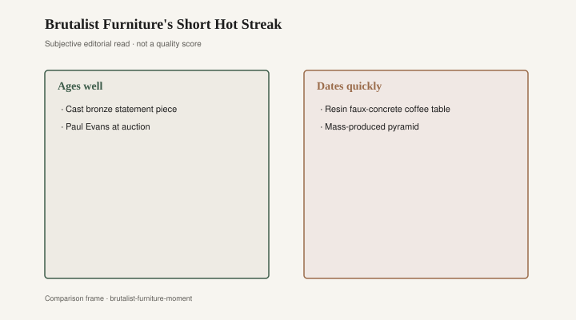

# Brutalist Furniture's Short Hot Streak

The coffee table has the manners of a bunker. Thick walnut, or a metal that looks poured and then attacked with a torch, corners that refuse to soften, a top you could land a plane on if the plane were a drink. Dealers now file that object under brutalist. The word is an import from architecture, and it is doing overtime. Paul Rudolph’s interiors — bush-hammered concrete, corduroy walls, built-ins that read as geology — were rooms first. Paul Evans’s sculpted steel and bronze for Directional, in the 1960s and 1970s, were furniture that wanted the same weather. The 2010s put both on 1stDibs and called the category a moment. The moment was a photograph. The better pieces were already forty years old.

Evans is the name the listings reach for when they want a price. Cityscape, Argente, the welded cabinets that look like a city seen from a bad altitude: chrome and brass patches, pewter, a surface that is work, not a stain. Directional sold him as a studio line inside a factory business. Treat a hangtag as a hangtag. A signed Evans is a signed Evans; a “Paul Evans style” cube from a later shop is a silhouette. I will not invent a hammer price. 1stDibs and the design fairs of the 2010s made the silhouette visible to people who had never walked a High Point temporary. Visibility is not the same as a census.

Rudolph’s rooms are harder to buy, which is why the furniture market borrowed his adjective. Yale’s Art and Architecture Building, finished in the early 1960s and now Rudolph Hall, is the public argument: ribbed concrete, a harsh light, seating that is part of the pour. Private interiors — apartments, offices — pushed the same idea into sofas and tables that did not apologize for mass. [CITE NEEDED on which published Rudolph interiors first used the furniture pieces later sold as “Rudolph.”] The adjective traveled farther than the architect. By the time a resin cocktail table in a 2019 catalog called itself brutalist, the word meant: chunky, gray-adjacent, good in a square photograph.

The 1970s already had the wood version without the French lesson. Chunky oak and walnut coffee tables, pedestal bases like tree stumps, dining tables with aprons thick as a stair tread, a Mediterranean or “sculpted” cousin that High Point could crate. Some of that wood was solid and jointed. Some was a carved skin over a cheaper core. The decade liked weight because the decade before had sold lightness. A walnut slab that can be oiled is still a table when the word brutalist has gone back to the architecture school. A printed grain with a chiseled edge is a year.

<figure class="fffb-figure">
  
  <figcaption>Brutalist decor often peaks in photography before it peaks in living rooms.</figcaption>
</figure>

Collector revival in the 2010s ran on two tracks. One was the actual object: Evans, the better studio-metal work, a documented 1970s walnut piece with a provenance a dealer could stand behind. 1stDibs, auction houses, and a handful of galleries taught a new audience that welded steel could be furniture and not a scrap pile. The other track was the look. Concrete-look resin, a gray pour with air bubbles arranged for charm, a “cast” table that had never seen a formwork in a yard. West Elm, CB2, and the infinite aisle sold the second track as the first. Instagram liked the shadow under a thick top. A living room liked a table you could move twice.

Resin is not a moral failure. Resin is a material with a job. A decent resin top on a steel base can live outdoors or take a wet glass. The failure is the costume: a coffee table sold as brutalist because the photograph needed a bunker and the factory had a mold. Concrete-look is a print of labor. Real concrete furniture exists — cast, heavy, a two-person lift, a surface that will stain if you let citrus sit. The resin cousin photographs the stain without earning it. After three summers the gray chalks or yellows and the air bubbles look like a product, which they were.

What ages is mass that is mass, and craft that is a surface you can maintain. Welded steel you can wax. Bronze that darkens on purpose. A walnut or oak slab thick enough to sand. Rudolph’s better built-ins, where they survive, are architecture; you do not recover them, you occupy them. Evans’s better metal is furniture that expected a life of hands. What dates is the texture gimmick: a foam “stone” finish, a resin bark, a coffee table whose only brutalist credential is a chamfer and a gray filter. Weight in a photograph is not weight in a room. Pick the object up. If two people are optional, you bought a picture of a bunker.

Status, in the short hot streak, was knowing the word and owning the shadow. A 1974 walnut cube in a loft said you had found the decade before the feed did. A 2018 resin “cast” said you had seen the loft. Both rooms can be comfortable. Only one object will still be itself when the adjective moves on — and it has moved on, into whatever the next square photograph needs. Brutalist decor peaks in photography first because photography is where mass is free. Living rooms have floors. Floors notice.

<figure class="fffb-figure">
  
  <figcaption>Weight and craft read timeless; texture gimmicks do not.</figcaption>
</figure>

Bradley Brand Furniture, in Warren, Arkansas, is a hardwood shop in the company’s telling — Bradley Lumber, 1902; solid wood; no particleboard — and a 1970s walnut table that is actually walnut is the kind of object that shop would recognize without needing the French. [CITE NEEDED on the 1902 date; company copy.] Soft contrast, not a sermon: a board you can refinish does not require a collector hashtag to remain a board. A resin bunker requires the hashtag to remain interesting. When the hashtag cools, you still have a gray oval and a story about concrete.

I have sat at Evans-adjacent tables that were honest metal and at catalog tables that were honest about nothing except the SKU. The honest metal was cold and slightly ringing. The catalog table was warm and slightly sticky, the way a pour that is not a pour gets in July. Both were called brutalist in the caption. The caption is a search term. It is not a provenance. Rudolph does not owe the resin anything. The resin owes Rudolph a footnote and a more accurate hangtag: gray, hollow, this year.

The hangover is already in the consignment aisle: chunky gray cocktail tables with a chip that shows a different gray, “brutalist” in the listing title the way “mid-century” is in every other title, a walnut cube that might be walnut if you check the underside. Check the underside. Grain that wraps a corner like a ribbon is a print. Weld that is weld will still be weld when the word has gone back to the buildings. Buy the weld, or the slab, if you want a table. Buy the resin if you want a season. Seasons are allowed. Bunkers, in furniture, should at least be heavy.
