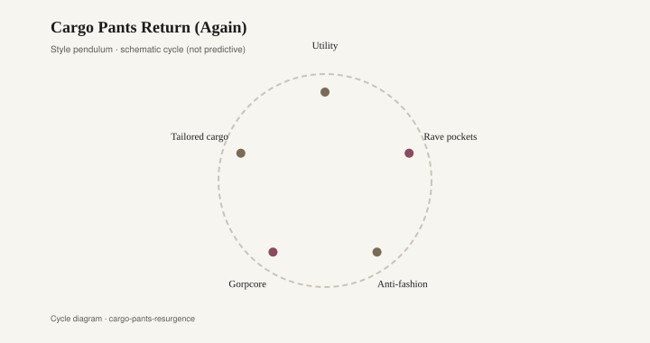

# Cargo Pants Return (Again)

A cargo pocket is a pouch sewn onto the outside of a trouser, usually on the thigh, with a flap and a snap or a Velcro tab. The army put it there to hold a map or a magazine. Fashion keeps putting it back because a pocket on the outside of the leg is jewelry that can carry keys.

The military original is older than the mall. British battle dress and American fatigues put bellows pockets on the thigh because a soldier needed both hands free. Helmut Lang's 1990s tailoring borrowed the idea in a slimmer, more expensive cotton and taught fashion how to keep the pocket after the war reference faded. The 1990s and early 2000s wore the civilian copies as if they had been issued. Rave kids bought army-surplus trousers in olive and khaki, then danced in them until the cotton softened. Hip-hop and skate mixed the same cut with a wider leg. Abercrombie & Fitch and American Eagle sold a civilian version to malls: many pockets, a drawstring, a wash that looked like it had already been on a field exercise. JNCO and other wide-leg labels treated the cargo as extra real estate for a logo. Dolce & Gabbana and a few runway houses put the pocket on silk or on a tailored wool and made the military reference expensive. The fabric story was cotton ripstop, canvas, sometimes a nylon that rustled, sometimes a stretch twill that tried to be both workwear and clubwear.

Then the pocket went quiet. Skinny jeans and a clean chino took the decade from about 2007 on. A cargo looked bulky next to a skinny ankle. People who still wore them were hunting, working, or ignoring the photograph.

The 2021 revival was not subtle. Balenciaga showed cargos as part of a larger baggy reset. Fear of God and a wave of street labels cut them in heavy cotton and in nylon with a drawcord hem. The North Face and Gucci's collaboration put a luxury logo on utility cloth and made the mashup official. TikTok treated a wide cargo as the anti-skinny: room in the thigh, a pocket that moved when you walked, a silhouette that read as 2003 and 2021 at once. Women got a low-rise cargo and a tailored cargo; men got the same pant they had in high school, now priced like a jacket. Olive, black, a washed grey. The flap returned as a design feature, even when the pocket held nothing.

<figure class="fffb-figure">
  
  <figcaption>Style cycle schematic for Cargo Pants Return (Again).</figcaption>
</figure>

Utility fashion always has to decide whether the hardware is for use or for show. A real surplus trouser has a pocket you can fill. A fashion cargo often has a pocket you are not supposed to fill, because a bulge ruins the hang. That tension is the point. The rave kid needed the pocket. The 2021 kid wanted the outline of the pocket.

Rooms run a close version of this with industrial hardware on furniture that will never see a factory. The industrial-farmhouse kitchen of the 2010s — a black iron pull on a white shaker door, a cage light, a rolling cart with caster wheels — treated hardware as jewelry the way a cargo treats a flap. Restoration Hardware and a dozen copycats sold the look as honesty. The honesty was partial. A barn door on an interior hallway is a pocket that does not need to hold a map. It still looks as if it could.

The rhyme is useful if you keep it at the level of ornament. A snap on a thigh and a black iron cup pull on a drawer are both saying: this object works. Sometimes it does. Sometimes the snap is glued to a fashion twill and the pull is on a particle-board cabinet. Taste is deciding whether you mind.

Cargos will recede when the leg goes slim again, or when the next utility item — a gilet, a tool belt, a different pocket — takes the camera. They will come back because military cloth is a cheap way to look prepared. Olive ripstop does a lot of signaling for the price of a pair of trousers. The durable pairs are the ones in a cotton that can take a wash and a pocket that actually opens. The dateable pairs are the ones that only work in a photograph: too many flaps, a logo on every pouch, a nylon that sounds like a snack bag.

If your room already has the industrial pulls, you already own the furniture version. You do not need to match a cargo to a caster wheel. You only need to notice that both decades — the surplus 1990s and the farmhouse 2010s — wanted the same reassurance: that the everyday object had a job, even if the job was looking like it had a job.
