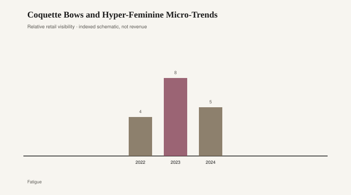

# Coquette Bows and Hyper-Feminine Micro-Trends

For a stretch of 2023 and 2024 the bow left the gift and went back on the body. Hair ribbons. Cardigans tied at the sternum. Ballet flats with a satin knot that Miu Miu had already sent down the runway in 2022, which is how a micro-trend gets a luxury alibi. The word on the app was *coquette*: a French noun doing English influencer work. Next to it sat ballet-core, a cousin that swapped the ribbon for a wrap sweater and a pink that wanted to be a leotard.

None of this was a secret history. Girls have tied bows for as long as ribbon has been cheap. Sandy Liang built a career on the sweet-and-sharp version — bows that knew they were clothes, not stickers. The 2023–24 wave was the sticker version at scale. Shein sold a bow clip that cost less than lunch. Urban Outfitters sold a bow that cost more and looked the same in a story. The feed did not care about the receipt. It cared about the knot.

Hyper-feminine micro-trends move like weather because they are weather: a mood, a palette, a single motif repeated until the motif is the whole outfit. Coquette’s motif was the bow. Ballet-core’s was the slipper. Together they offered a costume of softness after a run of “clean girl” slick buns and “mob wife” leopard. The pendulum did not need a theorist. It needed a contrasting prop.

Rooms already knew the prop. Shabby-chic — Rachel Ashwell’s roses, slipcovers, a white that had been tea-stained on purpose — spent the 1990s and 2000s tying the house in a bow. The 2016 blush wave did it again with velvet: chairs in Rose Quartz, pillows that matched Pantone’s assignment, a bedroom that looked like a jewelry box someone had opened for a photograph. Coquette is shabby-chic with a phone. The rose went to the hair. The blush chair went to the listing archive, then came back as a “vintage find” the same year the ribbon trended.

<figure class="fffb-figure">
  
  <figcaption>Retail-era visibility for Coquette Bows and Hyper-Feminine Micro-Trends.</figcaption>
</figure>

What made 2023 loud was the stack of platforms. TikTok taught the knot. Pinterest taught the moodboard (ballerina flats, strawberries, a gun — the last item was the tell that some of the moodboards were doing irony, or thought they were). Depop taught the price of a used Sandy Liang. Fast fashion taught the rest of us that a bow can be a SKU by Thursday. A motif that used to take a season to leave the atelier now takes a weekend to leave the warehouse.

The clothes that will look silly first are the ones that treated the bow as a logo. A grosgrain ribbon on a cheap barrette dates to the week it was filmed. A Miu Miu flat, if you can still walk in it, dates to a house that has been playing with girlishness since Miuccia Prada decided sweetness could be a weapon. Same motif, different spine. Ballet-core has the same split: a real wrap sweater from a dance shop versus a “ballet-core cardigan” with a care tag that forbids sweat.

The furniture rhyme is the 2016 blush chair and the rose-print settee, not a sermon about femininity. Those pieces were sincere the year they were bought. They became a timestamp when every catalog agreed on the same pink. Coquette’s closet is heading for the same closet: a bin of ribbons that were a personality for six months. Keep the one ribbon you actually like. The rest is weather.

There is a class edge people skip because the pictures are cute. Ballet-core borrows from a training uniform that costs time and tuition. Coquette borrows from a French word and a childhood of gift wrap. Both can be worn without the tuition. Both can also turn into a performance of girlhood that only works if someone is watching. The 2016 blush bedroom had the same audience problem. The audience then was Instagram. The audience now is a shorter app with louder audio.

A bow on a coat from 1998 can look like a coat. A bow on every visible surface in 2024 looks like a brief. Designers who understand the difference — Liang, sometimes Prada, sometimes a small label that sews one ribbon and stops — treat the knot as punctuation. The micro-trend treated it as the paragraph.

By late 2024 the feed had already started hedging: smaller bows, darker pinks, a joke about the joke. That is how you know the weather is changing. The flats will stay, because flats stay. The word *coquette* will join the pile of nouns that meant a cart for a season. Shabby-chic never fully left the cottage listings; it just waited until the ribbon needed a house to match.

If you are keeping score across closets and rooms, the pattern is not mysterious. A sweet motif arrives as relief. Retail copies the motif until relief becomes surplus. Surplus goes to resale, where it waits to be called vintage. The blush velvet chair from 2016 is already in that waiting room. The hair bow from 2024 has a reservation.

Wear the ribbon if it pleases you. Skip the noun if you can. The house version of that advice is older than Ashwell: one rose is a flower. A sofa of roses is a year.
