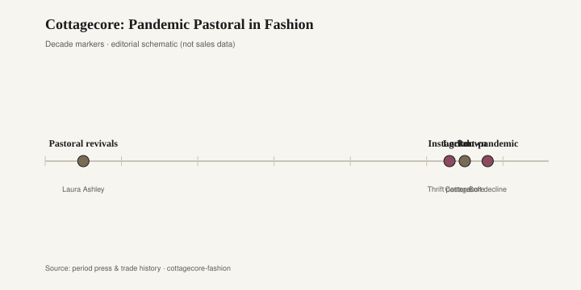

# Cottagecore: Pandemic Pastoral in Fashion

Cottagecore arrived on TikTok in 2020 with a sourdough starter and a prairie dress. The name was already in circulation among people who posted gardens, mending, and a kind of soft historical play-acting. Lockdown gave the mood a job. If you could not go to a city, you could dress as if you had never needed one.

The clothes were specific even when they pretended to be timeless. A puff sleeve in cotton lawn or a cheap polyester that tried to look like lawn. A square neckline. A midi skirt that moved like a curtain. Christy Dawn sold dresses in deadstock florals and talked about soil. Doen did a California version of the same romance: pintucks, a ribbon, a print that could have been a 1970s Laura Ashley swatch. Hill House's Nap Dress — an easy cotton piece that began as loungewear — became a uniform for people who wanted to look as if they might bake. Broderie anglaise, eyelet, a straw bag, a pinafore over a blouse. None of this was invented in 2020. The year just needed it.

Pastoral dress has a long American and British habit of returning when the news is loud. Laura Ashley built a company on that habit. By the 1980s her floral cottons were as much a room as a frock: a sprigged wallpaper, a bedspread, a high-necked dress in the same vocabulary. The look was village, even when it was sold in a mall. Ralph Lauren's prairie and "country" collections did a related job with denim, calico, and a lace-up boot. Gunne Sax, the Jessica McClintock line that dressed a generation of 1970s formal, had already put the romantic peasant on a dance floor. Cottagecore was a new caption on an old print.

<figure class="fffb-figure">
  
  <figcaption>Timeline for Cottagecore: Pandemic Pastoral in Fashion.</figcaption>
</figure>

The interior rhyme is sitting in the same catalogs. Joanna Gaines and Magnolia made "farmhouse" the default American renovation language of the 2010s: shiplap, a black-framed window, a sign that said "gather," a slipcovered sofa in oatmeal. The clothes of 2020 were that room walking around. Both sold a rural calm to people who mostly lived near a Target. Both used white paint and a floral as proof of virtue. Both were easy to mock and, for a lot of households, genuinely comforting. A person in a Christy Dawn dress on a Magnolia-style porch was not confused. They were wearing the matching set.

Rachel Ashwell's shabby chic, named and retailed from Santa Monica starting in 1989, is the older cousin that still looks related. Slipcovers in washed white cotton, a rose print faded on purpose, painted furniture with the edges worn. Ashwell's rooms were cottage without the farm chores. Laura Ashley's 1980s interiors were cottage with a British accent and a matching lampshade. Cottagecore fashion borrowed from both: the fade, the floral, the suggestion that time had already softened the object.

What 2020 added was the feed. A cottagecore video could move from a berry bowl to a hem in twenty seconds. The aesthetic had to read at phone scale, which favored a clear silhouette (puff, waist, midi) and a clear palette (cream, sage, dusty rose). It also favored props: a chicken, a loaf, a windowsill herb. Some of the posters lived that life. Many did not. The clothes still worked in an apartment if you ignored the chicken.

The British shop version of this wish is worth naming, because it predates the app. Laura Ashley stores in the 1980s sold a coordinated life: a cotton dress, a lampshade, a roll of wallpaper in the same sprig. The customer did not have to invent a cottage. She could buy the kit. Magnolia's later American kit — the paint deck, the furniture line at Target, the television renovation — did the same industrial work with shiplap and a black fixture. Cottagecore on TikTok was a kit made of clips instead of SKUs. You assembled it from a dress brand, a thrifted quilt, and a recipe.

After the first pandemic years the mood loosened. People went back to offices and to bars. The Nap Dress stayed in some closets because it was comfortable. The full pastoral costume — bonnet energy, a basket, a performance of butter-churning — receded the way most lockdown hobbies receded. Farmhouse interiors took their own hit: shiplap fatigue, a joke about "live laugh love," a turn toward moodier paint. The floral did not die. It just stopped being a moral position.

If you like the print, you can still buy it. Liberty Tana Lawn, a real cotton with a real archive, will outlast a TikTok sound. A secondhand Laura Ashley duvet will outlast a new "cottage" dress in thin poly. The durable part of cottagecore was never the name. It was the wish for a room and a garment that look as if they have already been lived in — Ashwell's fade, Ashley's sprig, a sleeve with enough cotton to wrinkle. Fashion will rename that wish. Rooms will keep a slipcover on hand for when the wish comes back.
