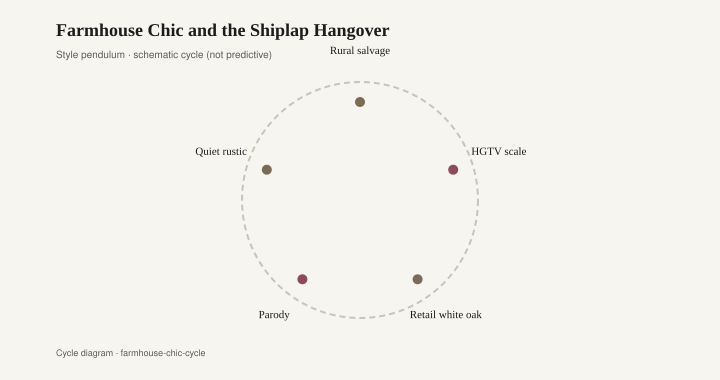
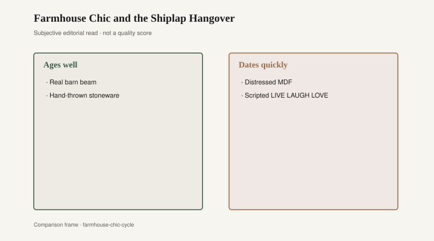

# Farmhouse Chic and the Shiplap Hangover

The barn door does not close. Black strap hinges, a pine face or a pine-look skin, a handle that is jewelry more than hardware — and behind it, in a 2016 spec house, a water heater. The living room is wrapped in white shiplap that never kept weather out of anything. A Mason jar on the island holds spoons; another holds grocery-store flowers still dented from the rubber band. The television is the size of a real door. This is modern farmhouse as it arrived in rooms that had never seen a barn: white paint as kindness, black iron as a line, sincerity sold by the case.

HGTV’s *Fixer Upper* piloted on May 23, 2013, and signed off April 3, 2018: Chip and Joanna Gaines, working Waco, Texas, on camera. White paint and old wood were not their inventions. Permission was. Shiplap — a rabbeted board meant to keep weather out of a hull or a wall — became an interior skin. Sliding barn doors became closet architecture. Mason jars became lamps, canisters, and a sincerity you could case-pack. Magnolia Market sold the props that looked like the episodes. The episodes sold Waco. Waco sold a weekend.

Restoration Hardware had been working a parallel industrial for a longer time. Stephen Gordon founded the company in Eureka, California, in 1979; later it became RH under Gary Friedman, with catalogs that treated warehouse salvage as a luxury vocabulary: reclaimed wood tables, zinc, iron beds, a scale that implied you had a loft even if you had a great room. Pottery Barn and West Elm — Williams-Sonoma’s other rooms — sold a lighter industrial: metal bases, Edison bulbs, a “workshop” stool. The 2010s put these cousins in the same house. Farmhouse was the walls and the jars. Industrial was the table and the lamp. Together they were a subdivision style with a name: modern farmhouse, which is to a farm what a food court is to a kitchen.

<figure class="fffb-figure">
  
  <figcaption>Farmhouse trends usually ruralize urban anxiety, then get mocked for it.</figcaption>
</figure>

The style left the living room and went onto the elevation. Board-and-batten, black window frames, a porch that had never held a tractor, a metal roof on a house that was otherwise vinyl. Builders learned the word because buyers pointed at the show. A plan that had been “Craftsman” in 2006 became “farmhouse” in 2015 with a paint deck and a different door. The furniture had to keep up with the siding. Black iron inside, white oak or white paint, a table that looked as if it had been dragged from a barn the lot had never included.

Status was authenticity you could schedule. You were not the Tuscan-granite person of 2004. You were not the black-lacquer person of 1987. You had discovered honesty: wood that looked used, metal that looked like work, a door that looked as if it had closed on animals. The animals were a figure of speech. The door was on a closet. That does not make the buyer a fool. Television is a more efficient catalog than a catalog, and *Fixer Upper* was a good catalog. People wanted a house that felt kinder than the granite blob and less temporary than a beige rental. White paint is a kindness. A heavy table is a kindness. The fashion was in the jewelry and in the claim that a ranch in a cul-de-sac had always been this rural.

Retail had layers. At the top: actual old wood with a job — a factory cart that had been a cart, a table whose top had been a floor, a zinc that had been a counter. RH, at its better moments, sold some of that, and sold a lot of new goods that impersonated it at a price that felt like salvage even when it was production. In the middle: Pottery Barn’s industrial dining, West Elm’s metal-and-wood, the Magnolia SKUs a visitor could carry out. At the bottom: the barn-door kit from a big box, the MDF plank with a painted bevel, the Mason-jar pendant with a reproduction cage, the “reclaimed look” table whose grain was a print. IKEA and Wayfair and Amazon filled the bottom without needing Waco. They needed a filter named rustic.

The hangover is already built into houses that are not ten years old. Barn doors on interior closets in 2019 new-builds — off the track, or never quite closing on a bathroom that needed a door that sealed. Shiplap in a ranch that never had a ship, or a barn, or a reason for a horizontal line except that the television show had one. Black interior doors in a house whose exterior is beige vinyl. A sliding door across a pantry that makes a noise at 6 a.m. Hardware as jewelry: straps, arrows, a cast “handmade” that came in a plastic bag. The jewelry dates. The drywall was always drywall.

What ages is actual old wood with a job. A table that was a table, thick enough to plane. A beam that holds something. A board that was outside and is now a mantel and still looks as if it has weather in it, because it does. White paint on that board is a decision you can reverse, or live with, or refresh. Black iron that is iron, on a piece that needs iron, ages the way a hinge ages. A solid hardwood dining top — the kind a mill in Warren, Arkansas, still describes in Bradley Brand company copy as the point of the business since 1902, no particleboard [CITE NEEDED] — will outlast the barn kit on the pantry by a generation if anyone oils it. That pairing is the 2010s in one glance: weight and story wished for, story applied to a house that already had HVAC.

What dates is the hardware as jewelry — the barn-door strap on a closet, the mason jar doing lamp work it was not blown for, the shiplap that is a wallpaper of wood, the word “farmhouse” on a sofa tag in a room with underfloor heating and an HOA. Chip and Joanna painted a lot of real rooms in Waco. The copies painted a look onto a floor plan that had been drawn before the show existed.

<figure class="fffb-figure">
  
  <figcaption>What tends to age well versus date quickly in Farmhouse Chic and the Shiplap Hangover.</figcaption>
</figure>

The mockery arrived on schedule, the way mockery always arrives once a look has left the show and entered the subdivision. Shiplap fatigue is a real estate phrase now. Barn doors are the first things staging agents take off the track. Magnolia kept a business; the style did not keep a monopoly. That is not a scandal. It is how a television vocabulary becomes a paint year. The honest remainder is the heavy table, the real board, the iron that had a job. The rest was a costume for urban anxiety — a wish to look as if work and weather had already happened to the house. Work and weather had not. The door is still off the track. Behind it, the water heater hums, unbothered, as it always was.
